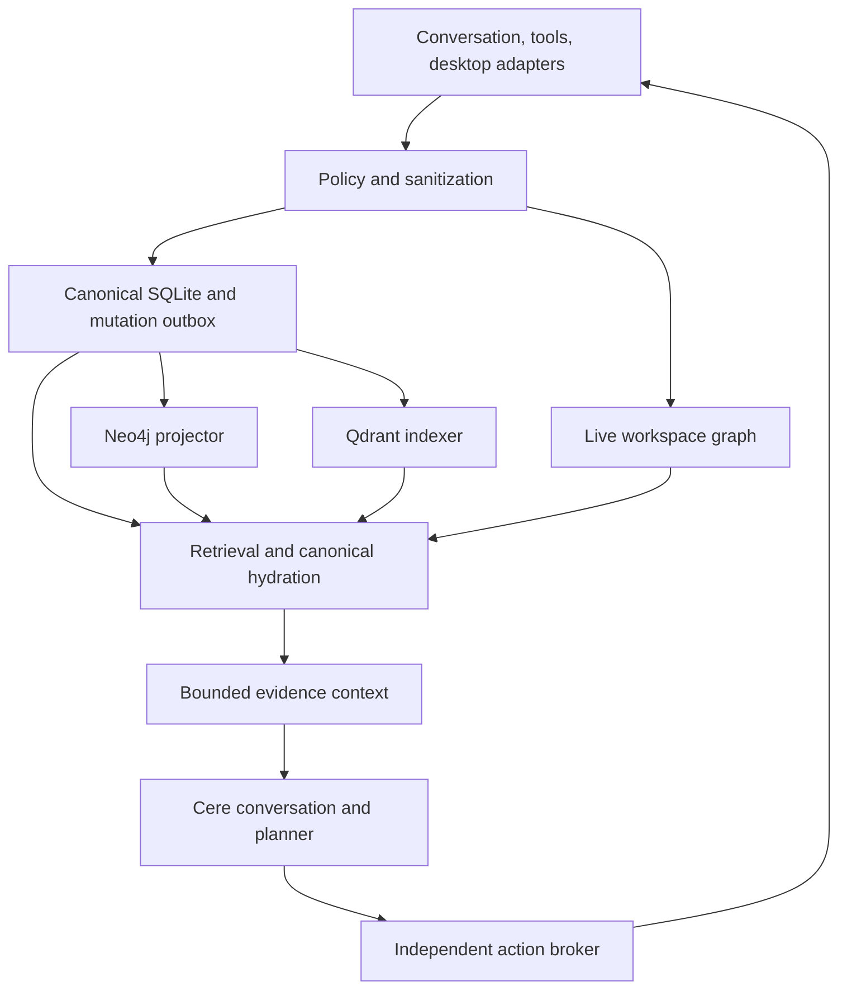
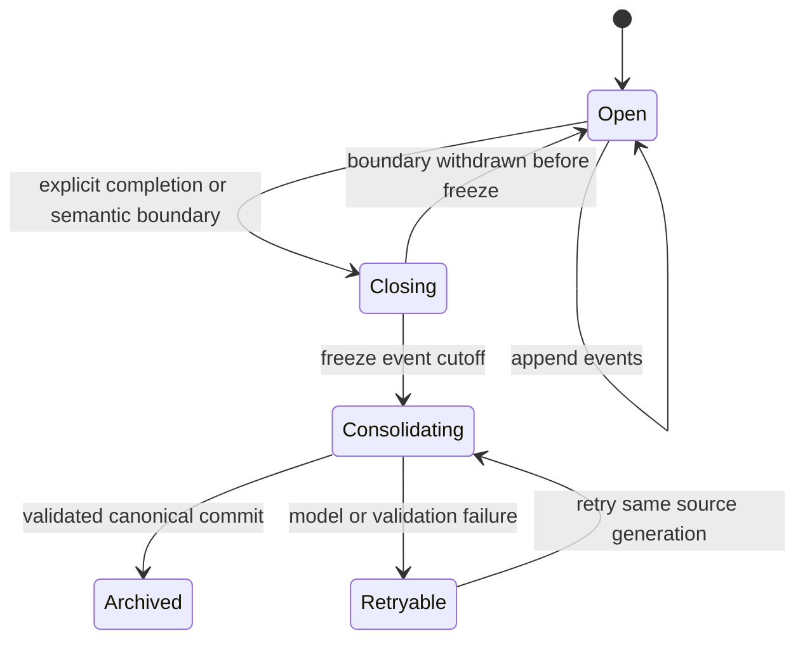

# Cere graph memory: coding-agent implementation instructions

**Status:** reviewed implementation specification.  
**Reviewed:** September 29, 2026.  
**Input:** the supplied architecture draft, `Pasted text(20260929-190715).txt`.  
**Target:** a local desktop assistant, initially Arch Linux with Hyprland, Fish, Kitty, and Ollama.

Implement the complete memory system described here in the actual Cere repository. Preserve Cere's existing conversation, model-provider, desktop, and action interfaces wherever possible. This document specifies the reference implementation, its contracts, its implementation order, and the tests required for completion.

The system must explain which evidence supports a memory, when it applied, when Cere learned it, what later changed it, and why it was retrieved. Graph relationships, vectors, and summaries must remain traceable to canonical records.

## 1. Instructions for the coding agent

1. Inspect the repository, its applicable `AGENTS.md` files, dependency locks, model abstraction, persistence, UI, desktop collectors, and action broker before editing. Identify the actual entry points and write a short integration map in `docs/memory/integration.md`.
2. Implement against that checkout. The module names below describe boundaries; adapt their locations to the existing project rather than creating a second application beside Cere.
3. Use Python 3.12 or later for a separate memory daemon if the repository does not already provide a suitable service. Reuse the existing runtime when it can satisfy these contracts. Keep the desktop UI thread free of database, model, and collector work.
4. Implement all required phases in Section 21. A plan, a vector-only demonstration, mock adapters, or a partially populated graph does not complete this assignment.
5. Use real Neo4j and Qdrant integrations for the reference profile. In-memory backends are test doubles and a degraded operating mode, not evidence that production integration works.
6. Check the official documentation for the versions you actually select. Pin package versions, container image digests, extraction prompts, schemas, and model identities. Commit the dependency lock and `docs/memory/versions.md`.
7. Add migrations, recovery commands, a CLI, a memory inspector, fixture data, integration tests, and benchmark tooling. Each feature must have an observable result and a failure behavior.
8. Complete necessary implementation and verification autonomously within the repository's authorization. Resolve ordinary implementation choices using this specification. Only unresolved product choices or actual external access blockers should require clarification.
9. Report what was implemented, the exact checks run, measured results, and remaining blockers. Never describe mocked or skipped integration checks as passing.

### Required outcome

The release must support conversation memory; a live workspace graph; task-specific active event graphs; archived episodes; a topic network; assertion-level provenance; bitemporal corrections; hybrid retrieval; configurable ranking decay; cross-store forgetting; and a review interface. It must remain usable when extraction, graph indexing, or embeddings are temporarily unavailable.

### Scope of the reference implementation

| Required now | Extension points to preserve |
| --- | --- |
| One local memory daemon and one serialized canonical writer | PostgreSQL and multiple hosts |
| SQLite canonical state and mutation journal | Sharded processing by owner or workspace |
| Neo4j Community graph projection | FalkorDB graph adapter |
| Qdrant semantic projection and SQLite FTS5 | Neo4j-native vector adapter |
| Local Ollama extraction and embeddings | Other capability-tested model providers |
| Hyprland, Fish, Kitty, editor/tool integration | Other compositors, shells, editors, and operating systems |
| Existing Cere UI integration; a small native inspector if none exists | More elaborate graph visualizations |

The optional backends are not release prerequisites. Do not split the initial implementation across several graph engines. Export repository interfaces that make later alternatives possible.

## 2. Review findings and resolved design decisions

The original draft's central architecture is sound. The following decisions remove ambiguities or close implementation gaps.

| Draft item | Review result and implementation instruction |
| --- | --- |
| GAM layers | Preserve active event graphs, archived event graphs, a topic network, and links between them. The archive is a distinct logical layer. [S1] |
| MemORAI attribution | Use its turn-level provenance and query-conditioned graph retrieval as research inspiration. Bitemporality, erasure, desktop adapters, and the consistency protocol are engineering additions specified here. [S2] |
| Vector backend | Select Qdrant for the reference profile. The draft also recommended starting with native Neo4j vectors; that is a separate compact profile, not the default for this implementation. |
| Store authority | SQLite owns accepted state. Neo4j and Qdrant are disposable projections. FTS5 is maintained inside the canonical transaction. |
| Event sourcing and deletion | Keep an ordered mutation journal, but place content in erasable records. An append-only copy of every old payload would defeat forgetting. |
| Index revisions | Track a contiguous completed watermark, pending work, and record-level versions. The largest completed job number is not a valid global watermark when earlier jobs remain unfinished. |
| Delayed embedding writes | A revision field alone does not provide cross-store compare-and-swap. Use immutable vector record identities, serialized publication, canonical hydration, and erasure barriers. |
| Temporal updates | A backdated correction creates a new knowledge-time interpretation of every affected validity segment. Do not overwrite the historical interpretation. |
| Unknown dates | Represent uncertainty explicitly. A null effective start is not proof that a fact applied at every earlier date. |
| Current desktop state | Maintain a fast live graph independently of durable history. Observation access does not imply permission to retain activity history. |
| Response provenance | Distinguish evidence supplied to the model from evidence the response actually cites. Do not label all retrieved evidence as used. |
| Latency | Apply focus changes immediately. Debounce history persistence separately; a 250 ms ingestion debounce cannot satisfy a 150 ms event-to-state target. |
| Database assumptions | Check the linked SQLite runtime, not just Python or the `sqlite3` CLI. Require a supported build with the WAL-reset fix. SQLite documents fixes in 3.51.3 and later, plus specific backports. [S3] |
| Model capabilities | Local Ollama supports schema-constrained outputs. Its documentation currently says Cloud does not; capability-test providers and keep extraction local by default. [S9] |
| Hardware claims | All latency and resource numbers below are engineering targets. Measure them on the target device; do not present them as paper results. |

### Non-negotiable invariants

- Every accepted assertion has validated supporting evidence or is a narrowly defined deterministic projection of such evidence.
- No model writes database mutations directly. It proposes typed candidates; deterministic application code resolves, validates, and commits them.
- No graph or vector response is sufficient authority to serve a fact. Hydrate it from canonical state.
- Corrections and forgetting affect the next retrieval immediately, even when projections lag.
- Scope, visibility, erasure, validity, and source restrictions are eligibility checks, not ranking weights.
- Reading, repeating, summarizing, or retrieving a fact does not create independent evidence for it.
- Memory supplies context to the action broker. It does not grant execution capabilities.
- Replay, reindexing, delayed jobs, restored backups, and caches must not resurrect erased content.

## 3. Architecture and process boundaries

Use one modular daemon with separate asynchronous worker tasks, not a collection of application microservices. Neo4j, Qdrant, and Ollama remain local dependency processes.



### Component responsibilities

| Component | Required responsibilities |
| --- | --- |
| Policy engine | Source access, sanitization, retention, sensitivity, model routing, scope resolution, policy epochs |
| Observation service | Idempotent intake, permitted persistence, source sequencing, retryable extraction jobs |
| Live graph | Runtime identity, current focus/pane/directory state, freshness and unknown states |
| Extractor | Structured candidates and evidence quotations; no authority to commit |
| Entity resolver | Stable identity, scoped aliases, tentative matches, reversible identity decisions |
| Ontology/validator | Predicate rules, evidence spans, modality, negation, temporal bounds, scope and cardinality |
| Canonical writer | Atomic mutations, assertion versions, lineage, FTS5, outbox, receipts |
| Graph projector | Idempotent Neo4j projection, monotonic aggregate updates, bounded graph reads |
| Vector indexer | Versioned text artifacts, embedding fingerprints, publication, retirement, erasure |
| Consolidator | Episode boundaries, source-linked summaries, durable promotion, topic associations |
| Retriever | Exact/lexical/vector retrieval, eligible graph expansion, fusion, hydration, context budget |
| Lifecycle service | Corrections, decay configuration, expiration, erasure, restore/rebuild |
| RPC/client | Typed local protocol, peer verification, cancellation, receipts, notifications |
| Inspector/CLI | Inspect, correct, resolve, forget, change collector policy, see pending/degraded work |

### Files and service placement

Use the existing package root and a layout with equivalent responsibilities:

| Suggested path | Contents |
| --- | --- |
| `memory/contracts.py` | Pydantic DTOs, enums, protocol version |
| `memory/ontology.py` | Predicate registry and value/qualifier schemas |
| `memory/policy.py` | Policy evaluation and sanitization |
| `memory/storage/` | SQLite repositories, writer, migrations, backup/restore |
| `memory/observations.py` | Intake, deduplication, extraction scheduling |
| `memory/extraction/` | Prompts, model adapters, span validation |
| `memory/entities.py` | Identity, aliases, tentative links, merge/split operations |
| `memory/temporal.py` | Valid-time intervals, knowledge revisions, conflict handling |
| `memory/live/` | Runtime graph and collector adapters |
| `memory/projections/` | Outbox consumers, Neo4j and Qdrant repositories |
| `memory/episodes.py` | Event graphs, state transitions, checkpoints |
| `memory/consolidation.py` | Summaries, promotions, topic linking |
| `memory/retrieval/` | Query interpretation, candidates, expansion, ranking, packets |
| `memory/lifecycle.py` | Expiry and lineage-aware erasure |
| `memory/rpc.py`, `memory/daemon.py` | Local server and worker supervision |
| `memory/client.py`, `memory/cli.py` | Cere client and administrative commands |
| `tests/memory/`, `tests/fixtures/memory/` | Deterministic, integration, and failure fixtures |
| `benchmarks/memory/` | Synthetic workloads and annotated retrieval evaluations |
| `docs/memory/` | Integration, operations, policy, versions, benchmark results |

## 4. Canonical schema and identity

Generate opaque UUIDs for persistent records. Names, titles, file paths, and email addresses must not be embedded in primary IDs. Use UUIDv5 only where a documented deterministic namespace is required, such as vector point identities; do not derive public identifiers directly from sensitive values.

Define `owner_id` as the local Cere profile and `scope_id` as a user, project, or task scope. A request's effective scope set comes from the policy engine. A caller cannot grant itself access by submitting additional scope IDs.

### Required tables

All content-bearing tables need `owner_id`, `scope_id`, creation/update revisions, sensitivity, retention, and erasure state, either directly or through enforced foreign-key ownership. Use `STRICT` tables where supported by the selected runtime. Put arbitrary structured content in validated JSON, not arbitrary column proliferation.

| Table | Essential columns and rules |
| --- | --- |
| `schema_migrations` | Migration ID, checksum, applied time; incompatible schema fails startup |
| `scopes` | ID, owner, kind, parent scope, policy reference; no cyclic hierarchy |
| `sources` | ID, kind, external identity, trust class, collector epoch, policy reference |
| `observations` | ID, source, source epoch/sequence, source event ID, occurrence/capture time, payload reference, storage mode, extraction state |
| `payloads` | ID, sanitized bytes/JSON, content digest, encoding/schema version, restrictions, expiry; physically erasable |
| `entities` | ID, type, scope, metadata payload reference, identity revision, active/erased state |
| `entity_aliases` | Entity, alias kind, normalized alias, scope, validity bounds; ambiguous aliases remain multiple candidates |
| `identity_links` | Left/right IDs, possible/same/not-same decision, evidence, revision; reversible |
| `fact_slots` | ID, subject, predicate, identity qualifiers, scope, cardinality, aggregate revision |
| `assertion_versions` | Version ID, logical assertion ID, slot, subject, predicate, entity object or literal value, polarity, modality, valid interval/mode, knowledge interval/revisions, status, epistemic type, extraction run |
| `evidence` | ID, source observation/revision, locator, source trust, restrictions, content digest; must resolve to permitted source content |
| `assertion_evidence` | Assertion version, evidence ID, support/contradiction relation, independence group |
| `extraction_runs` | ID, input references, model digest, prompt/parser/schema versions, status, validated output reference; raw debug output has bounded retention |
| `events` | ID, observation, task/thread, event kind, actor, occurrence/capture time, stream sequence, payload reference |
| `event_edges` | IDs, relation, evidence and order basis; causal links require actual supporting evidence |
| `tasks` | ID, scope, explicit binding, status, blockers and outcomes, revision |
| `episodes` | ID, task/thread, state, event cutoff, summary reference, source generation, revision |
| `episode_events` | Episode ID, event ID, ordering; frozen membership is versioned |
| `topics` / `topic_links` | Topic IDs, scoped descriptions, related topics, episode links, association weights, lineage |
| `artifacts` | ID, kind, text reference, source generation, assertion/episode IDs, embedding fingerprint, validity, invalidation state |
| `retrieval_documents` | Integer FTS row ID, artifact ID/content revision, eligible text reference and scope; versioned alongside artifacts |
| `lineage` | Derived record/artifact, input record/evidence, dependency role; acyclic derivation graph |
| `commits` | Globally ordered revision, transaction time, observed wall time, mutation ID, schema version, erasable delta reference |
| `mutation_effects` | Commit, opaque target ID, operation and aggregate version; replay metadata must not duplicate erased content |
| `outbox` | Backend, commit revision, targets, generation/epoch, state, attempts, next retry, lease; unique job identity |
| `projection_state` | Backend/generation, contiguous watermark, latest record revisions, health/error metadata |
| `erasure_jobs` / `tombstones` | Job, opaque targets, erasure epoch, immediate suppression state, per-backend acknowledgements |
| `response_records` | Response reference, supplied evidence IDs, validated cited IDs, snapshot revision, policy/erasure epochs |

Implement indexes for scope/entity lookup, source deduplication, slot timelines, knowledge revisions, episode membership, lineage in both directions, pending jobs, and erasure targets.

### SQLite setup

- Verify the SQLite library linked into the daemon. Prefer a current supported release at or above 3.51.3; explicitly verified patched backports are acceptable. Do not silently bypass the WAL-reset compatibility check. [S3]
- Require foreign keys and FTS5. Test FTS5 with a temporary virtual table rather than assuming the Python distribution enables it.
- Enable `PRAGMA journal_mode=WAL`, `PRAGMA synchronous=FULL`, and `PRAGMA foreign_keys=ON`. Set a bounded busy timeout, initially 5 seconds.
- Use one daemon-owned writer connection. Run the writer on its own thread/queue when using synchronous SQLite APIs. Do not call blocking SQLite work on the UI or asyncio event loop.
- Use short transactions. Extraction, embedding, model calls, graph RPCs, and filesystem scanning occur outside a transaction.
- Keep the database on a local filesystem. Use SQLite's backup API for live backups; never copy only the main database while WAL writes are active.
- Monitor WAL growth and checkpoint without blocking routine foreground work. A transaction cannot be acknowledged as durable before it commits.

SQLite WAL permits concurrent readers but retains one writer at a time. It is not the multi-host writer implementation. [S3]

### Assertion fields and validation

The public DTO and stored representation must contain these fields:

| Field | Contract |
| --- | --- |
| `version_id` | Unique physical interpretation/segment ID |
| `logical_id` | Stable identity of the proposition across revised interpretations |
| `slot_id` | Cardinality/conflict key; independent of the selected object for a single-valued slot |
| `subject_id`, `predicate` | Existing eligible entity and registered predicate |
| `object_entity_id` / `value_json` | Exactly one; literal values follow the predicate's schema |
| `qualifiers` | Registered, normalized JSON; identity qualifiers distinguished from descriptive ones |
| `polarity` | `positive` or `negative`; absence is not negative evidence |
| `modality` | `actual`, `planned`, `hypothetical`, `reported`, or `inferred` |
| `epistemic_type` | `explicit_user`, `instrumented`, `document_claim`, `inference`, or `derived_summary` |
| `status` | `candidate`, `accepted`, `disputed`, `rejected`, or `erased` |
| `valid_from_us`, `valid_to_us` | Half-open valid-time interval when bounded; nullable with explicit temporal mode |
| `valid_mode` | `bounded`, `known_current`, `atemporal`, or `unknown` |
| `time_precision`, `time_zone`, `time_expression` | Preserve date/instant/approximate precision and the original temporal expression |
| `known_from_revision`, `known_to_revision` | Half-open knowledge interval in canonical revision space |
| `known_from_us`, `known_to_us` | Transaction-time descriptions of those revision boundaries |
| `evidence_ids`, `extraction_run_id` | Verified source lineage, never invented identifiers |
| `extraction_confidence` | Extraction score only; not probability of truth |
| `retention_class`, `sensitivity`, `expires_at_us` | Policy-derived, never relaxed by an extractor |
| `aggregate_revision`, `erasure_epoch` | Guards against stale application and resurrection |

At the schema level enforce exactly one object representation, nonempty knowledge intervals, increasing bounded validity intervals, supported enum values, existing scopes/entities, and no orphan evidence. In the serialized canonical transaction also enforce predicate-specific temporal overlap and authority rules.

### Predicate registry

Start with this deliberately small registry. Additional predicates require a versioned schema change, validator, retrieval policy, and fixtures.

| Predicate | Subject → object | Cardinality and scope | Authority/temporal rule |
| --- | --- | --- | --- |
| `WORKS_ON` | User → Project/Task | Multiple, user/task | Current observation does not imply long-term commitment |
| `USES_TOOL` | Project/User → Tool | Multiple, or single within a declared purpose | Explicit statement or verified configuration; purpose is an identity qualifier |
| `PREFERS_TOOL` | User → Tool | Single per project/task category when declared | Direct user preference outranks behavioral inference |
| `BELONGS_TO` | Document/Directory → Checkout/Project | Registry-defined per entity type | Verified root/path relationship |
| `CHECKOUT_OF` | Checkout → Repository | Single per checkout | Repository metadata; worktrees remain distinct |
| `IMPLEMENTS` | Repository → Project | Multiple | Explicit mapping or verified project metadata |
| `DEPENDS_ON` | Task/Project → Task/Project/Tool | Multiple | Source-backed dependency; association alone is insufficient |
| `BLOCKED_BY` | Task → Task/Document/Outcome | Multiple | Active until explicitly resolved; resolution is an event |
| `LOCATED_AT` | Document/Checkout → Directory/literal path | Single within device and validity interval | Changes create new location history |
| `HAS_STATE` | Task/Action → registered literal | Single per state dimension | Instrumented/explicit transition |
| `RELATED_TO` | Topic → Topic | Multiple | Association with source lineage; never factual entailment |

`SUPPORTED_BY`, `DERIVED_FROM`, `SUPERSEDES`, `CONTRADICTS`, `IN_EPISODE`, and `RESULT_OF` are structural relationships with dedicated validation. They are not arbitrary facts the extractor may invent.

### Entity resolution rules

1. Prefer stable platform/provider identities within a scope: repository identity, verified checkout metadata, tool ID, explicit user profile ID.
2. Resolve exact scoped aliases only when unambiguous.
3. Use constrained semantic matching only among compatible types and scopes.
4. Store uncertain matches as `POSSIBLY_SAME_AS`; do not merge automatically.
5. Make merge and split operations revisioned, source-backed, and reversible. Recompute affected slots and artifacts, retaining original IDs as redirect history where policy permits.

Keep repository, checkout, project, directory, and document separate. Normalize repository URLs without storing credentials. Do not globally merge `config.json`, identical display names, or two different people with the same first name.

For filesystem identity, record device/root, logical document ID, location intervals, and content revisions. Rename correlation may use inode metadata as evidence; deletion followed by recreation must create a new identity unless stronger evidence establishes continuity. Symlinks retain a display path and a resolved path. Check approved roots using resolved paths and revalidate before reading.

## 5. Intake, extraction, and validation

### Observation envelope

Define a Pydantic model with `extra="forbid"` and a discriminated, source-specific payload schema. Every external request is untrusted until validation.

```json
{
  "schema_version": 1,
  "observation_id": "00000000-0000-4000-8000-000000000001",
  "owner_id": "00000000-0000-4000-8000-000000000002",
  "scope_id": "00000000-0000-4000-8000-000000000003",
  "source_id": "00000000-0000-4000-8000-000000000004",
  "source_epoch": "00000000-0000-4000-8000-000000000005",
  "source_sequence": 12,
  "source_event_id": "turn-219",
  "source_kind": "user_turn",
  "occurred_at": "2026-09-29T19:00:00Z",
  "captured_at": "2026-09-29T19:00:00.015Z",
  "task_id": null,
  "payload": {
    "role": "user",
    "text": "For this project, use Ruff for Python formatting."
  },
  "requested_storage": "durable"
}
```

These IDs and the statement are fixture examples, not claims about the real project. Owner/scope/source fields must be reconciled against authenticated client registration. The client cannot select its own trust or sensitivity classification.

### Intake procedure

1. Validate size, schema, client identity, source registration, and effective policy.
2. Sanitize the payload before it reaches persistent logs, queues, a model, or an embedding service. Return a structured rejection for disallowed content; do not log the original body.
3. Deduplicate using `(source_id, source_epoch, source_event_id)` or a documented sequence identity. A digest may support deduplication but cannot replace source identity.
4. Route `transient` observations to the live graph/active buffer only. Their receipt contains a workspace/buffer generation rather than pretending they have a durable revision.
5. Persist permitted `durable` observations and an extraction job atomically. Return an observation receipt after that transaction commits.
6. Parse structured desktop/tool payloads deterministically. Use an LLM only for content requiring interpretation.
7. Track occurrence time and capture time separately. Preserve out-of-order events in history, but do not let an older source sequence replace newer current state.

The current user turn remains available to the conversation even when memory extraction fails. Storing a turn does not imply accepting every sentence as a fact.

### Extraction contract

The extractor returns a `MutationProposalBatch`, not SQL, Cypher, or a list of arbitrary tool calls. Include:

- Temporary entity references and type/alias candidates.
- Registered predicate, normalized qualifier candidates, entity or literal object.
- Polarity, modality, epistemic type, and whether the text asserts, changes, corrects, or merely reports a claim.
- Original temporal expressions and candidate interpretations, including uncertainty.
- Exact quotations with source record ID and occurrence index; the validator computes canonical character spans.
- Proposed durability/importance scores as hints only. Policy sets actual retention and acceptance.

Use source-role boundaries in the prompt. User quotations of another person, instructions embedded in files, plans, hypotheticals, and assistant statements must not become direct user preferences or verified outcomes.

Recommended source gate:

| Source/content | Default extraction behavior |
| --- | --- |
| Explicit remember/correct operation | Deterministic API; commit after validation |
| Direct user statement about her own preference | Candidate for immediate acceptance under the configured personal-memory policy |
| Direct project decision | Candidate for immediate acceptance in that project scope |
| Structured tool result | Deterministic execution/outcome state; only claims actually supported by the result |
| File content | Attributed document claims with exact revision/span |
| Assistant response or topic summary | Derived artifact; cannot independently establish successful work or corroborate itself |
| Window title/focus or terminal directory | Current workspace state; no inferred personal preference |
| Behavioral inference | Hypothesis/candidate unless explicit policy permits promotion |

### Local Ollama adapter

- Send the JSON schema in `format` and validate the returned JSON through Pydantic. Schema-constrained syntax does not guarantee factual support. [S9]
- Set bounded input/output sizes, request timeout, cancellation, and a capability probe. Use a fixture probe rather than silently assuming cloud/local parity.
- Select the extraction model from Cere's configured providers and hardware budget. Do not hardcode an unverified model recommendation into the service.
- Store model digest/identity, provider endpoint class, prompt version, schema version, and parser version in every extraction run.
- Retry invalid output at most once with a bounded repair request. Further failure becomes a retryable job or a reviewable candidate error, not an invented partial assertion.
- A retry cannot apply after its source is erased, its source revision changes, or its policy grant is revoked.

### Validation procedure

Validate quotations against the sanitized source revision. Use half-open Unicode code-point offsets for text spans; JSON-pointer locators identify structured values. Define this convention in the protocol and test Unicode, CRLF, repeated quotations, and normalization.

The validator must check source existence, locator existence, quote equality, entity eligibility, predicate types/cardinality, qualifiers, scope, modality, negation, temporal interpretation, source authority, and lineage. Reject or quarantine unsupported proposals atomically. Do not let a valid quotation alone prove that the proposed relationship is entailed; apply source-role/modality rules and evaluate extraction precision separately.

Confidence, source reliability, freshness, and relevance are separate fields. None can override a policy denial or replace evidence.

## 6. Canonical commits and projection consistency

### Commit transaction

The writer receives only a validated batch with expected aggregate revisions. In one transaction:

1. Recheck source/policy/erasure state and expected revisions.
2. Allocate the next canonical revision and mutation ID.
3. Resolve or create eligible entities and slot identities.
4. Apply temporal changes and accepted/candidate/disputed assertions.
5. Write evidence, lineage, event/episode/topic changes, and invalidations.
6. Update versioned retrieval artifacts and FTS5 entries.
7. Append mutation metadata and erasable delta references.
8. Insert graph/vector outbox entries, including an explicit no-op disposition where a backend has no relevant change.
9. Commit and return `CommitReceipt`.

Use optimistic aggregate revision conflicts to reject stale editors or extraction work. Do not blindly retry by overwriting current state. Re-resolve against the new state.

### Receipt contract

`CommitReceipt` contains `mutation_id`, `accepted_revision`, affected logical/version IDs, a `read_token`, graph/vector contiguous watermarks, pending backend status, and policy/erasure epochs. A read token binds the owner/scope, committed revision, and affected records needed for immediate read-after-write behavior.

Use canonical revision space as the deterministic knowledge clock. Record actual wall-clock time separately. Assign transaction timestamps monotonically; record a clock-discontinuity indicator if wall time moves backward. `known_at` resolves through the commit table, while `known_revision` is the exact unambiguous API.

### Outbox execution

- Delivery is at least once. A unique backend/job key and monotonic aggregate guard make application idempotent.
- In version 1, use one ordered publisher per backend. Extraction and embedding preparation may run concurrently within bounded queues, but publishing state transitions follows canonical order.
- Claim jobs using a transaction and an expiring lease. A crash after backend success but before SQLite acknowledgement must safely repeat the job.
- Maintain a contiguous completed watermark. Revision 42 completing before 41 does not make the watermark 42.
- Retry transient backend failures with exponential backoff and jitter. Expose attempts/age. A poison job must not disappear silently; repair or explicitly reject its projection with a recorded reason and degraded status.
- Never store unrestricted copies of source bodies in job payloads. Resolve erasable canonical references at execution time.

### Graph projection

Create reified assertion nodes with `SUBJECT`, `OBJECT`, `SUPPORTED_BY`, and evidence/event/episode links. Store literals as validated assertion properties or scoped literal nodes; do not globally merge sensitive values.

Direct typed edges may accelerate common paths, but every one must carry the originating assertion/version ID, scope, aggregate revision, and generation. They are indexes, not independent facts. Retain temporal assertion versions for historical queries; direct edges for current state cannot substitute for the historical graph.

Use parameterized Cypher and fixed labels/relationship names from the ontology. Create node uniqueness constraints compatible with Neo4j Community. Application validation enforces existence/type rules that should not depend on Enterprise-only constraints. [S5]

```cypher
CREATE CONSTRAINT memory_entity_id IF NOT EXISTS
FOR (n:MemoryEntity) REQUIRE n.id IS UNIQUE;

CREATE CONSTRAINT memory_assertion_version_id IF NOT EXISTS
FOR (n:MemoryAssertion) REQUIRE n.version_id IS UNIQUE;

CREATE CONSTRAINT memory_evidence_id IF NOT EXISTS
FOR (n:MemoryEvidence) REQUIRE n.id IS UNIQUE;
```

Use one backend transaction for a mutation's graph changes and projection watermark. Guard each aggregate against older revisions and lower erasure epochs. A repeat with the same revision is a no-op; an older job cannot restore a retired edge or erased node.

### Semantic artifacts and Qdrant

Embed assertion texts, episode summaries, and topic summaries as separately typed artifacts. Entity descriptions may be an additional seed kind. Do not embed the entire profile as one vector.

Each artifact includes source IDs, source generation, schema/text-template version, restrictions, and its complete derivation lineage. Create an embedding fingerprint from:

`provider + model digest + dimension + normalization + distance metric + query/document templates + chunking version`.

For `nomic-embed-text`, verify and record the model-specific query/document prefix convention rather than assuming plain text is optimal. Probe the actual vector dimension and context limit. Use `/api/embed` with `truncate=false`; split oversize inputs deliberately and preserve span lineage. Ollama otherwise permits automatic truncation. [S10, S14]

Use immutable UUID point IDs derived from `(artifact_id, content_revision, embedding_fingerprint, index_generation)`. An old embedding cannot overwrite a newer point. Its stale point may still exist temporarily, so every hit must pass canonical eligibility and version checks.

Store only necessary filtering metadata in Qdrant payloads: owner/scope, artifact kind/ID, canonical content revision, fingerprint, generation, sensitivity, validity, source generation, erasure epoch, and expiry. Hydrate text from SQLite; avoid an unnecessary second copy of sensitive source text.

Create payload indexes for the fields used in scope/generation/kind/expiry filtering. Use current supported Qdrant query/filter APIs behind `VectorRepository`. Cross-store rank fusion remains in Cere; do not depend on Qdrant fusing results it does not own. [S6, S7]

Before publishing, recheck canonical source revision, artifact generation, and policy/erasure state. Serialize backend publication and deletion barriers. Retire old points, reconcile orphan points, and retain publication acknowledgements.

### Read-after-write and degraded retrieval

At retrieval start capture canonical snapshot revision `R`, current policy epoch, erasure epoch, and live generation. Use short SQLite read transactions to hydrate records as of `R`; do not hold a transaction across network/model calls. Later hydrations must select the same knowledge revision rather than silently mixing commits. Current erasure and access revocations override every historical snapshot.

When a backend watermark is behind `R`, merge a canonical overlay of changes since its watermark. Remove invalidated records/edges, include recent eligible artifacts and exact slot/task state, and pin relevant records from a read token. The overlay must support both additions and removals.

Initially cap this overlay at 256 relevant mutation effects. If the gap exceeds the cap, use canonical exact/FTS/relationship queries and return `graph_degraded` or `semantic_degraded`. Do not wait indefinitely or imply complete semantic recall. A pinned user correction must remain visible even in this mode.

Candidate IDs from any projection are untrusted pointers. Recheck scope, visibility, source generation, erasure, status, temporal eligibility, and requested snapshot before using their text or relationships. Recheck policy/erasure epochs immediately before handing the packet to a model and before serving an in-flight result.

## 7. Temporal history, corrections, and conflicts

### Time semantics

Use half-open intervals. For bounded world-time interval `[vf, vt)` and knowledge revision interval `[kf, kt)`, a version is eligible at world time `t` and knowledge revision `k` when:

```python
valid = valid_from <= t and (valid_to is None or t < valid_to)
known = known_from_revision <= k and (
    known_to_revision is None or k < known_to_revision
)
```

This fragment illustrates bounded interval logic, not the entire eligibility function. It must also check policy, erasure, status, modality, and the temporal modes below.

| Temporal mode | Eligibility rule |
| --- | --- |
| `bounded` | Apply known valid bounds at the preserved time precision |
| `known_current` | A source asserts present applicability but provides no reliable effective start; use in default current queries, not as proof about earlier dates |
| `atemporal` | Explicitly non-time-dependent proposition; still subject to knowledge revisions and corrections |
| `unknown` | Return as uncertain when relevant; cannot satisfy an exact historical fact query |

Planned changes use `modality=planned` until a source establishes they occurred. A future date in an intended action is not proof of its completion.

Normalize known instants to UTC. Preserve local timezone and precision for date-only statements. A date interval may be represented by local calendar-day bounds, but do not display it as an exact observed midnight transition. Relative dates use the source's local date/time and timezone, not the server's timezone. If the source timezone is missing and materially affects interpretation, preserve uncertainty.

### Slot key

Construct a canonical slot identity from:

`owner + scope + subject + predicate + registered identity qualifiers`.

For a single-valued slot, do not include the object in that key. For multi-valued propositions, retain an object/polarity-level logical identity while allowing several values in the slot. Normalize qualifiers with a deterministic encoding and ontology version.

Check overlapping validity segments of versions visible in the current knowledge revision. Multiple conflicting accepted values in a single-valued slot are forbidden; represent them as disputed versions instead.

Acceptance/dispute/rejection status is part of a versioned knowledge interpretation. A later dispute must not retroactively change what an earlier knowledge query sees. Erasure is the deliberate exception: no historical view may recover erased content.

### Correction algorithm

Implement correction as a pure interval transformation with a transaction wrapper:

1. Resolve the target slot/assertion and obtain its aggregate revision.
2. Validate whether the new source declares a change, a correction, a planned transition, or unresolved disagreement.
3. Determine the affected validity range without inventing missing bounds.
4. At new knowledge revision `K`, close the previous interpretations' knowledge intervals at `K`.
5. Split their validity intervals as needed and insert replacement interpretations visible from `K`. Preserve unaffected segments with their original evidence.
6. Insert the new assertion/segments with their evidence and correct modality.
7. Link revised interpretations through `SUPERSEDES`; attach contradictory evidence where applicable.
8. Invalidate dependent summaries, vectors, direct graph edges, and cached packets. Publish the canonical commit and read token.

Correction must also handle bounded exceptions and a return to an earlier value. For example, A → B for one week → A requires three valid segments, not permanent replacement of A.

### Required temporal fixture

On September 1, Cere learns that a fixture project uses Black. On September 29, the user reports that it switched to Ruff on September 20. All fixture dates use an explicitly specified timezone and date precision.

| Interpretation | Valid period | Visible knowledge period |
| --- | --- | --- |
| Black, original | September 1 onward | First commit through correction commit |
| Black, corrected | September 1–20 | Correction commit onward |
| Ruff | September 20 onward | Correction commit onward |

Required answers:

- World date September 25, knowledge after correction: Ruff.
- World date September 25, knowledge before correction: Black.
- World date September 10, knowledge after correction: Black.
- World date September 20 boundary, knowledge after correction: Ruff at the fixture's declared date granularity.

### Authority and disagreement

Apply rules by predicate and source, not a global recency score:

- The user's direct statement controls her preference in the declared scope.
- An instrumented result establishes the observed outcome of that execution, not unrelated project success.
- A file establishes its content at that revision; an author's claim remains attributed.
- Assistant conclusions and behavioral inferences cannot override direct evidence merely because they are newer.
- Equal-authority incompatible evidence remains disputed until a resolution source exists.

Scope precedence may select a more specific project/task preference over a general preference, but must not rewrite either scope's history. Negation and retraction are explicit mutations; the absence of a value is not evidence for its opposite.

Do not increment confidence when a memory is retrieved. Group repeated/copy-derived sources by origin so repetition does not become independent corroboration.

## 8. Active event graphs, archives, and the topic network

Implement three logical memory layers plus cross-layer links. GAM separates an active Event Progression Graph from the Topic Associative Network and preserves archived event graphs for grounded retrieval. This implementation adds task-specific buffers, policy-aware archives, and canonical assertions. [S1]

### Active Event Progression Graph

- Maintain one active graph per explicit task thread, plus a conversation thread for unassigned turns. A desktop focus switch alone does not select or close a task.
- Append requests, investigation events, findings, proposed actions, executions, results, decisions, and unresolved questions.
- Use `NEXT_IN_STREAM` for source ordering, `IN_TASK` for task binding, and `RESULT_OF` only when an execution/result ID or an explicit source establishes that relation.
- Preserve interleaved source streams without pretending capture-time order proves causality. A later-arriving event may belong earlier in its source timeline.
- Keep a compact working graph in memory. Persist checkpoints only where retention policy permits. Initial limits: 500 events or 4,096 summary-buffer tokens per active thread; checkpoint at 50 durable events or 10 seconds. Cap fully resident threads initially at 16; preserve compact heads/checkpoints for inactive tasks and restore details on demand rather than allowing unbounded buffers.
- On buffer pressure, create a maintenance/consolidation job. Do not block foreground conversation or discard accepted evidence.

### Episode lifecycle



Boundary detection should run on explicit completion, session-end markers, sustained semantic shifts, natural pauses, and capacity pressure. Start with deterministic task/session signals. Add bounded model-based semantic detection at sparse maintenance points, not every desktop event.

Freezing records `(episode_id, event_cutoff, source_generation, policy_epoch, erasure_epoch)`. The model works outside the canonical transaction. Publishing rechecks these values. Events arriving after the cutoff enter a successor episode linked by `CONTINUES`; do not let a summarizer race with active membership edits.

An explicit remember/correction operation bypasses consolidation delay. Episodic archiving must not gate immediate canonical knowledge updates.

### Consolidation job

1. Read permitted source events and existing accepted assertions at the frozen cutoff.
2. Produce a structured episode summary: narrative, participating entities, decisions, actions/outcomes, unresolved questions, and claim-to-source references.
3. Validate every substantive claim against accepted assertions or evidence. Preserve uncertainty and attributed claims.
4. Propose durable candidates under source/predicate policy. Do not promote transient activity into a permanent personal trait.
5. Select at most five nearby topic candidates by eligible embeddings or exact anchors. Score/link this bounded set; do not compare against every topic.
6. Commit the episode archive, accepted promotions, topic links, summary artifact, lineage, and projection work atomically after generation checks.
7. Mark the job archived and release its frozen working buffer. Failure retains permitted source records and a retryable job.

Generated summaries use a structured claim list internally, even if the UI displays prose. Each claim lists assertion versions/evidence. Summaries cannot be fed back as independent corroboration.

### Archived episodes

Retain the event structure and permitted evidence required to reconstruct important decisions and outcomes. The archive must contain source links, not just an LLM's prose. Its retention is configurable; transient observations without history permission must not be copied into it.

When durable assertions outlive the raw turn's general retention, retain a minimal sanitized evidence witness under an explicitly allowed memory-evidence policy. It contains the exact verified excerpt/structured value, original source identity and revision, locator, and digest. This is a representation change with the same source lineage, not new evidence. If policy forbids retaining that witness, the assertion cannot outlive its source support.

### Topic Associative Network

Topics organize retrieval and navigation. Accepted assertions remain the factual substrate. Implement topic descriptions, source-linked summaries, episode associations, and weighted `RELATED_TO` links with lineage.

Keep topic IDs scoped. A similar topic name in another project is not automatic identity. Association strength is a retrieval feature, not entailment or source reliability.

When an assertion is corrected or erased, invalidate every summary that included it before serving those summaries again. Rebuild from eligible surviving sources. Removing a sentence through an unreliable string replacement is insufficient.

## 9. Live workspace graph and desktop adapters

The live graph should answer: which window is focused, which pane/shell belongs to it, where that shell is working, which verified checkout/project contains that path, and how fresh those observations are.

Keep live observation, durable activity retention, and action capabilities distinct. By default, structured workspace state stays transient; history requires its own policy. Do not embed every focus change or invoke a model for it.

### Runtime identities

| Entity | Identity and invalidation rule |
| --- | --- |
| Device | Local registered device ID |
| Desktop session | Device + compositor instance/session UUID |
| Window | Desktop session + compositor address + open-generation UUID |
| Workspace | Desktop session + workspace identity/generation |
| Kitty instance | Registered endpoint + instance lifetime |
| Terminal pane | Kitty instance + pane ID + lifetime generation |
| Shell session | UUID created when the shell integration starts |
| Checkout | Distinct verified checkout/worktree identity; not a repository URL |
| Document | Logical ID + separate path/content revision history |

Process IDs and window addresses may be reused. Mark runtime entities ended on close/exit/restart. Do not reuse an old generation merely because the address matches.

### Hyprland collector

- Subscribe to the current compositor instance's event socket at the documented runtime location. Use address-bearing events such as `activewindowv2`, window open/close, title updates, and workspace changes. [S11]
- Register a collector epoch and monotonically increasing collector sequence. Hyprland events do not supply a canonical memory timestamp; use capture time unless a producer timestamp is available.
- Fetch structured snapshots with fixed commands such as `hyprctl -j clients` and `hyprctl -j activewindow` on startup/reconnect and for bounded reconciliation. Execute argument arrays, never shell-expanded title strings.
- Parse the event-name separator once. Parse only the documented fixed leading fields; preserve delimiters inside titles. Unknown/malformed events trigger bounded reconciliation rather than fabricated state.
- Apply focus changes to the live graph immediately. Coalesce repeated title/history observations over an initial 250 ms interval.
- Treat an empty focus address as no active client. Closed windows lose focus/current edges immediately.
- Use titles as observation properties, not permanent entities. Capture titles only for permitted applications; initially allow app identity/window metadata while leaving browser-title capture off.
- Watch session lock/suspend signals through the existing desktop integration or an appropriate session service. Mark state unknown on lock, suspend, disconnect, or stale heartbeat; resnapshot on resume.

### Fish integration

Provide an installable Fish script and a lightweight nonblocking emitter:

- Register shell start/exit, directory changes (`--on-variable PWD`), permitted interactive execution results, and focus signals when supported.
- Use `fish_preexec`, `fish_postexec`, `fish_posterror`, and `fish_exit` as appropriate. Explicitly load the handlers; Fish event handlers are not activated merely by leaving an autoload file untouched. [S12]
- Capture command status/pipeline status before executing helper commands. For example, the first statement can capture both expansions with `set -l cere_status_snapshot $status $pipestatus`; subsequent commands must not be mistaken for the user's status.
- Do not send the event's command-line argument by default. Emit shell/session ID, sequence, CWD, registered terminal binding, status, and duration where reliably measured.
- Serialize structured data through the emitter. Paths containing spaces, quotes, newlines, or Unicode must remain valid; do not concatenate shell values into JSON.
- Use a short deadline and drop/coalesce transient metadata if the daemon is unavailable. The shell must remain responsive, its exit status behavior must be verified, and nothing should print into the prompt on normal failures.
- Emit an initial CWD on shell start and recover it on the next event after reconnect. Do not recover by scanning shell history.

Benchmark emitter startup and handler overhead. A full Python application import on every prompt is not an acceptable default integration.

### Kitty integration

Use `kitten @ ls` through an explicitly configured local inspection endpoint. The command returns a window/tab/pane JSON hierarchy and can include process command lines and environment data; allowlist fields immediately and discard the rest before logging or persistence. Restrict remote-control capabilities to inspection. [S13]

Required retained fields are registered instance identity, supported OS-window/tab/pane IDs, focused/active flags, and permitted working-directory metadata. Shell hooks can supply `KITTY_WINDOW_ID` as a scoped pane binding; do not ingest the entire environment.

Correlate compositor focus with the verified Kitty instance/window and pane. A process PID alone cannot distinguish several OS windows owned by one Kitty process. Combine supported focused-window metadata and explicit shell/pane bindings, then verify the mapping with a real multi-window smoke test. If cross-surface identity cannot be established, return `pane=unknown`; never substitute an arbitrary recent pane.

Do not automatically enable unrestricted Kitty control, capture terminal text, or send keystrokes as part of memory ingestion.

### Editor, filesystem, and repository integration

- Prefer the editor's explicit open-document/project events over title parsing. Integrate the actual editor API already available to Cere.
- Observe filesystem changes only beneath approved roots. Metadata watching and file-content access are separate policy permissions.
- Record document revision/relocation events. Ignore excluded files, credentials, caches, build output, and oversized/binary content by configurable rules.
- Verify checkout identity with fixed Git metadata commands, including linked-worktree handling. A path may belong to a checkout while the assistant has no permission to read its file bodies.
- Treat `git rev-parse`, branch data, and repository configuration as observed metadata, not instructions. Redact credentials from remotes.
- A tool executor must emit action ID, approved request reference, execution ID, result, exit state, and verified affected-file references. Preserve proposal, authorization, execution, and outcome as distinct events.

### Freshness and current-state projection

Use monotonic time for local freshness and duration, UTC for recorded event time. Refresh/reconcile structured state initially every 5 seconds while active; a 10 second freshness TTL is a starting setting. Field-specific TTLs may be shorter for titles/focus and longer for verified checkout identity.

Live state contains `observed_at`, `last_verified_at`, `expires_at`, `source_epoch`, `source_sequence`, and `freshness= fresh|stale|unknown`. On missed heartbeat or lock, do not keep asserting that the last pane/directory is still current.

Historical events remain historical after live expiry, if their retention was authorized. Expiry removes current-state eligibility, not the fact that an earlier observation happened.

## 10. Hybrid retrieval and query interpretation

Expose one retrieval pipeline with explicit budgets, canonical eligibility, and diagnostic reasons. It must support current queries, world-time queries, knowledge-time queries, task continuity, entity lookup, and relationship questions.

### Query contract

`QueryContext` includes query text, authenticated owner, requested scope anchors, explicit entity/task IDs, temporal mode, `world_at`/world range, `known_at` or `known_revision`, optional read token, workspace snapshot reference, model route, token budget, and deadline.

Resolve the effective scope set through policy. Interpret relative dates with the user/source timezone. If a question's time meaning is ambiguous, expose that interpretation or uncertainty instead of silently answering a different question.

Use deterministic IDs and explicit temporal parameters first. A bounded optional query interpreter may extract intent and entity mentions; it cannot mutate memories, grant scopes, or select unbounded traversal queries.

### Candidate pipeline

1. Capture canonical revision, eligible scopes, policy/erasure epochs, live generation, and backend watermarks.
2. Resolve exact named entities, paths, active task, slot keys, and read-token records from canonical state.
3. Run lexical and vector searches concurrently within the deadline. Apply scope, generation, sensitivity, kind, expiry, and temporal filters where supported.
4. Hydrate candidate pointers and discard ineligible/stale records before using them as graph seeds.
5. Expand an eligible bounded subgraph through registered paths. Apply the canonical overlay for lagging projections.
6. Hydrate and eligibility-check the resulting records/edges before graph ranking. Remove unauthorized intermediates as well as unauthorized final results.
7. Fuse candidate lists, perform optional relational ranking/reranking, diversify by source/episode, and assemble a token-bounded packet.
8. Recheck epochs and touched-record invalidations before dispatch. Return uncertainty and degraded status when a required path is unavailable.

### Exact and lexical retrieval

Maintain a versioned `retrieval_documents` mapping with stable integer row IDs for FTS5 and artifact IDs for hydration. Update its FTS index in the same canonical transaction as artifact changes and deletion.

Use FTS5 for symbols, error text, filenames, and terms. Parameterize SQL and compile/escape user input into a bounded FTS expression. Do not treat arbitrary punctuation in a filename as FTS operators. Test quoted phrases, `AND`/`OR`, double quotes, and Unicode. FTS5 ranking sorts best scores first using its documented convention; do not accidentally reverse BM25 order. [S4]

FTS tokenization is not exact path identity. Maintain exact normalized alias/path indexes, and optionally a verified trigram index for substring identifiers. Permission-eligible rows must be filtered before a result limit starves a requested scope; oversampling alone is not the correctness mechanism.

### Vector retrieval

The query uses the same fingerprint-compatible embedding conventions as documents. A model switch requires a new generation/collection; never compare different dimensions or model fingerprints.

Apply Qdrant payload filters to all relevant prefetch/search branches, then canonical checks after retrieval. A filter lag cannot grant access. Oversample initially to 40 eligible candidates per semantic kind, with a total seed cap. Refill a bounded number of times if stale IDs consume the candidate set; return degraded coverage if the budget is exhausted.

### Graph expansion budgets

Defaults to implement and expose in configuration:

| Budget | Initial setting |
| --- | --- |
| Semantic seed records | 40 per retriever/kind, 120 total |
| Semantic expansion depth | 2 hops; maximum configurable 3 |
| Physical evidence traversal | Separate budget; reified assertions add physical hops |
| Eligible nodes/edges | 200 nodes and 500 edges |
| Per-node outgoing selections | 20, chosen by typed relevance |
| Hydrated/reranked artifacts | 80 |
| Evidence witnesses in final packet | 24 |
| Default memory token allocation | 4,000, reduced to fit the actual model context |
| Warm retrieval deadline | 500 ms target including warm query embedding and backend calls; partial results at deadline |

Use typed paths such as Task → blockers → relevant documents, Project → decisions → supporting episodes, Document → Checkout → Project, and Topic → archived episodes → evidence. Expand high-degree User/Device/generic-topic nodes only with a predicate filter and bounded selection.

Every traversal edge must have an eligible assertion/structural source at the requested time and knowledge revision. Inaccessible intermediates cannot influence graph scores or appear in an explanation path. All text is hydrated from eligible canonical records.

### Reciprocal rank fusion

Use service-side RRF for independent lexical, semantic, and graph-ranked lists:

\[
\operatorname{RRF}(m)=\sum_j\frac{w_j}{c+\operatorname{rank}_j(m)}.
\]

Use 1-based ranks, initial `c=60`, and equal weights as a measured baseline. A missing candidate contributes zero. Deduplicate multiple chunks/versions into the intended logical retrieval unit before fusion while preserving historical segment identity when needed. Use stable tie-breaking by artifact/version ID.

Exact read-token/current-slot records are pinned when relevant and eligible, rather than depending on a boost to beat unrelated semantic results. Qdrant documents RRF for its own hybrid query branches; the service's cross-store fusion is a separate implementation. [S6]

### Query-conditioned graph ranking

Implement an optional but working `relational_ranker` over the already eligible focused subgraph. MemORAI's research contribution includes query-conditioned weighted ranking; the deterministic algorithm below is an engineering implementation inspired by it. [S2]

1. Convert reified factual paths to semantic transitions while keeping their evidence path IDs.
2. Assign nonnegative edge weights from a registered intent/predicate table, query relevance, and permitted evidence-quality features. Clamp cosine-based features to nonnegative values; association does not become proof.
3. Row-normalize to transition matrix `P`. Normalize eligible seed weights to vector `s`.
4. For damping `alpha=0.85`, iterate:

\[
p_{n+1}=(1-\alpha)s+\alpha P^\top p_n.
\]

5. Redistribute dangling-node mass through `s`. Stop at L1 change below `1e-6` or 30 iterations. Empty seeds produce an empty rank list.
6. Produce a graph rank list for RRF. Explain useful paths separately; PageRank is relevance, not factual verification.

Do not score the whole graph, require paid graph-analytics plugins, or invoke an LLM for every edge. A bounded model/cross-encoder reranker can be a configured enhancement after baseline evaluation, with timeout and local-routing checks.

## 11. Context packet and conversation integration

Return a typed `MemoryContext`, not concatenated database rows. Include:

| Field | Required contents |
| --- | --- |
| `snapshot` | Canonical revision, projection watermarks/generations, policy/erasure epochs, live generation |
| `query_interpretation` | Intent, entity/scope anchors, world/knowledge time, uncertainty |
| `workspace` | Fresh eligible current-state facts and live evidence references |
| `assertions` | Version/logical IDs, claim, scope, valid/known bounds, epistemic type, supporting evidence |
| `episodes` | Relevant source-linked excerpts and unresolved tasks/outcomes |
| `conflicts` | Disputed values, hypotheses, missing evidence, and source distinctions |
| `paths` | Bounded relationship paths with eligible assertion/evidence IDs |
| `evidence` | Minimal permitted witnesses, source locators/revisions, provenance availability |
| `coverage` | Degraded backends, skipped expired sources, interpretation limits |
| `budget` | Actual/estimated tokens, trimmed items, reserved conversation capacity |

Use the target model's tokenizer when available. Otherwise apply a conservative estimator with a margin. Reserve space for system instructions, the current turn, tool definitions, and the response. Do not let a nominal 4,000-token memory allocation overflow a smaller actual context.

Budget facts together with their supporting witnesses and necessary qualifiers. If a claim's evidence cannot fit, trim the claim too. A source ID by itself is not a substitute for an available witness when the packet presents a consequential factual claim. Preserve both sides of a conflict or state that coverage is incomplete.

Put retrieved memory in a delimited data section. Source text, titles, and documents remain untrusted content; they must never be promoted into system instructions. The model should distinguish current observations, accepted knowledge, attributed claims, plans, and hypotheses.

Request response-level evidence IDs where the model interface supports them. Validate cited IDs against supplied evidence and current eligibility. Store `supplied_evidence_ids` and `cited_evidence_ids` separately. Unstructured responses may record supplied IDs without pretending that every claim was verified.

### Conversation turn flow

1. Receive the user turn and authorized live snapshot.
2. Append a permitted observation; include the current turn directly in conversation context regardless of indexing progress.
3. Apply explicit structured remember/correct/forget operations synchronously through the canonical writer. Other extraction work may run asynchronously.
4. Obtain a read token for successful synchronous changes. If a clear correction cannot be validated yet, preserve the current user statement and mark relevant old knowledge as pending review rather than presenting it as settled.
5. Retrieve within the deadline, using canonical hydration and overlay.
6. Recheck packet epochs, route the permitted context to the configured conversational model, and generate the response.
7. Validate returned citation IDs and record the response with supplied/cited provenance. Assistant text becomes a derived event, not a verified outcome.
8. Schedule consolidation/maintenance outside the foreground turn.

If a correction targets an ambiguous entity/date, return a reviewable candidate and avoid a destructive temporal edit. Explicit APIs with resolved IDs provide the deterministic path for the inspector and CLI.

### Action integration

The planner receives memory context, then independently requests capabilities from Cere's existing action broker. Recheck relevant live state immediately before execution. A stale terminal directory must not redirect an approved operation to another checkout.

Record intended operation, broker decision, execution, and observed result separately. Only a verified outcome supports a completion assertion. Statements such as “I fixed it” are not execution evidence.

## 12. Decay, expiration, and reinforcement

Keep attention decay separate from truth, temporal validity, retention, and erasure.

An optional ranking feature is:

\[
A(m,q,t)=R(m,q)\,I(m)\,2^{-\Delta t/h_m}.
\]

`R` is relevance, `I` is bounded configured importance, and `h_m` is a memory-class half-life. These are ranking features, not truth probabilities. Apply them only after hard eligibility and do not let them suppress a pinned correction or exact historical evidence required by the query.

| Memory class | Lifecycle rule |
| --- | --- |
| Live focus/CWD | Freshness TTL; stale current state becomes unknown |
| Open task | Retain task state while open; closed tasks become episodic history |
| Project decision | No truth decay; supersession/correction changes applicability |
| Explicit preference | No automatic truth decay; user change or relevant revalidation |
| Historical event | Historical evidence until policy expiry; default attention can decay |
| Candidate/inference | Review/expiry policy, initially 7 days unless attached to an open task |
| Generated summary | Valid only while its source generation and lineage remain eligible |

Historical queries rank against the requested period, not just distance from today. Retrieval frequency may be an optional attention feature but cannot increase evidential confidence or extend prohibited retention.

Implement a periodic expiration job that removes current eligibility, invalidates dependent artifacts, and queues permitted physical cleanup. Expiration and explicit forgetting must have distinct audit reasons and user-facing states.

## 13. Forgetting, erasure, and restoration

Forgetting is a graph of dependencies, not a single vector deletion. Implement it as an idempotent job with immediate canonical suppression and eventual verified cleanup.

### Erasure states

`REQUESTED → SUPPRESSED → PURGING → COMPLETE`, with `RETRYABLE` for unresolved backend work. The receipt must distinguish “will no longer be used” from “all managed live-store copies removed.”

### Erasure algorithm

1. Resolve the authorized target: assertion, evidence/source, episode, entity, scope, or time range. Preview matches for the inspector when the request is broad; an explicit resolved API/CLI target supplies intent.
2. In a canonical transaction increment erasure epoch, suppress targets immediately, invalidate descendants through lineage, revoke pending jobs, remove eligible FTS rows, and create opaque tombstones/outbox work.
3. Invalidate cached packets and notify clients. Cancel affected in-flight model requests/streams and gate/drop their late output even if provider cancellation fails; a response holding revoked memory must not continue serving it after erasure acknowledgement.
4. For dependent assertions with surviving independent support, rederive an eligible version from that support. Otherwise erase/reject the unsupported assertion. Repetition-derived witnesses do not count as independent survivors.
5. Delete canonical source payloads, retained evidence witnesses, summaries, candidate/debug output, graph/vector content, and prohibited aliases/links. Regenerate surviving summaries from eligible sources, not the old prose.
6. Cross each backend's publication fence: no earlier in-flight write may recreate a removed artifact after the purge acknowledgement. Ambiguous timed-out writes leave the backend acknowledgement pending until synchronization/reconciliation proves completion.
7. Remove stale points across all active and retired embedding generations. Keep only non-content tombstones and the minimal target identities needed to block replay.
8. Verify per-backend cleanup and mark the job complete. Unavailable backends remain pending while reads continue to suppress the content.

For assertion-level forgetting, remove or redact the supporting occurrences in retained source bodies as well as the assertion and its derivatives. Otherwise a later extraction could recreate the same fact with a new ID. Preserve permitted unrelated spans as a new sanitized source revision, or remove the whole payload when safe span redaction cannot be established. Block erased source occurrences and revoke their pending extraction jobs; retaining an untouched raw turn behind an assertion tombstone is insufficient. Apply the same rule to retained assistant responses that contain the forgotten content, using their supplied/cited lineage conservatively.

A predicate, object label, raw quote, original model output, or content hash that reveals the erased value must not survive merely because it was called audit metadata. Use opaque IDs in tombstones and scrub erasable journal delta payloads too.

### Projection fences

For Neo4j, update erasure guards and remove content within a transaction, rejecting lower epochs thereafter. For Qdrant, immutable point IDs prevent overwrites but do not independently prevent stale-point resurrection. Serialize publication and deletion, track RPC acknowledgements, and reconcile generations before reporting a physical purge complete.

Never equate canceling a client coroutine with canceling a remote write. A timed-out write can have succeeded. Scope/generation filters and canonical hydration continue protecting reads while cleanup resolves.

### Backup and replay rules

- Backups record schema version, canonical revision, projection generations, and erasure watermark. Back up canonical state; projections can be rebuilt.
- Keep the current minimal erasure registry separately from the database snapshot being restored. Durably record and fsync resolved erasure intents before acknowledging suppression; reconcile registry intents and canonical tombstones on startup. Pending intents are enforced conservatively during restore, even if a crash interrupted the canonical operation. Updating the registry is part of the erasure workflow and backup lifecycle.
- Restore into a non-serving staging location. Apply the current erasure registry before replay/reindexing or enabling queries.
- If the current registry/watermark is unavailable, refuse an automatic serving restore that could lose later erasures. Explain the missing state rather than silently reviving old memory.
- Replay must load tombstones first and skip erased payloads. Deterministic replay covers permitted surviving state; it cannot reconstruct deliberately deleted bytes.
- Declare backup retention and purge/expiration behavior in operations documentation. Do not claim immediate forensic deletion from arbitrary historical media.
- Where encrypted storage is configured, document how restored keys interact with erasure. Encryption is not a substitute for content/lineage deletion.

Test restoration of a backup taken before a forget operation with the current erasure registry. The forgotten value must never appear in a query, cache, regenerated summary, or rebuilt projection.

## 14. Local RPC and public interfaces

Use a Unix-domain socket under `$XDG_RUNTIME_DIR/cere-memory/` with a private directory and socket permissions. A newline-delimited JSON protocol is sufficient; do not expose a network service just for the local desktop client.

Verify Linux peer credentials and registered client/source capabilities. Same-user IPC is an application boundary, not protection against a compromised account; source-role registration still prevents a normal collector from claiming to be the user conversation client.

### Wire contract

- Request: `protocol_version`, `request_id`, `method`, `params`, optional deadline/cancellation token.
- Response: matching ID, result or structured error, server protocol version.
- Notifications: projection progress, policy/erasure invalidation, workspace generation, episode completion.
- Maximum frame size: initially 1 MiB; support deliberate bounded chunking for larger permitted documents.
- DTOs use `extra="forbid"`, validated enums, UTC timestamp encoding, and opaque IDs.
- Errors include `INVALID_ARGUMENT`, `UNAUTHORIZED_SCOPE`, `POLICY_DENIED`, `REVISION_CONFLICT`, `SOURCE_CHANGED`, `NOT_FOUND`, `BACKEND_UNAVAILABLE`, `DEADLINE_EXCEEDED`, and `INCOMPATIBLE_SCHEMA`.
- Never include rejected raw source text or credentials in an error.

### Required methods

| Method | Parameters | Result/behavior |
| --- | --- | --- |
| `observe` | Validated observation | Durable receipt/revision or transient live generation |
| `retrieve` | `QueryContext` | `MemoryContext` with coverage and snapshots |
| `remember` | Resolved claim, source/witness, scope | Validated commit/read token |
| `correct` | Target/slot ID, replacement, effective range, expected revision | Bitemporal commit or reviewable ambiguity |
| `resolve_conflict` | Disputed slot, resolution source, expected revision | Versioned resolution |
| `forget_preview` | Resolved target/filter | Eligible matches and dependent impact, no mutation |
| `forget` | Resolved target/filter, expected revision where applicable | Immediate suppression and erasure job receipt |
| `erasure_status` | Job ID | Per-store acknowledgement and remaining work |
| `inspect` | Entity/assertion/episode ID, temporal parameters | Provenance, history, lineage, and pending work |
| `workspace` | Source/scope selection | Fresh snapshot or explicitly unknown state |
| `policy_get` / `policy_update` | Authorized policy target/change | Current rules and new epoch; revoke affected packets/jobs |
| `health` / `stats` | No content query | Readiness, lag, queue depths, timings, resource use |
| `rebuild` | Backend/generation and dry-run option | Job/progress; canonical source stays authoritative |

Do not expose internal `commit` or arbitrary Cypher/SQL as model-callable methods. Keep repository APIs behind the validated service layer.

## 15. Inspection UI and CLI

Integrate a Memory panel into Cere's existing UI. If there is no suitable UI, implement a small PySide6 native inspector using the same RPC client. The UI is part of the deliverable; a graph database console is not a substitute.

Required views/actions:

- Search by entity, project, task, source, and date.
- Show accepted/candidate/disputed state, scope, validity, knowledge history, and evidence provenance.
- Inspect live window/pane/CWD freshness and unknown mappings.
- Inspect an episode's decisions, actions, verified outcomes, and unresolved questions.
- Correct a resolved assertion with an effective date/range and revision guard.
- Resolve a conflict using a source-backed decision.
- Preview/perform forgetting and show suppression versus purge progress.
- Enable/pause collectors, choose roots/title/history permissions, and control local/cloud model routing.
- Show indexing lag, consolidation failures, backend health, and reindex progress without displaying raw private logs.

Represent source text as escaped data. Links to local files must pass approved-root checks before opening. Keep UI mutations asynchronous, with revision conflicts returning the current state for review.

Implement equivalent CLI commands, adapting naming to the repository:

```bash
cere-memory doctor
cere-memory daemon
cere-memory health --json
cere-memory inspect --id <record-id>
cere-memory query --scope <scope-id> --text "What is still blocked here?"
cere-memory correct --id <assertion-id> --expected-revision <revision>
cere-memory forget --id <record-id>
cere-memory erasure-status --job <job-id>
cere-memory rebuild --backend graph --dry-run
cere-memory rebuild --backend vector
cere-memory backup --output <approved-local-path>
cere-memory restore --input <backup-path> --staging <empty-staging-path>
```

The actual correct/remember interfaces should accept structured JSON or a file/stdin body for complex claims, not require shell quoting of JSON. The administrative CLI enforces owner/source capabilities just like the UI. Exported content uses the same policy and erasure rules as retrieval.

## 16. Policy and configuration

Implement a versioned configuration with validation and migration. Bootstrap from Cere's existing permissions/preferences instead of inventing duplicate grants. All examples below are safe starting settings and must be adapted to the user's approved project roots and actual provider setup.

```toml
schema_version = 1
profile = "reference"
timezone = "America/New_York"

[canonical]
backend = "sqlite"
synchronous = "FULL"
busy_timeout_ms = 5000
require_wal_fix = true

[graph]
backend = "neo4j"
uri = "bolt://127.0.0.1:7687"
database = "neo4j"

[vector]
backend = "qdrant"
url = "http://127.0.0.1:6333"
generation = "initial"

[models]
extraction_route = "local"
embedding_route = "local"
embedding_model = "nomic-embed-text"
max_extraction_concurrency = 1
max_embedding_concurrency = 1
allow_cloud_memory = false

[collectors.hyprland]
enabled = true
capture_titles = false
history_enabled = false
refresh_interval_ms = 5000
freshness_ttl_ms = 10000
history_coalesce_ms = 250

[collectors.fish]
enabled = true
capture_command_text = false
capture_terminal_output = false
history_enabled = false

[collectors.kitty]
enabled = false
inspection_only = true

[collectors.filesystem]
enabled = false
approved_roots = []
read_file_content = false
follow_symlinks_outside_roots = false

[retention]
raw_turn_days = 30
candidate_days = 7
desktop_history_hours = 24
durable_assertions = "until_forgotten_or_policy_expiry"
retain_accepted_evidence_witnesses = true

[retrieval]
deadline_ms = 500
memory_token_budget = 4000
semantic_depth = 2
max_nodes = 200
max_edges = 500
max_neighbors = 20
rrf_constant = 60
relational_ranker = true
canonical_overlay_limit = 256
```

Keep credentials out of this file. Resolve secrets using Cere's established secret/config mechanism or a permission-restricted runtime credential file. Authenticate database services and bind their ports to loopback; do not publish them on all interfaces as a Compose default.

### Restriction propagation

Derived artifacts inherit the strictest relevant sensitivity and model-routing restrictions of their actual inputs. A summary cannot launder local-only content into an allowed cloud packet. Mixed-source artifacts need either the combined restriction or a separately regenerated eligible version.

Retention rules distinguish raw source-body retention from permitted minimal evidence-witness retention. If the source policy establishes a hard maximum that also covers derivatives, that maximum applies to assertions/witnesses/summaries too. Defaults are not authority to override a user's explicit source policy.

Supersession ends current applicability, not historical retention. Retain superseded versions and their permitted evidence until explicit forgetting or policy expiry; otherwise the required historical knowledge queries cannot work.

Redaction precedes all logging and model/indexing routes. Initially exclude arbitrary environment variables, clipboard content, browser history, private-window titles, password fields, and terminal output. Additional source types require explicit configured access and a tested sanitizer.

On policy revocation increment policy epoch, cancel affected jobs/requests, suppress ineligible artifacts, and queue required removal. Never rely on a stale Qdrant payload or cached permission list as the policy authority.

## 17. Deployment, resource management, and observability

### Packaging

- Provide reproducible dependency locks and a local Compose/Podman dependency profile with persistent volumes, health checks, authentication, image digests, and loopback bindings.
- Run the daemon as a user service. Use `$XDG_STATE_HOME/cere-memory/` for persistent canonical state and `$XDG_RUNTIME_DIR/cere-memory/` for the socket/transient runtime files.
- Apply private directory/file permissions. The service unit must use the actual package entry point, restart policy, and graceful shutdown behavior; do not place credentials in world-readable command arguments.
- Provide `doctor` checks for SQLite runtime/FTS5, graph/Qdrant connectivity and schemas, model capabilities/digest/dimension, compositor socket, Fish loading, Kitty inspection restrictions, and configured roots.
- Missing optional collectors produce a clear disabled/unknown capability, not daemon failure. Missing graph/vector services produce degraded retrieval, not loss of canonical writes.

### Backpressure and scheduling

Use bounded queues with separate priorities: synchronous correction/forgetting and conversation reads first; structured live updates next; model extraction/consolidation/indexing in the background.

Coalesce transient focus/title/CWD observations by source/entity. Durable accepted observations must either commit or return an explicit retryable failure; silently dropping them is forbidden. Bound pending model jobs and persisted outbox growth with quota/error states.

On an RTX 4050 6 GB / 32 GB system, initially allow only one extraction and one embedding preparation request, and coordinate them with foreground conversational inference through Cere's model scheduler. Reserve enough memory for the UI and model runtime. Establish actual CPU/RAM/VRAM limits after a representative benchmark; model swapping/keep-alive policy must not freeze desktop interaction.

### Metrics and logs

Record content-free structured diagnostics:

- Intake count/latency, duplicate and denied-source counts.
- Live event-to-state latency, collector heartbeat/freshness, unknown mappings.
- Extraction queue age, schema/span failures, supported-candidate precision evaluation.
- Canonical transaction latency, SQLite busy errors, WAL size, commit revision.
- Graph/vector pending age, contiguous watermarks, retry/dead-letter counts, generation state.
- Retrieval stage latency, candidate counts, rejection reasons, traversal budgets, token use, coverage.
- Consolidation success/invalidations, orphan lineage/artifact counts.
- Erasure suppression/purge latency and per-backend outstanding acknowledgements.
- Process CPU/RAM and model-scheduler contention.

Do not log raw prompts, titles, source excerpts, rejected JSON, model responses, full paths, or secrets by default. Authorized inspection queries can display permitted content; operational logs should not become another memory archive.

### Shutdown and restart

Stop new work, flush accepted writer requests, checkpoint permitted active buffers, release worker leases, close sockets/clients, and mark live state unknown. Restart recovers expired leases, verifies migrations, loads erasure guards, reconciles projections, then starts collectors. Canonical health failure blocks writes; graph/vector failure only disables their contribution.

## 18. Reindexing, migrations, and alternative backends

### Embedding migration

1. Create a new collection/generation with the verified dimension, metric, templates, and fingerprint.
2. Build only eligible canonical artifacts; capture the starting revision and erasure epoch.
3. Catch up through canonical changes and erasures while the old generation serves reads.
4. Verify coverage, policy filters, deletion, and retrieval fixtures on the new generation.
5. Atomically select the new active generation in canonical configuration. Queries use one compatible fingerprint, not an uncalibrated mixture.
6. Drain old in-flight requests and retire/purge the old generation, retaining required erasure fences until cleanup is acknowledged.

Rebuilding a graph follows the same staging/catch-up/swap principle. Do not stop serving correct canonical state just because a projection is rebuilding.

### Database migration

Use checksum-verified ordered migrations with backup and compatibility checks. An interrupted migration must either roll back transactionally or recover through a documented staged operation. Run migrations before serving incompatible requests. Changing ontology or identity rules requires explicit data migration/revalidation, not just a different prompt.

### Optional adapters

`GraphRepository` exposes schema setup, apply mutation, erase, eligible bounded expansion, inspect projection revision, and rebuild operations. `VectorRepository` exposes generation setup, publish immutable artifact, filtered search, erase generations, inspect coverage, and retire.

Neo4j supports native vector indexes; their query APIs vary by version, so implement the compact adapter only against a pinned supported release. [S16] FalkorDB is another potential graph adapter; configure its persistence and test restart/recovery rather than assuming an in-memory process is durable. [S17]

A later PostgreSQL migration keeps the same domain contracts but replaces canonical transactions and writer coordination. A clustered Neo4j deployment is a separate operational change: its documented architecture has a writer per database and replication/read scaling, and clustering requires Enterprise capabilities. [S15]

## 19. Test suite and correctness gates

Use ordinary unit tests for pure identity/time/ranking functions, temporary SQLite databases for canonical behavior, recorded protocol fixtures for collectors, and real dependency containers for integration tests. Fake models produce deterministic proposals; separate real-model evaluation measures extraction quality.

Tests must exercise behavior that can fail. Do not add assertion-free smoke tests or tests that merely duplicate implementation branches.

### Required test matrix

| ID | Scenario | Required result |
| --- | --- | --- |
| M01 | Duplicate source event and replay | One observation/mutation; stable canonical state |
| M02 | Crash after canonical commit before indexing | State survives; pending jobs resume |
| M03 | Backend success then worker crash before ack | Retry is idempotent; no duplicate edges/points |
| M04 | Jobs finish out of order | Contiguous watermark does not skip a pending revision |
| M05 | Delayed embedding after correction | Old hit rejected; new fact available through read token/overlay |
| M06 | Delayed/timed-out write around forgetting | Immediate suppression; no physical purge claim before publication fence |
| M07 | Black → Ruff backdated correction | All four answers in Section 7 are correct |
| M08 | Bounded exception and return to prior value | Correct interval splitting with preserved old knowledge view |
| M09 | Unknown effective date and future plan | No fabricated historical applicability/completion |
| M10 | Equal-authority conflicting values | Disputed state; no silent latest-wins answer |
| M11 | Project-specific and general preference | Specific retrieval precedence; both histories preserved |
| M12 | Same basename across two checkouts | Separate document/checkout identities and correct task mapping |
| M13 | Rename; deletion/recreation; symlink escape | Verified continuity only; new identity on recreation; no unauthorized read |
| M14 | Window address/PID reuse | New runtime generation; no inherited stale state |
| M15 | Two Kitty instances and several OS windows/panes | Verified current pane/CWD or explicitly unknown, never arbitrary mapping |
| M16 | Collector disconnect, lock, suspend, reconnect | Unknown/stale state before fresh reconciliation |
| M17 | Out-of-order source events | Historical ordering retained; current state not rolled backward |
| M18 | Paths/titles with commas, quotes, newline, Unicode | Valid parsing/serialization; no command execution |
| M19 | Fish command failure/pipeline plus emitter outage | Correct captured status; shell remains usable; no prompt pollution |
| M20 | Secret in Kitty environment/commandline/title | Excluded before logs, models, persisted bodies, or embeddings |
| M21 | Source text instructs Cere to rewrite memory/execute | Stored as data; no unauthorized mutation/capability |
| M22 | Assistant claims completion without execution | No verified-success assertion |
| M23 | Repetition and summary feedback | No additional independent evidence/confidence |
| M24 | Malformed JSON, unsupported predicate, fabricated span | Rejected/quarantined; source retained only as permitted |
| M25 | Erasure through raw turns, responses, summaries, aliases, episode and evidence | Source occurrences and derived copies gone or regenerated from independent survivors; re-extraction cannot recreate the fact |
| M26 | Policy revoked during retrieval/model request | Context/results invalidated; no forbidden dispatch/output |
| M27 | Stale index across disallowed scope | No content/path/ranking influence through inaccessible records |
| M28 | Backup predates forgetting | Current registry applied before serving/reindexing; erased value absent |
| M29 | Embedding dimension/template/model change | Separate generation; no mixed incompatible search |
| M30 | Graph/vector/model unavailable | Canonical operations work; retrieval accurately declares coverage |
| M31 | FTS punctuation/operator/BM25 ordering | Exact IDs resolve; lexical query safe and ordered correctly |
| M32 | High-degree/cyclic graph | Fixed node/edge/depth budgets and deadline honored |
| M33 | Stale inspector update | Revision conflict; no lost correction |
| M34 | Consolidation source erased/changed during model call | Generation check rejects publication; no source resurrection |
| M35 | Epoch change after packet cache hit | Packet revalidated/invalidated before dispatch |
| M36 | Evidence supplied versus cited | Response record distinguishes them; invented citation ID rejected |

### Deterministic release gates

- 100% pass rate on the required correctness/failure fixtures.
- No false entity merges in the identity fixture set.
- Every accepted fixture assertion has a resolvable permitted witness and lineage.
- No erased fixture value appears through query, inspect, export, replay, cache, summary rebuild, or restored serving state.
- Scope isolation holds even with intentionally stale projection metadata.
- Real Neo4j/Qdrant integration tests cover retries, correction, historical retrieval, generation migration, and deletion.
- Real Hyprland/Fish/Kitty smoke tests establish live focus/pane/CWD behavior in the supported configuration. Unavailable adapters are explicitly reported; recorded fixtures alone do not certify a live integration.

### Evaluation corpus

Before tuning retrieval, create at least 60 annotated cases balanced across exact identifiers, single-hop and multi-hop relationships, temporal changes, historical knowledge views, interrupted tasks, contradictions, and abstention. Include at least 20 relationship-dependent questions.

Each case specifies the source timeline, eligible scopes, world/knowledge time, expected facts, required evidence IDs/paths, forbidden facts, and whether the correct behavior is uncertainty/abstention. Include copied/repeated sources and deletion/policy changes. Keep development and held-out evaluation cases separate.

Compare vector-only, exact+lexical+vector, hybrid+graph expansion, and hybrid+graph ranking using the same canonical eligibility, embedding model, corpus, token budget, and response model. Vector-only is an ablation, not a less safe permission baseline.

Measure evidence recall@10, nDCG@10 or MRR, temporal answer accuracy, unsupported-claim rate, false merges, provenance coverage, token use, and stage latency. Initial quality targets are at least 95% precision for accepted extracted assertions and at least 90% required-evidence recall@10 on the relational subset, with a 5 percentage point improvement over vector-only on that subset. These are local release targets to evaluate, not guaranteed benefits of graph memory.

If a quality target fails, fix the cause and rerun the affected evaluation. Do not hide degradation by changing the expected answers or tuning on the held-out set. Report statistical uncertainty and the sample size for claimed improvements.

## 20. Performance and resource benchmarks

Build a reproducible synthetic dataset with 100,000 assertion versions, 10,000 entities, and 10,000 episodes, including high-degree topics, corrections, independent scopes, and expired/erased records. Include a smaller development dataset for routine CI. Document actual text sizes, vector dimensions, index settings, and machine details.

| Measurement | Initial target and interpretation |
| --- | --- |
| Structured event → live state | p95 under 150 ms; includes immediate update, excludes optional history coalescing |
| Canonical small correction commit | p95 under 100 ms on local storage, excluding model interpretation |
| Warm retrieval | p95 under 500 ms including warm query embedding, backend calls, and bounded ranking; excludes cold model loading and conversation generation, both reported separately |
| Foreground responsiveness | No blocking database/model/collector work on the UI thread |
| Fish emitter | Measured bounded overhead; target p95 under 20 ms and graceful outage behavior |
| Erasure suppression | Complete in the canonical transaction before acknowledgement |
| Erasure purge | Report measured per-backend time; pending dependencies do not relax suppression |
| Traversal | Hard node/edge/depth limits even under high-degree/cyclic input |

Report cold and warm paths separately. Include extraction, embedding, optional model reranking, and model-swap latency in end-to-end measurements. Model reranking must honor the same retrieval deadline or produce a declared fallback. Show p50/p95/p99, queue sizes, CPU/RAM/VRAM, database sizes, and projection catch-up time.

A request reaching its deadline returns an eligible partial packet with coverage metadata. Cancel leftover work and prevent completed late tasks from mutating that already returned response. Sustained indexing backlog must not starve corrections or the UI.

## 21. Implementation phases and exit criteria

Work through all phases. Keep each phase independently reviewable, but continue until the complete required system works.

| Phase | Implementation deliverables | Exit criteria |
| --- | --- | --- |
| 0. Repository integration | Integration map, version choices, interfaces, fixtures/evaluation skeleton | Existing Cere entry points and permissions identified; reproducible environment |
| 1. Canonical core | DTOs, ontology, migrations, serialized writer, evidence, slots, mutation journal, FTS5 | M01/M07–M13/M24/M31/M33 pass; correction and inspect APIs work |
| 2. Live workspace | Runtime graph; Hyprland/Fish/Kitty adapters; editor/tool bindings; freshness | M14–M20/M22 pass; real desktop smoke test documented |
| 3. Extraction and entities | Local Ollama schema adapter, role/modality gate, span validator, resolver | Capability probe; deterministic tests; initial extraction precision report |
| 4. Projections | Outbox, real Neo4j schema/projection, Qdrant artifacts/generations, leases | M02–M06/M29/M30 pass with real dependencies; correct watermarks |
| 5. Memory layers | Active task graphs, freeze/archive lifecycle, summaries, topic network | M23/M34 pass; durable claims retain source witnesses |
| 6. Retrieval and conversation | Query contract, exact/FTS/vector/graph, ranking, overlay, context packets, response provenance | M05/M07–M11/M27/M31/M32/M35/M36 pass; next-turn corrections visible |
| 7. Lifecycle and policy | Decay, expiry, erasure fences/lineage, backup registry, restore/rebuild | M06/M20/M21/M25–M28/M34/M35 pass; no resurrection |
| 8. Inspector and operations | UI, CLI, configuration, service packaging, doctor, metrics | User can inspect/correct/forget; service survives dependency outages/restarts |
| 9. Release verification | Complete real integration suite, held-out evaluation, performance results, operations docs | Correctness gates pass; measured quality/performance and limitations reported |

Do not delay erasure guards until Phase 7: tombstone/epoch fields and projection guards must exist from the canonical/projection phases. Phase 7 completes the user workflow and recovery guarantees.

### Required repository deliverables

- Working integrated daemon/client and memory inspector.
- Locked dependencies and pinned local dependency deployment profile.
- Schema/ontology migrations and model/text-template versions.
- Install/uninstall instructions for Fish and configured desktop collectors.
- Canonical backup/restore, staging reindex, and orphan reconciliation commands.
- Test/evaluation fixtures and executable benchmark tooling.
- `docs/memory/integration.md`, `architecture.md`, `operations.md`, `policy.md`, `versions.md`, and `evaluation.md`.
- A final implementation report listing actual passing/failed/skipped checks and measured outcomes.

### Definition of done: user-visible scenarios

The following must work through Cere, not just repository tests:

1. “What am I working on?” resolves fresh window/pane/CWD to a verified checkout/project or explains which mapping is unknown.
2. “What is still blocked in this project?” retrieves task blockers, related documents, and source episodes across interruptions.
3. “Remember this project decision” becomes available on the next turn while vector indexing is deliberately paused.
4. “We switched tools last week” creates a source-backed temporal change; current and historical questions select the right interpretation.
5. “What did you think before I corrected that?” retrieves the earlier knowledge view without presenting it as current truth.
6. “Why do you remember that?” shows the specific source, locator/witness, valid period, and correction history.
7. “Forget that” suppresses all use immediately, exposes purge progress, and remains forgotten after delayed-job completion and backup restoration.
8. A malicious instruction in a document/title cannot change memory policy, fabricate a successful action, or authorize desktop control.
9. A graph/vector/model outage leaves the conversation usable with explicit coverage and pending-memory status.

## 22. Primary sources and implementation notes

The source links below replace the draft's nonportable `chatgpt-content-reference` markers. Documentation was checked on September 29, 2026. Recheck API syntax and version compatibility during implementation.

Research explains the memory structures and retrieval ideas. The transaction protocol, temporal schema, authority rules, deletion workflow, budgets, desktop behavior, and release gates in this document are proposed engineering requirements, not claims that the cited papers implement them.

| ID | Primary source | What it establishes |
| --- | --- | --- |
| S1 | [GAM: Hierarchical Graph-based Agentic Memory for LLM Agents](https://arxiv.org/html/2604.12285v1) | Active event progression, archived event graphs, topic network, consolidation and cross-layer retrieval |
| S2 | [MemORAI: Memory Organization and Retrieval via Adaptive Graph Intelligence](https://arxiv.org/html/2605.01386v1) | Selective memory, turn-level provenance, focused subgraphs, query-conditioned weighted ranking |
| S3 | [SQLite Write-Ahead Logging](https://sqlite.org/wal.html) | WAL behavior, writer constraints, recovery considerations, WAL-reset fix versions |
| S4 | [SQLite FTS5](https://sqlite.org/fts5.html) | Full-text table/query behavior, tokenization, rank/BM25, index maintenance |
| S5 | [Neo4j constraints](https://neo4j.com/docs/cypher-manual/current/schema/constraints/create-constraints/) | Uniqueness constraints and edition-dependent existence/type/key constraints |
| S6 | [Qdrant hybrid queries](https://qdrant.tech/documentation/search/hybrid-queries/) | Query fusion, RRF, and version-dependent ranking features |
| S7 | [Qdrant filtering](https://qdrant.tech/documentation/search/filtering/) | Payload filtering syntax and supported conditions |
| S9 | [Ollama structured outputs](https://docs.ollama.com/capabilities/structured-outputs) | Schema-constrained local output and current Cloud limitation |
| S10 | [Ollama embedding API](https://docs.ollama.com/api/embed) | `/api/embed`, batched input, dimensions, automatic truncation option |
| S11 | [Hyprland IPC](https://wiki.hypr.land/IPC/) | Event sockets, event names, address-bearing window events |
| S12 | [Fish language: event handlers](https://fishshell.com/docs/current/language.html#event-handlers) | Interactive execution/focus events and handler loading behavior |
| S13 | [Kitty remote control](https://sw.kovidgoyal.net/kitty/remote-control/) | `ls` JSON hierarchy, exposed fields, restricted remote-control capabilities |
| S14 | [Ollama: nomic-embed-text](https://ollama.com/library/nomic-embed-text) | Available initial embedding model; actual digest/templates/dimension still require implementation verification |
| S15 | [Neo4j clustering architecture](https://neo4j.com/docs/operations-manual/current/clustering/introduction/) | Writer/replication/read-scaling model and Enterprise clustering scope |
| S16 | [Neo4j vector indexes](https://neo4j.com/docs/cypher-manual/current/indexes/semantic-indexes/vector-indexes/) | Native vector indexing and version-dependent query interfaces |
| S17 | [FalkorDB persistence](https://docs.falkordb.com/operations/durability/persistence) | Configurable RDB/AOF persistence for a future adapter |

### Final instruction to the coding agent

Implement the required reference system, integrate it into Cere, run the correctness/integration/evaluation gates, and leave reproducible operations instructions. Preserve uncertainty and evidence lineage throughout. The completion criterion is reliable, explainable memory behavior through the assistant, including correction and forgetting under failures.
