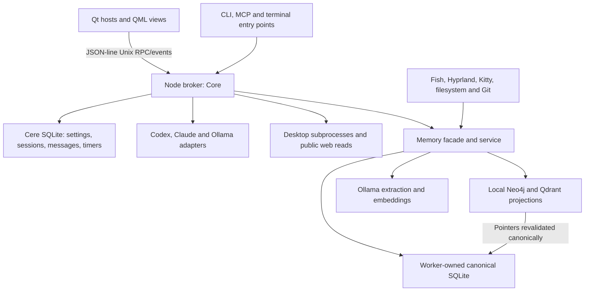

# Cere project review

## 1. Summary

Cere has a substantial native desktop interface, a working broker/provider test suite, and an opt-in graph-memory subsystem with explicit experimental status, but its authorization, erasure, model routing and recovery boundaries need correction before relying on them for sensitive work. This read-only audit found **46 issues: 6 Critical, 15 High, 24 Medium and 1 Low**. The five highest-priority issues are actions retaining revoked automatic authorization (F-001), broker impersonation through an unsafe fallback runtime parent (F-002), forgotten stable memory IDs leaving current content recallable (F-003), local-only text reaching cloud-marked embedding models (F-004), and cloud chat aliases bypassing the memory-sharing opt-out (F-005). A separate critical deletion-confirmation mismatch is F-006. All 98 backend tests passed; strict checking of additional tools found a broken live checker, and native builds/UI execution could not run because the required toolchain/compositor is absent. Every one of the 152 tracked files at the pinned revision was reviewed, including all seven PNGs; no source changes or commits were made. Only this review document is added.

## 2. Project map

**Repository:** [otectus/Cere](https://github.com/otectus/Cere). **Reviewed revision:** `e97f0475e155496d0a44867f953f5354a83f8d38`, the checked-out `main` snapshot. **Audit date:** 2026-09-29. Locations below refer to this revision, not future line numbers. README was read first. The baseline contains 152 tracked files: 145 text files and seven PNGs. No tracked CI workflow, container build file, separate migration directory, localization catalog, or project-specific agent instruction file exists. Memory's initial checksum-validated SQL migration is embedded in `broker/graph-memory/schema.ts`; Docker Compose deployment is in `packaging/memory-compose.yml`. The project has no tracked generated build products; it does have saved benchmark results and generated runtime artwork.

The C++/Qt application is a native host for QML. Its primary UI process owns the tray and expanded workspace; the overlay process owns the layer-shell pet/permission bubble and, with always-on-top enabled, the compact panel. Compact-panel routing switches to the primary host when always-on-top is disabled. Both communicate with the independent Node/TypeScript broker through JSON-line Unix sockets. The broker manages sessions, SQLite state, grants/approvals, desktop commands, web retrieval, provider subprocesses, and HTTP Ollama conversation. Models receive narrowly defined Cere tools through session-scoped MCP capability tokens or the Ollama tool loop. Codex and Claude use their separately installed CLIs and authentication. Linked terminal sessions report lifecycle, while managed sessions receive Cere transcripts, tools and personality.



Memory is shared through `broker/memory.ts` and `MemoryService`; its canonical SQL calls run in a worker. The memory scope binds the saved Ollama host and project CWD; canonical scopes may also have ancestors. Source observations and exact evidence support typed, temporal assertion versions; mutations increment revisions and write ordered projection/extraction jobs. The service drives indexing, extraction, episode consolidation and retention. Neo4j/Qdrant pointers are hydrated through canonical eligibility rather than trusted as authoritative text. Live desktop collectors maintain transient workspace observations. Forgetting first suppresses canonical use and records an external erasure registry, scrubs managed chat history through a persisted retry intent, then tracks separate projection purge acknowledgements. Restore requires the current registry. F-003, F-004/F-005, F-009/F-010 and F-014 identify gaps across these boundaries.

Entry points and configuration:

| Entry point / contract | Behavior and dependencies |
| --- | --- |
| `tools/run.sh`, `tools/cere`, `native/main.cpp` | Workspace/installed launch, broker startup/reuse, native interface or overlay, UI-instance locks. `--show` opens the expanded workspace. |
| `broker/main.ts` | Private broker listener, peer-credential validation, JSON RPC, subscription/events, shutdown. |
| `broker/cli.ts`, `broker/mcp.ts`, `broker/terminal.ts` | Local RPC client; capability-scoped model tool server; terminal lifecycle wrapper. |
| `broker/memory-cli.ts`, Fish emitter/integration | Administrative memory commands; approved, credential-checked collector ingestion. |
| `CMakeLists.txt`, `tools/build.sh`, `PKGBUILD`, `tools/install-user.py` | Native application/tests, N-API peer credentials, locked production dependency staging, Arch/per-user installation. |
| `tests/*.test.ts`, `tests/motion.cpp`, `tests/ui.cpp` | Backend protocol/logic fixtures, native policy/asset tests, actual QML/native UI checks. |
| `tools/check-*.ts`, `tools/live-check.ts`, `tools/probe-providers.ts` | Live validation; some consume provider inference and require isolated state. They were read, but live billed/provider runs were not invoked here. |
| State/config/runtime paths | `$XDG_STATE_HOME/cere/cere.sqlite`; graph memory under the sibling `graph-memory` directory; captures in state `captures`; broker at `$XDG_RUNTIME_DIR/cere/broker.sock`; default Fish collector at `$XDG_RUNTIME_DIR/cere-memory/memory.sock`. `CERE_STATE_DIR` and `CERE_RUNTIME_DIR` select isolated locations. Without XDG runtime, the broker uses `/tmp/cere-UID/cere` (F-002). |
| Settings and dependency configuration | Defaults/types in `broker/types.ts`, validation in `Core.updateSettings`, persisted via Store; model endpoints can be session-pinned. `CERE_CODEX_BIN`, `CERE_CLAUDE_BIN`, `CERE_OLLAMA_HOST`/`OLLAMA_HOST`; graph adapter environment is documented in `docs/memory/operations.md` and `packaging/memory.env.example`. |

Complete directory/file map follows. Names are relative to the directory in the first column; the coverage log gives every full path and review extent.

| Directory | Responsibility | Every tracked file |
| --- | --- | --- |
| `/` (repo root) | Root documentation, manifests, build/package configuration | `.gitignore`, `.node-version`, `CMakeLists.txt`, `PKGBUILD`, `README.md`, `VALIDATION.md`, `package-lock.json`, `package.json`, `tsconfig.json` |
| `artwork/` | Cleanup master and expression-generation provenance | `cere-clean-white.png`, `expressions-prompt.txt` |
| `assets/` | Runtime/legacy sprite textures, masks, catalogs and prompt provenance | `animations.json`, `artwork-prompts.txt`, `cere-atlas.png`, `cere-expressions.png`, `cere-mask.png`, `cere-polished-icon.png`, `cere-polished.png`, `cere.png`, `motions.json` |
| `benchmarks/memory/` | Synthetic 100k retrieval workload, corpus generator, opt-in cloud sample and saved results | `evaluate-extraction.ts`, `extraction-results.json`, `generate-cases.ts`, `results.json`, `run.ts` |
| `broker/` | Broker entry points, session/permission/store contracts, providers, desktop/web tools and memory integration | `cli.ts`, `client.ts`, `core.ts`, `desktop.ts`, `main.ts`, `mcp.ts`, `memory-cli.ts`, `memory.ts`, `models.ts`, `ollama.ts`, `orchestration.ts`, `paths.ts`, `peercred.ts`, `permissions.ts`, `personality.ts`, `providers.ts`, `store.ts`, `terminal.ts`, `types.ts`, `web.ts`, `wire.ts` |
| `broker/graph-memory/adapters/` | Projection/model backends and transient desktop/filesystem/repository collectors | `contracts.ts`, `hyprland.ts`, `kitty.ts`, `live.ts`, `neo4j.ts`, `ollama.ts`, `qdrant.ts`, `workspace.ts` |
| `broker/graph-memory/adapters/fish/` | Fish hook and Python metadata emitter | `cere-memory-emitter.py`, `cere-memory.fish` |
| `broker/graph-memory/` | Canonical schema/contracts/ontology/temporal/ranking engine, worker RPC and orchestration service | `canonical.ts`, `client.ts`, `collector-rpc.ts`, `contracts.ts`, `ontology.ts`, `ranking.ts`, `schema.ts`, `service.ts`, `temporal.ts`, `worker.ts` |
| `docs/` | Full graph-memory reference design | `Cere_Graph_Memory_Implementation.md` |
| `docs/memory/` | Implemented architecture, policy, operations, versions, integration and candid publication/evaluation records | `adapters-validation.md`, `architecture.md`, `evaluation.md`, `implementation-report.md`, `integration.md`, `operations.md`, `policy.md`, `versions.md` |
| `native/` | Qt/QML host/controller, motion/follow policy and N-API peer credentials | `controller.cpp`, `controller.h`, `follow.h`, `main.cpp`, `motion.cpp`, `motion.h`, `peercred.cpp` |
| `packaging/` | User service, desktop entry and pinned local database deployment/environment example | `cere-broker.service`, `cere.desktop`, `memory-compose.yml`, `memory.env.example` |
| `qml/` | Screens, dialogs, approval controls, themed widgets, pet/sprite rendering and module metadata | `ActivityPanel.qml`, `ApprovalBubble.qml`, `ApprovalCard.qml`, `CActionRow.qml`, `CButton.qml`, `CCheckBox.qml`, `CComboBox.qml`, `CDialog.qml`, `CField.qml`, `CScrollBar.qml`, `CSection.qml`, `CSlider.qml`, `CSpinBox.qml`, `CText.qml`, `CereSprite.qml`, `Chat.qml`, `Desktop.qml`, `GesturePlayer.qml`, `GraphMemoryInspector.qml`, `KnowledgeSettings.qml`, `MemoryDialog.qml`, `MessageCard.qml`, `NewSession.qml`, `OllamaConnection.qml`, `OllamaSessionDialog.qml`, `PageScroll.qml`, `Panel.qml`, `PersonalitySettings.qml`, `Pet.qml`, `SectionLabel.qml`, `SessionList.qml`, `Settings.qml`, `Shell.qml`, `Theme.qml`, `Workspace.qml`, `qmldir` |
| `tests/` | Backend suites and native motion/UI suites | `core.test.ts`, `desktop.test.ts`, `knowledge.test.ts`, `memory-adapters.test.ts`, `memory.test.ts`, `models.test.ts`, `motion.cpp`, `ollama.test.ts`, `providers.test.ts`, `ui.cpp` |
| `tests/fixtures/memory/` | All 70 annotated retrieval cases, including source timelines and expected/forbidden evidence | `retrieval-cases.json` |
| `tests/fixtures/` | Deterministic provider and Ollama subprocess/server fixtures | `permissions-cli.mjs`, `ui-codex.mjs`, `ui-ollama.mjs` |
| `tools/` | Build/install/launch/staging, artwork preparation, dependency lifecycle and smoke/live/idle validation utilities | `build.sh`, `cere`, `check-knowledge.ts`, `check-memory-adapters.ts`, `check-memory-install.py`, `check-ollama.ts`, `clean-artwork.py`, `install-user.py`, `live-check.ts`, `measure-idle.py`, `memory-dependencies.sh`, `prepare-assets.py`, `probe-providers.ts`, `run.sh`, `stage-runtime.mjs`, `stop-test-broker.ts` |

## 3. Verification performed

Commands ran from the repository root unless an absolute scratch path is shown. The audit runtime was Linux x64, Node **v24.19.0**, linked SQLite **3.53.3**, and npm **11.9.0**. This satisfies the package's Node >=24 requirement and canonical SQLite >=3.51.3 guard, but differs from the publication's validated Node 26.8.2. Elevated execution was used only where the managed sandbox blocked networking, loopback sockets or subprocess fixtures. Disposable state directories, test-owned processes and synthetic text were used throughout. No real cloud inference, user conversation, installed Cere service, live desktop action, or dependency deployment was used.

| Exact command / check | Result and observed output |
| --- | --- |
| `git clone --depth 1 https://github.com/otectus/Cere.git Cere` | First attempt exit 128: proxy connection failure to port 8889; repeated with permitted network execution, exit 0. README was already read through the GitHub connector before clone. |
| `git rev-parse HEAD`; `git ls-files`; `git status --short` | Pinned commit above; 152 tracked files; clean working tree before the report. |
| `node -p 'JSON.stringify({node:process.version,sqlite:process.versions.sqlite,platform:process.platform,arch:process.arch})'` | `{"node":"v24.19.0","sqlite":"3.53.3","platform":"linux","arch":"x64"}`. |
| `npm ci --ignore-scripts` | Restricted attempt stalled and was interrupted (exit 130); permitted repeat exit 0, `added 34 packages in 2s`. Manifest and lockfile unchanged. |
| `npm test` | Restricted attempt exit 1 with Node callback assertion and blocked fixture sockets/subprocess output. Permitted repeat **exit 0: tests 98, pass 98, fail 0, cancelled 0, skipped 0, todo 0**, duration 4232.058273 ms. Sandbox-only failures were not filed as defects. |
| `node --test tests/core.test.ts tests/desktop.test.ts` | Permitted run exit 0: 27 passed, 0 failed, 0 skipped; duration 3245.398432 ms. Restricted subprocess failures disappear outside the sandbox. |
| `node --test tests/memory-adapters.test.ts` | Permitted run exit 0: 9 passed, 0 failed. Restricted first attempt had fixture execution restrictions. |
| `node --test tests/memory.test.ts` | Exit 0; restricted runner reported one passing file-level test. Individual assertions are also covered by the permitted 98-test full-suite result. |
| `npm run typecheck` | Exit 0, `tsc --noEmit`. Its configured scope is broker/tests, excluding tools/benchmarks. |
| `node node_modules/typescript/bin/tsc --noEmit --target ES2023 --module NodeNext --moduleResolution NodeNext --strict --allowImportingTsExtensions --erasableSyntaxOnly --skipLibCheck tools/*.ts benchmarks/memory/*.ts` | **Exit 2**: three diagnostics below; F-044. |
| `./node_modules/.bin/tsc --noEmit --target ES2023 --module NodeNext --moduleResolution NodeNext --strict --allowImportingTsExtensions --erasableSyntaxOnly --skipLibCheck benchmarks/memory/*.ts` | Exit 0, no diagnostics. |
| `npm run build` | **Exit 127**, `./tools/build.sh: line 9: cmake: command not found`. Environment prerequisite failure, not evidence of a source build defect. |
| `npm audit --omit=dev --json`; `npm audit --json` | Both permitted runs exit 0; `vulnerabilities:{}`, total known reported vulnerabilities 0. Full lockfile metadata: prod 32, dev 3, total 34 (npm's category counts overlap). Registry data is a point-in-time advisory check, not proof of dependency safety. |
| `node tools/stage-runtime.mjs /workspace/scratch/c3aad0ee012f/audit/staged/runtime` | Exit 0; all locked production package directories staged. Import smoke checks of `linkedom`, `neo4j-driver` and `zod` succeeded independently from the staged runtime. |
| `systemd-analyze --user verify packaging/cere-broker.service` | Exit 1: `Failed to lookup RuntimeDirectory path: No such device or address` and `Failed to initialize manager`; no user service manager is available. |
| `python3 tools/prepare-assets.py` | **Exit 1**, `FileNotFoundError: .../Cere/all-states.gif`; no tracked GIF exists (F-043). Failure occurred before any output write. |
| `g++ -std=c++17 -D_GLIBCXX_ASSERTIONS /workspace/scratch/c3aad0ee012f/audit/native-clamp.cpp -o /workspace/scratch/c3aad0ee012f/audit/native-clamp` then `/workspace/scratch/c3aad0ee012f/audit/native-clamp` | Compilation exit 0; isolated source-arithmetic execution aborts: `screenHeight=720 panelHeight=680 low=40 high=27`, then assertion `!(__hi < __lo)` failed. F-036; this is not a running Qt application. |
| `python3 /workspace/scratch/c3aad0ee012f/audit/native-cross-output.py` | Exit 0; numerical source-policy reproduction: visible seam step 192 px versus expected per-frame maximum 1.2 px. F-037; no compositor rendering claim. |
| `CERE_MEMORY_BENCH_DIR=/workspace/scratch/c3aad0ee012f/audit/benchmark-copy/workload node /workspace/scratch/c3aad0ee012f/audit/benchmark-copy/benchmarks/memory/run-instrumented.ts` | Exit 0 on a copied/instrumented scratch runner: `relationalRecallTarget:false`, `improvementOverVectorFivePoints:false`, `correctionP95Under100Ms:true`, `rejectedByEligibility:[]` on the current corpus. A separate targeted future-bound candidate proves the filtering defect in F-028. No tracked corpus or result file was regenerated. |

Extended TypeScript output, verbatim:

```text
tools/check-knowledge.ts(40,124): error TS7006: Parameter 'r' implicitly has an 'any' type.
tools/check-knowledge.ts(61,115): error TS2339: Property 'rows' does not exist on type 'Promise<any>'.
tools/check-knowledge.ts(61,125): error TS7006: Parameter 'r' implicitly has an 'any' type.
```

Additional syntax/integrity checks were run against **every** applicable tracked file. `json.loads` parsed all eight JSON files; `ast.parse` parsed all six Python files. Each of `bash -n PKGBUILD`, `bash -n tools/build.sh`, `bash -n tools/cere`, `bash -n tools/run.sh`, and `bash -n tools/memory-dependencies.sh` exited 0 with no diagnostics. Each of `node --check tools/stage-runtime.mjs`, `node --check tests/fixtures/permissions-cli.mjs`, `node --check tests/fixtures/ui-codex.mjs`, and `node --check tests/fixtures/ui-ollama.mjs` exited 0. No interpreter execution of installers or cleanup scripts was needed to read their logic.

Pillow decoded and verified all seven PNGs, followed by complete-image visual inspection. The 10,944-pixel-wide legacy atlas was inspected as a complete reduced-resolution sheet; its dimensions and runtime crop/alpha contracts were checked numerically. All 24 current runtime frames pass coordinate/bounds, transparent gutter and alpha checks equivalent to the static asset tests. This does not claim pixel-by-pixel artistic QA. Resource JSON and all provenance prompts were read in full.

Targeted synthetic harness commands and observations:

| Command (temporary harness) | Result / findings established |
| --- | --- |
| `node /workspace/scratch/c3aad0ee012f/audit/canonical-repros.ts` | Reproduced retained edited/logical-ID memory after forgetting; opposite-polarity coexistence; same-slot CHECK failure; unchanged expiration reprocessing; epoch-stranded work; retryable episode freeze; question accepted as fact; inherited-anchor/provenance mismatch; recorded-only identity decisions. Exact observations and recipes are in F-003, F-009–F-013, F-025, F-026 and F-029. |
| `node /workspace/scratch/c3aad0ee012f/audit/memory-adapter-repros.ts` | Synthetic local HTTP/worker fixtures reproduced cloud-marked dispatch (no actual cloud call), revoked live metadata, deletion blocked by embedding identity, nested Git ENOENT, title capture off despite flag, assistant-to-user trust escalation, a 25 ms deadline taking 186 ms over nine requests, dead-worker pending call, workspace 1→2 reported as 1→1, and uncertain date accepted as bounded. F-004/F-005, F-014/F-015/F-017, F-030–F-035. |
| `node /workspace/scratch/c3aad0ee012f/audit/providers-repro.mjs` | Reproduced cached dead Codex adapter failing first explicit resubmission; orphaned capture/tool context; one missing model breaking catalog; user/assistant memory policy rejection breaking chat. F-016, F-038–F-040. |
| `node /workspace/scratch/c3aad0ee012f/audit/qml-repros.ts` | Executed actual canonical APIs with QML-generated payloads/handler logic: preview A deletes B, correction loses negative/planned semantics, stale editor overwrites, health lacks policy, two same-session composers diverge. F-006, F-019/F-021/F-041/F-042. No live QML execution claim. |
| `node /workspace/scratch/c3aad0ee012f/audit/broker-core-repro.ts` | Controlled fake adapters/commands established timer duplication, no Stop timer while interrupt waits, grant revocation after bookkeeping, 17 MiB history rejection, abort ignored by capture, and missing nested desktop entry. F-001/F-007/F-022–F-024. The grant case uses a tools-enabled Ollama session; the asynchronous memory gate is held deliberately rather than requiring a slow real backend. |
| `node /workspace/scratch/c3aad0ee012f/audit/grant-approval-repro.ts` | Permitted isolated rerun of the corrected tools-enabled Ollama grant fixture: exit 0, `grant-revocation {"remainingGrants":[],"approvals":0,"scriptOutput":"grant-revocation-executed"}`. This held bookkeeping fixture simulates active memory without cloud/model dispatch. |
| `node /workspace/scratch/c3aad0ee012f/audit/runtime-parent-repro.ts` | Isolated foreign-UID parent/server fixture: private leaf accepted, replaced through its parent, forged JSON accepted by client. No real runtime directory touched. F-002. |
| `bash tools/memory-dependencies.sh local-stop` with a temporary `DEPS_HOME` containing a test-owned unrelated sleep PID | Exit 0; controlled sleep terminated with SIGTERM (`-15`). No user application or live dependency touched. F-045. |

These temporary harnesses were audit aids outside the checkout and are not additional deliverables. The evidence fields specify the source inputs, state transitions and expected assertions needed to add permanent repo tests; existing tests provide fixture setup. Findings marked confirmed by source proof do not require pretending a native/live test ran.

Could not execute `build/cere-motion-check`, `build/cere-ui-check`, `makepkg`, staged native installation smoke, QML lint, live Fish/Kitty/Hyprland integration, or actual Neo4j/Qdrant/Ollama/provider inference checks. This environment lacks CMake, Ninja, Qt/LayerShellQt, Node development headers, Arch packaging tools, QML tooling, Fish, shellcheck, Docker/Podman and a live compositor/user service session. Native binaries were never produced. g++ alone enabled the pure arithmetic reproduction. Real provider calls would also require authenticated installed CLIs/models and can incur usage. Historical successes and the **18-pass/2-fail** full UI run in `docs/memory/implementation-report.md` were checked as documentation, not repeated here; its open composer-focus and cross-output failures remain release risks. They are not inferred to share a proven root cause with the geometry findings.

## 4. Findings

Entries are ordered by the requested severity definitions; IDs are sequential and stable within this document. “Confirmed” includes either a reproduced failure or a direct source/data-flow proof, stated explicitly. No suspected issue is represented as a reproduced exploit. Related IDs specify implementation/test dependencies; independent issues should not be merged merely because they touch the same file.

### F-001 — Revoking a broad grant does not invalidate an action waiting in memory bookkeeping

- **ID** — F-001
- **Severity / Category** — Critical / Security
- **Location** — `broker/core.ts:L353-L374`; settings mutation `broker/core.ts:L324-L340`.
- **Description** — The broad project grant is evaluated once before deciding to skip approval. With memory enabled, the action subsequently awaits `authorized` and `running` memory events. After these awaits, the code only rechecks category enablement and saved-script equality. Revoking the grant, changing away from the broad profile, or disabling a bypass while keeping its category enabled does not revoke the prior automatic authorization.
- **Evidence** — An isolated Core fixture with an Ollama tools-enabled session used a broad `scripts` grant and a saved harmless `/usr/bin/printf`. `memory.actionEvent` was paused at the `authorized` phase; `updateSettings({grants:[]})` then completed; resuming bookkeeping yielded `grant-revocation {"remainingGrants":[],"approvals":0,"scriptOutput":"grant-revocation-executed"}`. The tool category remained enabled. There was no manual approval for this execution.
- **Confidence** — confirmed
- **Impact** — A script or sensitive desktop action can execute after the user has revoked the only grant that allowed it to skip approval. Existing tests cover category removal and bypass revocation only when that also disables the category, so they do not cover this case.
- **Proposed fix** — Record the action's authorization source (explicit allow versus automatic grant/bypass) and an authorization revision. Before every side-effect boundary following an await, revalidate current pause/category and, for automatic authorization, the same still-valid project grant/profile/bypass. If its authority changed, abort with a request-again error or obtain fresh approval; never silently retain the old automatic authorization. Explicit manual approval should not require an unrelated broad grant.
- **Acceptance criteria** — Add the controlled memory-event regression described above using an Ollama tools-enabled session with memory enabled and a saved harmless executable. Assert removing the matching grant, expiring it, changing broad to scoped, and switching bypass off with the category still enabled prevents execution without a new allow response. Ensure valid retained grants and manual allow responses still execute exactly once.
- **Related** — F-007. Revalidation before execution and cancellation after execution begins are separate checks.

### F-002 — Unsafe fallback runtime parent permits cross-user broker impersonation

- **ID** — F-002
- **Severity / Category** — Critical / Security
- **Location** — `broker/paths.ts:L9-L16`; `broker/client.ts:L6-L11`; `broker/main.ts:L10-L19`; native client connection also lacks server credential verification at `native/controller.cpp:L111-L115`.
- **Description** — The fallback runtime has two components under shared temporary storage, `/tmp/cere-<uid>/cere`. `privateDir()` recursively creates both but verifies ownership, symlinks and permissions only for the final `cere` directory. Another UID can precreate the outer directory, then rename the legitimate user's private leaf and replace it with a directory and broker socket under the attacker's control. The Node client accepts replies from that different-UID socket. Incoming server-side `sameUserPeer()` does not authenticate the server to clients.
- **Evidence** — An isolated root-run fixture created a temporary parent owned by UID 65534, called `privateDir(parent + '/cere')` as UID 0, then launched a genuinely UID-65534 child that renamed the private leaf, created its replacement and served forged JSON. Exact output: `privateDir-accepted {"parentUid":65534,"leafUid":0,"clientUid":0}` followed by `client-accepted {"forged":"foreign-user server","serverUid":65534}`. No real runtime directory was used. The accepted private leaf does not protect against rename by its parent owner.
- **Confidence** — confirmed (reproduced with a foreign-UID Unix socket server)
- **Impact** — On a multi-user host with the affected runtime layout, a local attacker can impersonate the broker to Node clients and receive subsequently submitted RPC data. The unauthenticated native connection has the same source-level exposure; native forged-state rendering was not run here. Existing same-user checks on the legitimate broker do not prevent this pathname substitution.
- **Proposed fix** — Build the default fallback base separately and validate it before creating its child: require a real directory owned by `getuid()`, mode 0700, and no symlink; reject a foreign-owned existing base instead of chmodding/using it. Apply equivalent checks to explicitly configured runtime roots and unsafe writable ancestors up to a trusted owner-private boundary, allowing the shared `/tmp` only above the secure owned base. Also feature-test SO_PEERCRED on outgoing broker sockets and reject a server UID different from the current UID, including the native QLocalSocket client. Do not regard successful `occupied()` connection alone as proof of a trusted running broker.
- **Acceptance criteria** — Add a path test for a preexisting foreign-owned fallback base and a symlinked base (both rejected without modifying them); test ordinary private runtime creation. In a privileged isolated integration fixture, launch a socket server as a second UID and assert both Node/native clients reject it before sending any RPC payload. Keep the legitimate same-UID server working.
- **Related** — None.

### F-003 — Forgetting stable memory IDs can leave their current content recallable

- **ID** — F-003
- **Severity / Category** — Critical / Security
- **Location** — `broker/graph-memory/canonical.ts:L591-L614`, `broker/graph-memory/canonical.ts:L1697-L1755`, especially `broker/graph-memory/canonical.ts:L1719-L1727` and `broker/graph-memory/canonical.ts:L1739-L1753`.; broker/graph-memory/canonical.ts:L1948-L1982
- **Description** — Saved-note replacement assigns its new artifact the original observation's `record_id` without linking the replacement observation into that stable record's history. Erasure of the visible note ID finds the original observation and both note artifacts, but misses the replacement observation and its witness/assertions. Separately, a logical assertion ID is resolved to only one arbitrary `assertion_versions` row, so erasing that logical ID may remove only its oldest supporting occurrence while rederiving the current repeated claim from later occurrences. Both failures are incomplete resolution of the stable identity's full source/version lifetime before descendant erasure.
- **Evidence** — Reproduction: save `Atlas uses Black for formatting.`, edit the same note to `Atlas uses Ruff for formatting.`, remember the replacement's exact witness, then forget the visible original ID. It returns `suppressed:true`, yet replacement observation has `erased:0`, a live witness still contains the replacement, and retrieval returns `Atlas USES_TOOL Ruff {"purpose":"formatting"} [actual; known_current]`. A second reproduction remembers Ruff twice, obtains the current row's `logical_id`, forgets that logical ID, and still retrieves Ruff. `inspect` explicitly supports logical IDs, so this is an accepted identifier class, not an invalid caller.
- **Confidence** — confirmed (both reproduced)
- **Impact** — A user is told deletion is suppressed while the edited/repeated content remains in canonical evidence and model recall. The missed source remains eligible for direct remember and can be reintroduced if later queue reconciliation/re-extraction runs; already extracted assertions remain recallable now. Backup/restore replay inherits the incomplete target set.
- **Proposed fix** — Introduce one resolver for a requested stable memory ID that enumerates all note revisions, their actual observation IDs, all assertion versions sharing a logical ID and all their supporting source occurrences before building the erasure closure. Preserve the distinction between deleting one explicitly selected observation and deleting a whole note/logical assertion. Record a replacement-note relationship or a note ID separate from observation identity; perform creation and stable note revision replacement atomically. For existing notes, derive replacement sources from artifact -> evidence lineage instead of assuming `record_id` is the observation. Use the same expansion for preview, source-history scrubbing, suppression and registry replay. Retain source-occurrence deletion's independent-survivor behavior; whole-note/logical-fact deletion must not rederive from another version's own evidence. Repair existing data as well as future deletes: reconcileRegistry currently skips intents already present in erasure_jobs. Use retained artifact/evidence lineage to find missed edited-note sources for previously applied intents; append and fsync supplementary intents for newly discovered descendants before suppressing and queueing purge. Keep original registry entries immutable and repair idempotent. Future intents must retain selector kind and stable identity as well as resolved targets. Old target-only registries may not distinguish whole-logical-fact deletion from one source occurrence; do not infer broader destruction from that ambiguity. Expose unresolved legacy-selector repair for review and never silently report that ambiguous closure is complete.
- **Acceptance criteria** — Tests save+edit+extract+forget using the ID returned by `list(saved)`, including two edits and restart/backup restore, and assert no live payload, witness, assertion, lexical document, embedding record or retrieval result contains any revision's text. A repeated assertion deleted through `logical_id` removes all its source occurrences; deleting only the first observation still preserves independently supported current facts as the existing test requires. Replaying a pre-erasure backup with the current registry produces the same suppression. Start from a pinned database where edited-note forgetting already ran; upgrade/reopen with its current registry and require the leaked replacement to be suppressed and queued for purge. Reopen twice to prove supplementary repair is idempotent. A legacy intent whose selector cannot be reconstructed must expose the unresolved repair rather than silently over-delete independent sources.
- **Related** — F-017 must be covered by the same saved-note replacement regression. F-009 must not requeue missed erased sources; F-006 must use the same complete target resolver; F-030 completes physical vector purge independently.

### F-004 — Production embedding bypasses the local-only adapter checks

- **ID** — F-004
- **Severity / Category** — Critical / Security
- **Location** — broker/graph-memory/service.ts:L150-L167,broker/graph-memory/service.ts:L169-L201,broker/graph-memory/service.ts:L304-L313,broker/graph-memory/service.ts:L537-L551; broker/graph-memory/adapters/ollama.ts:L224-L230; broker/graph-memory/canonical.ts:L2605-L2612
- **Description** — The production memory service does not use OllamaEmbeddingAdapter, whose identity() rejects cloud embedding models. Its identity() merely obtains a digest, and embed() forwards text with the general HTTP helper. Pending artifacts are embedded without checking sensitivity or route. Therefore protected source bodies can be submitted to a remote-marked embedding model even with both cloud permissions disabled.
- **Evidence** — The synthetic loopback fixture advertised 'embed-alias' with remote_host:'https://ollama.com' and embedding capability. Set memory.model:'embed-alias', allowCloudExtraction:false, allowCloudMemory:false, and observe a local_only passage. Calling recall caused /api/embed input to contain the local_only passage. Production identity() accepted the model; in contrast the standalone adapter has `if (info.cloud) throw new Error('Embedding model must be local')`. This verifies application dispatch to a cloud-marked model without making a real cloud request.
- **Confidence** — confirmed
- **Impact** — The local_only storage restriction protects chat/extraction eligibility but fails before semantic indexing. An embedding route can expose source content that the user intended to retain locally.
- **Proposed fix** — Use one production embedding identity implementation with explicit endpoint/model-route validation. Enforce local model routing before document/query embedding; at minimum reject cloud-backed embedding models and apply local_only sensitivity to every outbound artifact. Carry source sensitivity and the applicable policy epoch into index work and foreground overlay embedding, then revalidate immediately before dispatch. Keep lexical recall available when embedding is denied. Add shared metadata route validation to the production identity/embed path while preserving its Nomic prefixes, bounded Unicode chunks, weighted averaging, batching and configured remote Ollama-server compatibility. Do not blindly substitute the standalone adapter, which imposes a different loopback/dimension contract. A remote server and a cloud-backed model are distinct routing facts.
- **Acceptance criteria** — Exercise both project('vector') and retrieve() against a remote-marked embedding alias. Assert that no /api/embed request receives any memory body when that route is disallowed, and that local_only artifacts are never remotely dispatched even when other cloud permissions are enabled. Local fixture embedding and lexical degradation must continue to work.
- **Related** — F-005. Share the route classifier and test both outbound boundaries together.

### F-005 — Cloud aliases bypass the recalled-memory privacy gate

- **ID** — F-005
- **Severity / Category** — Critical / Security
- **Location** — broker/memory.ts:L156-L164; broker/ollama.ts:L114-L137; broker/core.ts:L46-L49; broker/graph-memory/service.ts:L629-L630
- **Description** — Memory.recall determines the chat route using only /cloud/i.test(session.model). A cloud-backed model registered under an ordinary alias is explicitly identified as cloud in the provider catalog but receives model_route:'local'. Canonical local-only restrictions and allowCloudMemory:false are consequently bypassed, including when assembling the chat prompt.
- **Evidence** — The production line is `model_route: /cloud/i.test(session.model) ? 'cloud' : 'local'`. Reproduction used isolated Core/Store and a loopback Ollama fixture: /api/tags advertised model 'remote-alias' with remote_host:'https://ollama.com', valid digest, and /api/show advertised completion. With memory.enabled:true and allowCloudMemory:false, insert one observe_text source with sensitivity:'local_only' and one saved note, then recall 'orchid' and send a turn. Catalog cloud was true, both protected records were returned, and the sole /api/chat request contained the saved private note. No real cloud service was called.
- **Confidence** — confirmed
- **Impact** — Users selecting cloud aliases disclose retained project memory despite disabling cloud recall; even sources explicitly marked local_only can enter a cloud prompt.
- **Proposed fix** — Resolve the actual model route from the conversation's saved server and current /show plus /tags metadata before memory retrieval. Share this classifier with model discovery and extraction; honor remote_host, remote_model, and supported cloud suffixes. Pass an explicit verified route into Memory.context/recall, and fail closed for memory dispatch if the route cannot be determined. Recheck route/policy before /chat dispatch so aliases or routing changes cannot change consent.
- **Acceptance criteria** — Add an integration test whose alias has no 'cloud' substring but advertises remote_host. With allowCloudMemory:false, neither saved notes nor local_only passages may appear in recall results or any /chat body. With cloud recall enabled, cloud_allowed notes may appear but local_only sources must still be withheld. Cover /show-only remote metadata and route changes on an existing session.
- **Related** — F-004; F-014.

### F-006 — Forget confirmation is not bound to the previewed record

- **ID** — F-006
- **Severity / Category** — Critical / Bug
- **Location** — `qml/GraphMemoryInspector.qml:L44-L51`; `qml/GraphMemoryInspector.qml:L79-L79`; `broker/graph-memory/canonical.ts:L1777-L1784`; `broker/graph-memory/canonical.ts:L1802-L1819`; `broker/memory.ts:L126-L129`.
- **Description** — The inspector retains a forgetting preview while the editable record ID changes. Its confirmation submits the current record ID and the previous preview revision. The revision checks protect against intervening database mutation, but do not bind the target to the preview. Merely selecting or typing another ID does not change that revision. The button therefore deletes a different record from the one previewed.
- **Evidence** — The UI displays `inspector.preview.count`, but submits `inspector.call("forget",{id:record.text,expected_revision:inspector.preview.revision})`. There is no `record.text` change handler that invalidates the preview. Canonical's `forget()` recomputes `forgetPreview(p)` from the submitted ID and compares only `expected_revision` with `this.revision`. Synthetic actual Canonical reproduction: create independent saved Alpha/Beta notes; preview Alpha; submit Beta plus Alpha's preview revision. Result: Alpha's observation remains (`erased=0`), Beta's becomes erased (`erased=1`).
- **Confidence** — confirmed (actual canonical deletion reproduced; QML dispatch contract proven from source)
- **Impact** — A user inspecting multiple records can erase the wrong note, its supporting sources, dependent copies, and managed-history passages. The confirmation still describes the earlier preview.
- **Proposed fix** — Capture an immutable preview selection `{sessionId,id,revision,target_ids,count}` when `forget_preview` completes. Invalidate it immediately on record/session changes, another inspection, reopening, mutation, or a revision-conflict response. Render the confirmed ID and deletion impact explicitly. Submit the captured preview ID, never the mutable field. Disable confirmation unless the captured session/ID still match current selection. For stronger API guarantees, return a selection token/digest from preview and validate the same selector/targets in erase before transcript scrubbing or suppression; never relax revision checks.
- **Acceptance criteria** — Add a native UI regression with two independent notes: preview A, then edit the field/select B; confirmation must disappear or be disabled, and neither note is erased. Fresh preview B permits only B deletion. Add a backend selector-token test if that additional guarantee is implemented. Preserve the existing stale-revision rejection.
- **Related** — F-003 for target expansion; F-018 must fail lost mutations without replay; F-042 for inspector initialization.

### F-007 — Stop deadline is armed after interruption completes, and capture execution ignores cancellation

- **ID** — F-007
- **Severity / Category** — High / Reliability / performance
- **Location** — `broker/core.ts:L258-L271`; `broker/desktop.ts:L100-L123`, `broker/desktop.ts:L125-L128`, `broker/desktop.ts:L153-L155`; `broker/ollama.ts:L343-L344`; `broker/providers.ts:L135-L136`; `broker/wire.ts:L45-L50`; `broker/core.ts:L570-L570`, `broker/core.ts:L575-L585`.
- **Description** — `stopTurn()` awaits `adapter.interrupt()` before creating the ten-second forced-stop timer. Codex interruption can wait for initialization and then the default 60-second RPC timeout. Ollama interruption awaits its entire task. Screenshot execution calls `captureInSatty()` without the supplied AbortSignal, and its Satty process has no timeout. Leaving the editor open therefore keeps Ollama interruption pending indefinitely, so the fallback is never armed. MCP-originated actions also receive no session cancellation signal at all.
- **Evidence** — A fake adapter whose `interrupt()` awaits a controlled promise yielded `stop-deadline {"status":"stopping","forceStopTimers":0}` after Stop had started. A synthetic Satty executable, started through the real `desktopAction('screenshot.capture', ..., signal)` call, was held open for one second; aborting the signal yielded `capture-abort {"signalAborted":true,"settled":false}` and the call later returned `{"path":"<temporary>/captures/<uuid>.png","message":"Capture saved from Satty"}`. These used fake desktop executables and no real capture. Source proves an indefinitely open editor gives an indefinitely pending task.
- **Confidence** — confirmed
- **Impact** — Stop remains stuck in `stopping`, a session cannot accept another turn, and broker shutdown can await that same task forever. A provider timeout also exceeds the advertised ten-second fallback. Cere-owned CLI MCP side effects are not associated with a cancelable broker action lifetime.
- **Proposed fix** — Arm the interruption deadline immediately when transitioning to `stopping`, before awaiting anything. Race interruption against a bounded force-close path, and make that force-close path itself bounded. Track per-session in-flight Cere action AbortControllers; combine them with caller signals and abort them on Stop/disconnect/close, including MCP-originated calls. Pass the signal through Satty capture prerequisite checks, monitor query, grim, the delayed capture step and Satty exec. Preserve `finally` cleanup of the raw image and capture lock. An interactive user-started capture may remain open during normal UI use, but shutdown must cancel owned work. Pass session cancellation through foreground memory/action bookkeeping too; a dead worker must reject promptly rather than hold interruption open.
- **Acceptance criteria** — Add an adapter fixture that never acknowledges interruption and assert the session becomes interrupted within the configured deadline and can receive a new turn. Hold a fake Satty editor indefinitely, invoke Ollama Stop, assert editor termination, raw-file removal, release of the capture lock, and successful next turn. Cover broker close during the same capture and a CLI MCP saved script in flight. Verify real provider interruption still produces one terminal outcome.
- **Related** — F-035 before memory cancellation/degradation can rely on rejection; F-016; F-038.

### F-008 — Public-address filter rejects the entire public 192.0.0.0/16 range

- **ID** — F-008
- **Severity / Category** — High / Bug
- **Location** — `broker/web.ts:L26-L35`; consumers `broker/web.ts:L42-L43`, `broker/web.ts:L55-L60`.
- **Description** — The IPv4 exclusion `(a === 192 && (b === 168 || b === 0))` treats every address with first two octets `192.0` as private/reserved. The relevant special protocol block is `192.0.0.0/24`, and the documentation block is `192.0.2.0/24`; the remaining /16 contains ordinary public allocations, including Automattic's `192.0.64.0/18`.
- **Evidence** — Deterministic calls produce `publicAddress('192.0.78.24') === false` and `publicAddress('192.0.66.80') === false`; `8.8.8.8` is accepted. IANA's special registry lists the /24 boundary: https://www.iana.org/assignments/iana-ipv4-special-registry . ARIN's primary allocation record assigns `192.0.64.0/18` to AUTOMATTIC: https://whois.arin.net/rest/net/NET-192-0-64-0-1.html . A live DNS lookup of wordpress.com was attempted but failed with environment `EAI_AGAIN`; no live website fetch is claimed.
- **Confidence** — confirmed
- **Impact** — Web reading rejects legitimate sites in those public allocations, whether given as an IP URL or reached through DNS, reporting a private-network error. This breaks normal source verification for affected results.
- **Proposed fix** — Replace the broad `b === 0` predicate with the actual special prefixes: retain `192.168.0.0/16`, reject `192.0.0.0/24` and `192.0.2.0/24`, and retain all other current exclusions. Prefer a clearly tested CIDR table using `BlockList` so prefix widths are explicit; choose a policy for globally reachable special anycast exceptions and document it. Preserve DNS address pinning and per-redirect validation.
- **Acceptance criteria** — Add boundary tests accepting `192.0.78.24`, `192.0.66.80`, and adjacent ordinary ranges while rejecting `192.0.0.1`, `192.0.2.1`, `192.168.1.1`, private/mapped IPv6, loopback, link-local, multicast and documentation blocks. Use an injected resolver/transport to assert accepted public DNS results proceed and mixed public/private DNS answers still fail closed.
- **Related** — None. Existing DNS pinning and redirect checks must remain in place; no private-network SSRF exploit was demonstrated.

### F-009 — Global policy/erasure epoch changes permanently strand unrelated extraction work

- **ID** — F-009
- **Severity / Category** — High / Reliability / performance; Incompleteness
- **Location** — `broker/graph-memory/canonical.ts:L1828-L1832`, `broker/graph-memory/canonical.ts:L1985-L2005`, `broker/graph-memory/canonical.ts:L2282-L2287`, `broker/graph-memory/canonical.ts:L2296-L2307`, `broker/graph-memory/canonical.ts:L2331-L2331`.
- **Description** — Extraction selection requires both stored epochs to equal the global current epochs. Any forget advances the erasure epoch, making all unrelated pending runs ineligible, but they remain pending. Any policy edit changes pending/running jobs to `revoked`, even changes to a ranking/retention parameter. Neither class is rescheduled: retry only updates `retryable` runs, and extraction error reporting rejects stale epochs before it can mark an in-flight run retryable.
- **Evidence** — Create two observations `Forget me` and `Keep me`, forget the first. The second run remains `{status:"pending",erasure_epoch:0}` against global epoch 1 and `extractionNext()` returns null. `retry({scope_id})` still yields null. Updating `half_life_days` to 100 changes that surviving run to `revoked` and it remains unselectable. The extraction service catches the stale result and its attempt to write `MODEL_UNAVAILABLE_OR_INVALID` is itself discarded by this epoch check.
- **Confidence** — confirmed (reproduced; service caller traced)
- **Impact** — Ordinary forgetting, retention expiration or memory setting changes silently stop extraction of already captured eligible observations across every project. The health queue can advertise work that no worker can ever claim. Restart does not repair pending/revoked epochs.
- **Proposed fix** — Keep stale in-flight publication fail-closed, but explicitly cancel and re-evaluate surviving pending/running/revoked runs against current source erasure, payload availability, capture/extraction policy and cloud restrictions. Reschedule eligible retained sources with current epochs; leave denied/erased sources terminal with a reason. Separate non-authorizing rank/retention setting changes from extraction consent changes where appropriate. Make retry cover a revalidated stale/revoked class, and perform queue transitions in the same canonical mutation that advances an epoch. Ensure disabling extraction does not immediately dispatch work; reenabling should reconcile permitted backlog.
- **Acceptance criteria** — Forget an observation in project A while project B has pending and in-flight extraction. B is eventually extracted, A is never published and an old in-flight result is rejected. Repeat with raw expiration and benign policy edits. Disable/reenable cloud or capture policy and verify no denied source is rescheduled or sent while disabled, but eligible work resumes after approval. Restart preserves these properties.
- **Related** — F-003 before requeueing; F-010; F-026.

### F-010 — Retained-witness raw expiration reprocesses the same source forever

- **ID** — F-010
- **Severity / Category** — High / Reliability / performance
- **Location** — `broker/graph-memory/canonical.ts:L2674-L2693`, especially `broker/graph-memory/canonical.ts:L2676-L2677`, `broker/graph-memory/canonical.ts:L2685-L2689`.
- **Description** — When `retain_evidence` preserves an accepted assertion's witness, raw expiration erases the observation payload but deliberately leaves the observation live. The next expiration query selects it again because the query tests `observations.erased=0` and the old `expires_us`, but does not exclude already erased payloads or clear their expiry. Each pass appends/fsyncs another registry record, commits another erasure epoch and adds projection jobs for the same already removed raw content. Only the first 50 selected observations are processed, so 50 such sources can occupy the entire quota indefinitely and prevent later expirations.
- **Evidence** — A source `Atlas uses Ruff for formatting. Unrelated private detail.` is asserted using only the Ruff sentence; set its raw payload `expires_us=1`. Two sequential `expire()` calls both return `expired:1`; revisions advance 4 -> 5, erasure epochs advance 1 -> 2, and two erasure jobs exist. The supporting assertion remains appropriately live. Existing test only calls expiration once.
- **Confidence** — confirmed (reproduced)
- **Impact** — After the default 30-day retention begins taking effect, maintenance repeatedly invalidates model packets, expands the registry/outbox and performs filesystem flushes. It compounds F-009 and can leave later expired raw data beyond retention.
- **Proposed fix** — Select only non-erased raw payloads (join payloads and require `p.erased=0`), or journal a durable raw-expiration completion flag and clear expiry atomically. Preserve retained evidence and the explicit-forget path. Process the quota in deterministic expiry order so a partially completed batch cannot starve others.
- **Acceptance criteria** — After one retained-witness expiration, a second maintenance call reports zero expired records and does not change revision, erasure epoch, registry length or outbox size for that source. Seed more than 50 expired retained-evidence sources plus an expired unretained source; repeated maintenance drains every raw payload and preserves only required exact witnesses. Keep the existing explicit-forget-after-expiration test.
- **Related** — F-009.

### F-011 — Opposite polarity in a multivalued slot is accepted as two simultaneous facts

- **ID** — F-011
- **Severity / Category** — High / Bug
- **Location** — `broker/graph-memory/ontology.ts:L17-L22`, `broker/graph-memory/canonical.ts:L894-L927`, especially `broker/graph-memory/canonical.ts:L912-L915`, `broker/graph-memory/canonical.ts:L1453-L1459`.
- **Description** — The conflict set detects polarity differences, but normal-assert conflict handling is gated by `rule.single`. A multivalued relation should allow different objects simultaneously; it cannot permit the same object both positively and negatively over overlapping validity intervals. Current code accepts both and presents both in `assertions`, with no conflict warning.
- **Evidence** — Remember `Atlas uses Ruff for formatting.` with `USES_TOOL` and empty qualifiers, then `Atlas does not use Ruff.` with the same subject/object, empty qualifiers and `polarity:'negative'`. Retrieval yields two accepted current assertions: `Atlas USES_TOOL Ruff [actual; known_current]` and `Atlas does not USES_TOOL Ruff [actual; known_current]`; `conflicts.length===0`.
- **Confidence** — confirmed (reproduced)
- **Impact** — Memory supplies contradictory normal-use facts as settled evidence whenever a multivalued tool/dependency/relationship assertion is denied. This can mislead orchestration and does not support the advertised conflict inspector behavior.
- **Proposed fix** — Detect contradiction by target identity/literal plus overlapping valid interval plus opposite polarity independently of slot cardinality. In a multiple slot, dispute/version only the contradictory member(s) and the incoming member; keep unrelated objects accepted. Keep single-valued differing-object conflicts and targeted correction semantics unchanged. Explicit resolution should close the relevant contradictory member set without removing unrelated values.
- **Acceptance criteria** — Tests cover positive then negative, negative then positive, disjoint bounded intervals and explicit resolution for multivalued predicates. Same-target opposite polarity with overlap produces conflicts and no settled fact for that target; unrelated Kitty remains accepted. Non-overlap preserves both historical answers.
- **Related** — F-012; F-013.

### F-012 — Two extraction proposals for one slot roll back an otherwise valid entire extraction

- **ID** — F-012
- **Severity / Category** — High / Bug
- **Location** — `broker/graph-memory/canonical.ts:L155-L156`, `broker/graph-memory/canonical.ts:L770-L780`, `broker/graph-memory/canonical.ts:L912-L927`, `broker/graph-memory/canonical.ts:L978-L982`, `broker/graph-memory/canonical.ts:L2325-L2329`, `broker/graph-memory/schema.ts:L15-L15`.
- **Description** — `applyExtraction` runs every `remember` under a shared transaction revision. A later proposal that repeats or conflicts with a version inserted earlier in the same batch calls `closeVersion`, assigning the same revision to `known_to_revision` as `known_from_revision`. The table requires the end to be strictly greater, so SQLite aborts the entire batch. This affects repeated proposals as well as two single-valued alternatives; no slot-level staging/deduplication exists.
- **Evidence** — Observe `Atlas uses Ruff and Black for formatting.` and apply two exact-quote proposals with `USES_TOOL`/`purpose:formatting`. `applyExtraction` throws `CHECK constraint failed: known_to_revision IS NULL OR known_to_revision>known_from_revision`; canonical assertion count remains 0. A single extraction supports up to 32 proposals and this ordinary source can name multiple alternatives. Existing tests exercise separate transactions only.
- **Confidence** — confirmed (reproduced)
- **Impact** — A valid multi-assertion extraction can lose every unrelated assertion in the batch and be labeled retryable; repeated inference of the same source keeps failing deterministically. Depending on corpus composition this prevents normal structured memory formation.
- **Proposed fix** — Stage and normalize a batch by slot/identity/interval before publication, then write the final version set once for each slot at the batch revision. Deduplicate identical proposals and combine their supports; stage conflicting alternatives as disputed without closing any same-revision inserted version. Preserve a single atomic batch commit and strict positive knowledge intervals. Avoid relaxing the schema constraint or silently dropping conflicting evidence.
- **Acceptance criteria** — Submit one batch with duplicate proposals, same-slot competing tools, disjoint bounded intervals and an unrelated independent slot. It commits once, produces deduplicated/supported or correctly disputed versions, retains the unrelated assertion, and every stored knowledge interval satisfies the constraint. Invalid witness in any proposal still rolls back the complete batch.
- **Related** — F-011.

### F-013 — Model-proposed questions can become accepted actual user facts

- **ID** — F-013
- **Severity / Category** — High / Bug
- **Location** — `broker/graph-memory/canonical.ts:L858-L872`, `broker/graph-memory/canonical.ts:L950-L976`, `broker/graph-memory/service.ts:L439-L487`.
- **Description** — For model proposals, acceptance is decided by subject/object substring presence and a short modal/negation keyword blacklist. It does not distinguish a user question from an assertion, or prove that the quoted relation has the proposed polarity/predicate. Exact-source grounding guarantees that words were said, not that the user asserted the extracted fact. Such proposals receive `accepted`, `actual`, `explicit_user` and normal recall authority.
- **Evidence** — Observe `Does Atlas use Ruff for formatting?`, then submit a `model_proposal:true` actual `USES_TOOL` proposal with the exact full quote. Status is `accepted` and retrieval returns `Atlas USES_TOOL Ruff {"purpose":"formatting"} [actual; known_current]`. The service's `extraction_run_id` uses the same guard branch, so this is the actual extracted-proposal boundary. A question alone does not state this fact.
- **Confidence** — confirmed (reproduced at canonical boundary; model need not be assumed always to emit this proposal)
- **Impact** — An extractor error or source wording can turn a question into a persistent user-authoritative fact used to guide later tasks. The current quote/schema validations do not prevent this class of false memory.
- **Proposed fix** — Add explicit assertion-status validation for source spans before granting accepted/actual user authority: interrogative/hypothetical/reported spans remain candidates, and polarity/predicate semantics must be grounded by a conservative validator or explicit user confirmation. At minimum, questions (including interrogative clauses without a terminal `?`) and affirmative evidence for a negative proposal must fail acceptance. Prefer a safe candidate fallback for unsupported free-form relationship phrasing rather than granting authority based only on co-occurring entity names. Keep exact quotes and schema checks in addition to this step.
- **Acceptance criteria** — Table-driven canonical extraction acceptance tests include direct positive assertions, direct denials, questions, rhetorical/quoted questions, third-party reports, ambiguous co-occurrence and affirmative-source/negative-proposal mismatch. The question above is never in settled `assertions`; candidate recall preserves its uncertainty. Re-evaluate accepted-assertion precision through the canonical boundary, not just the adapter's predicate schema.
- **Related** — F-011; F-017; F-028 for actual canonical accepted-precision evaluation.

### F-014 — Revoking collector roots retains and redispatches captured workspace data

- **ID** — F-014
- **Severity / Category** — High / Security; Reliability / performance
- **Location** — broker/graph-memory/service.ts:L96-L148,broker/graph-memory/service.ts:L629-L635,broker/graph-memory/service.ts:L681-L697,broker/graph-memory/service.ts:L715-L716; broker/graph-memory/adapters/workspace.ts:L62-L87,broker/graph-memory/adapters/workspace.ts:L123-L135; broker/graph-memory/adapters/kitty.ts:L86-L107; broker/graph-memory/collector-rpc.ts:L117-L170; broker/graph-memory/service.ts:L707-L713
- **Description** — Collector restart stops objects but preserves LiveWorkspaceState. Filesystem and repository stop() do not clear or invalidate their previous observations. workspace() spreads the entire snapshot, including stale records, into prompt context without rechecking current source permissions or approved roots. In-flight collector work also retains its emit callback and can republish after stop. startCollectors gates configuration.enabled rather than the canonical policy.enabled returned by policy_get.
- **Evidence** — Seed LiveWorkspaceState with a fresh filesystem observation under '/approved', set the current policy to filesystem_enabled:false and approved_roots:[], and call MemoryService.startCollectors(). workspace() still contains '/approved/private.txt' with freshness:'fresh'. Source proof: startCollectors does not clear this.live; FilesystemMetadataCollector.stop only closes watchers; repository stop only clears its own emit; service workspace returns `{...snapshot,current:...}`. Expiry changes freshness but leaves properties in the emitted snapshot. A direct canonical policy_update({enabled:false}) also does not satisfy the configuration-only early gate.
- **Confidence** — confirmed
- **Impact** — Previously approved path/repository metadata continues to be returned to UI/CLI and injected into future memory prompts after revocation, potentially indefinitely as stale observations. Late subprocess/watch results can reintroduce revoked data.
- **Proposed fix** — Fence each collector generation and suppress callbacks after stop or policy-epoch changes. On revocation, delete or redact affected live observations immediately, including roots removed from the allowlist, and honor both configuration and canonical enabled/paused policy. Filter workspace prompt snapshots against current collector/root/title policy rather than relying on freshness alone. Collector stop must clear emit and cancel or await in-flight work. Apply the same filtered serialization to health/doctor workspace fields, which currently use live.snapshot() directly.
- **Acceptance criteria** — Collect a filesystem path and repository observation, remove its approved root and disable the collector, then inspect workspace and a subsequent memory prompt: neither may contain revoked properties. Repeat while an observation or Kitty reconciliation is delayed; releasing the work after revocation must not reinsert it. policy_update(enabled:false) must stop all collectors.
- **Related** — F-005; implement before or together with F-033; F-042 must accurately display the policy.

### F-015 — Git checkout inspection fails for ordinary nested repository CWDs

- **ID** — F-015
- **Severity / Category** — High / Bug
- **Location** — broker/graph-memory/adapters/workspace.ts:L106-L110; broker/graph-memory/collector-rpc.ts:L171-L183
- **Description** — Relative --git-common-dir values are resolved against the checkout root rather than the directory passed to git -C. Git reports that path relative to its current directory, so ordinary nested CWDs point at the wrong directory and fail realpath. The Fish collector swallows the failure and loses the verified checkout. Git configurations returning absolute common-directory paths are not affected by this particular error.
- **Evidence** — At the reviewed checkout, `git -C broker/graph-memory rev-parse --show-toplevel --git-dir --git-common-dir` returned the repo root, an absolute .git path, and '../../.git'. inspectGitCheckout(repoRoot) succeeded; inspectGitCheckout(repoRoot+'/broker/graph-memory') failed ENOENT while resolving the .git path two directories above the checkout root. The current line is `commonDirectory = await realpath(resolve(checkoutRoot, commonDirectoryText))`.
- **Confidence** — confirmed
- **Impact** — Most shell work below a project root yields an unknown checkout despite an approved CWD, preventing reliable project/checkout association and returning incorrect workspace context.
- **Proposed fix** — Request absolute Git metadata paths, for example using `git -C <cwd> rev-parse --path-format=absolute --show-toplevel --git-dir --git-common-dir`, or resolve each relative result against the canonical -C path as required by Git. Preserve worktree/common-directory distinctions and credential redaction.
- **Acceptance criteria** — Add tests for repo root, nested subdirectory, and linked worktree root/subdirectory. All must return the same appropriate checkoutRoot/gitDirectory/commonDirectory and stable runtime checkout ID. Exercise CollectorRpc.ingest from a nested approved CWD and assert CHECKOUT_VERIFIED.
- **Related** — None.

### F-016 — Memory intake failures block ordinary chat or mark delivered replies as failed

- **ID** — F-016
- **Severity / Category** — High / Bug; Reliability / performance
- **Location** — broker/memory.ts:L107-L116,broker/memory.ts:L166-L171; broker/graph-memory/contracts.ts:L161-L176; broker/ollama.ts:L203-L206,broker/ollama.ts:L232-L233,broker/ollama.ts:L267-L271
- **Description** — Optional memory persistence errors propagate through the main Ollama turn. context() awaits observe_text before inference; capture() awaits observation/response provenance after the reply has streamed. The sensitive-content guard also rejects innocent programming snippets. There is no local degradation boundary to keep chat working while skipping unsuitable memory capture.
- **Evidence** — An isolated actual Core with memory enabled and a mocked Ollama server was sent 'Show an example JavaScript declaration.' The fixture streamed `const password = "placeholder";`: the transcript contained the complete reply, but the session finished status:'error' with 'Sensitive source content was rejected before persistence'. Sending a user message containing that same declaration produced zero new /api/chat requests and the same error. Both failures occur without credentials or model/backend outages.
- **Confidence** — confirmed
- **Impact** — Normal coding conversation becomes unusable when memory is enabled. Successful replies look like failed turns, while memory backend failures can also prevent otherwise available inference.
- **Proposed fix** — Introduce explicit capture outcomes (captured, skipped_by_policy, degraded) at the Memory boundary. Skip prohibited memory content and record a content-free memory warning while allowing the user-authorized conversation to proceed. Preserve fail-closed memory privacy without making a memory policy rejection a chat denial. Catch non-cancellation post-response memory failures and expose them in memory status; never reinterpret a fully delivered response as failed solely because provenance persistence failed. Preserve real Stop/abort behavior. Clear prior-turn packets/observation_id at context() entry and retain no old source packet when current intake is skipped, so structured model tools cannot attach a new claim to the previous turn.
- **Acceptance criteria** — Add actual Core integration tests for both user and assistant `password = "placeholder"` snippets with memory enabled: chat dispatch must occur, the reply must finish idle/success, and rejected content must be absent from graph memory. Simulate observe_text/record_response backend failure and assert degraded memory status with successful chat. Abort must still interrupt the turn.
- **Related** — F-035 first; F-007. Preserve current-turn source attribution when degrading.

### F-017 — Model replacements of saved notes are promoted to explicit user evidence

- **ID** — F-017
- **Severity / Category** — High / Bug; Security
- **Location** — broker/memory.ts:L122-L124; broker/core.ts:L417-L418; broker/graph-memory/canonical.ts:L585-L599,broker/graph-memory/canonical.ts:L626-L632,broker/graph-memory/canonical.ts:L858-L892
- **Description** — Memory.save correctly supplies source_role:'assistant' for model-issued memory_save calls. Canonical.saveText respects that role for new notes but hardcodes role:'user' for replacements. A model can therefore replace a saved note and create explicit_user evidence from its own text.
- **Evidence** — Call Canonical.saveText with source_role:'assistant' to create a note, then call saveText again with its id, text:'Jade prefers Ruff.', source_role:'assistant'. Query observations joined to evidence: the first row is role assistant/trust derived_summary; the replacement is role user/trust explicit_user. Calling remember with the replacement witness, matching user/tool entities, and model_proposal:true returns status:'accepted'. The responsible replacement call is `this.observeText({... role: 'user', ...})`.
- **Confidence** — confirmed
- **Impact** — Assistant inventions or manipulated tool output can become authoritative user preferences and accepted graph claims by editing an existing note; new notes are less trusted than equivalent replacements.
- **Proposed fix** — Preserve source_role in every saveText branch, including replacements, and validate the permitted roles consistently. Retain the assistant/unverified artifact attribution and derived_summary evidence trust for model edits. Do not treat an existing note's original user provenance as authority for new model-authored content. Audit existing replacement observations if a migration can reliably identify them.
- **Acceptance criteria** — Add a test through Core.callTool(memory_save) editing an existing note. Its new observation/evidence must remain assistant/derived_summary, and a proposed explicit_user assertion based on that replacement must be rejected or remain a candidate. Direct user/UI edits must retain user attribution.
- **Related** — F-003; F-013.

### F-018 — Reconnecting does not reconcile missed transcript events or finish lost RPC callbacks

- **ID** — F-018
- **Severity / Category** — High / Reliability / performance
- **Location** — `native/controller.cpp:L50-L54`, `native/controller.cpp:L111-L132`, `native/controller.cpp:L173-L189`; cross-layer contracts `broker/main.ts:L29-L40`, `broker/main.ts:L44-L46`, `broker/core.ts:L57-L58`; representative locked consumers `qml/NewSession.qml:L89-L97`, `qml/PersonalitySettings.qml:L28-L32`, `qml/PersonalitySettings.qml:L49-L72`. Additional affected request-ID consumers: `qml/SessionList.qml:L48-L51`, `qml/OllamaConnection.qml:L19-L37`, `qml/OllamaSessionDialog.qml:L19-L34`, `qml/KnowledgeSettings.qml:L39-L70`, `qml/MemoryDialog.qml:L38-L81`, `qml/GraphMemoryInspector.qml:L24-L79`.
- **Description** — The native UI resumes the Unix connection but does not recover its application state. The selected session ID and transcript survive disconnection; resubscription returns only the broker snapshot, and that snapshot contains no messages. `applyState` loads a transcript only when `m_selected` is empty, while `select` immediately returns for the already selected ID. Consequently, missed message inserts/updates stay missing or partially streamed indefinitely. Separately, pending RPC IDs remain in `m_requests` and never receive a result when their connection disappears. QML forms wait for those exact result IDs before unlocking. This leaves settings editors read-only, session creation disabled, and several dialogs stuck even after `App.connected` becomes true again.
- **Evidence** — `connect(...disconnected...){stopRoaming(false);refreshMotion();emit stateChanged();m_retry.start(1500);}` does neither callback cancellation nor transcript reconciliation. Successful `subscribe` calls only `applyState(value.toMap())`, republishes panel/attention and emits its own result. `if(m_selected.isEmpty()... )select(...)` and `if(m_selected==id)return` prevent recovery of the current session. Broker subscription is `send(client,{id:m.id,result:core.snapshot()})`, and `snapshot()` lists sessions/settings/memory/approvals/actions/panels/attention but no transcript. In `PersonalitySettings`, `readOnly:personality.requestId>=0` and the only reset is `onResult(id,value){if(id!==personality.requestId)return;personality.requestId=-1;...}`. `NewSession` similarly requires `requestId<0` to reopen the button. These contracts prove both failures; native end-to-end reproduction was unavailable because Qt/build dependencies are absent. `qml/ApprovalCard.qml:L14-L15` and `qml/Desktop.qml:L222-L224` already implement local disconnect recovery, demonstrating that the remaining consumers do not inherit automatic recovery.
- **Confidence** — confirmed by complete native lifecycle and broker/QML contract tracing; native runtime reproduction unavailable
- **Impact** — Broker restarts, transient socket failures and backpressure disconnections lose visible conversation output and can permanently disable normal UI controls for the lifetime of the host. Restarting the entire UI or switching away and back is currently needed for transcript recovery. Settings mutations may have committed before their acknowledgment was lost, so automatic replay would be unsafe.
- **Proposed fix** — Add one native disconnection handler that takes and clears every outstanding request record before signaling failure for each ID through the existing `result` signal, using an error such as “Connection lost; the operation outcome was not confirmed.” Reset `m_messagesRequest` and transport framing state consistently. Do not replay any mutation, especially session creation/send, approvals, scripts or settings writes. After a fresh `subscribe` snapshot succeeds, explicitly refetch the selected session’s transcript even when its ID is unchanged; factor a `reloadMessages()` helper out of `select` rather than clearing/reselecting the session, which could discard its draft or focus. Restore selected-session validity against the snapshot. Use request generation/session identity guards so stale responses cannot replace a newly selected transcript. Resume only safe read-only requests after subscription or through the page’s existing refresh path. Reconcile complete message records by ID so events arriving during the reload are not overwritten by an older snapshot. If the pagination finding is implemented first, reload through that bounded contract.
- **Acceptance criteria** — Add an isolated native test with a test-owned `QLocalServer` or broker fixture. Select a session, deliver a partially streamed assistant message, disconnect, mutate the server’s stored transcript while disconnected, reconnect, and verify the UI shows the complete transcript without changing selection. Disconnect with a personality-save and new-session RPC pending; verify every pending ID gets exactly one error result, `m_requests` is empty, the personality editor and buttons unlock, unsaved text remains available, and no mutation is automatically resent. Run `build/cere-ui-check` and the backend broker reconnect/pagination tests. Test events interleaved with transcript recovery so a newer message cannot be lost.
- **Related** — F-023 before or together with transcript reload; F-006, F-020, F-021, F-041 and F-042 rely on reliable request completion.

### F-019 — Generated graph correction JSON silently changes the claim's meaning

- **ID** — F-019
- **Severity / Category** — High / Bug; Inconsistency
- **Location** — `qml/GraphMemoryInspector.qml:L55-L61`; `qml/GraphMemoryInspector.qml:L79-L79`; `broker/graph-memory/contracts.ts:L39-L76`; `broker/graph-memory/canonical.ts:L807-L809`; `broker/graph-memory/canonical.ts:L950-L965`.
- **Description** — Inspecting an assertion prepopulates its correction JSON with only a subset of the existing claim. It drops polarity, modality, epistemic type, time precision/zone/expression, and extraction confidence. The strict claim parser assigns meaningful defaults to all those omitted fields. Filling in the required witness and pressing Correct therefore changes unrelated semantics without the editor showing those changes.
- **Evidence** — The initializer's claim is `{subject:r.subject,predicate:r.predicate,object:r.object||undefined,value:...,qualifiers:...,valid_mode:r.valid_mode,valid_from_us:r.valid_from_us,valid_to_us:r.valid_to_us}`. `claimSchema` defaults polarity to positive, modality to actual, epistemic type to explicit_user, zone to UTC, confidence to 1. Harness evaluated the actual initializer against a canonical inspected negative/planned/document_claim preference, supplied the same exact witness, and submitted its generated correction. Actual stored replacement became positive/actual/explicit_user/UTC/1, from negative/planned/document_claim/America/New_York/.5. This is independently confirmed even though multivalued candidate-correction restrictions may block other predicates. Exact fixture: subject User Atlas, single-valued predicate PREFERS_TOOL, object Tool Ruff, witness "Atlas does not plan to use Ruff for formatting."; all other reproduced fields are listed above.
- **Confidence** — confirmed (actual prefill and canonical correction reproduced)
- **Impact** — Correcting a graph memory can reverse a negation, promote a plan to a fact, or alter provenance/confidence/time interpretation. Later recall presents the wrong assertion as stronger evidence.
- **Proposed fix** — Serialize every versioned claim field into the correction initializer: subject, predicate, exactly one object/value, qualifiers, polarity, modality, epistemic_type, valid_mode/from/to, time_precision, time_zone, time_expression, extraction_confidence. Prefer exposing a typed complete `claim_data` from inspect and using it directly so schema changes cannot drift this initializer. Keep expected_revision and the explicit exact-quote witness requirement. Do not infer or upgrade omitted semantics.
- **Acceptance criteria** — Test inspection→UI correction initializer→parse round trips for negative, planned/reported/inferred claims, literal false/0, object-valued claims and bounded dates with non-UTC source zone. Apart from a deliberately changed field/witness, each claim field must remain identical; planned/inferred memories must retain their candidate status and negative claims their polarity. Include native inspector coverage rather than testing only backend parsing.
- **Related** — F-041; F-011, F-012 and F-034 if semantic contracts change before round-trip tests.

### F-020 — Workspace and compact approvals omit their requesting session

- **ID** — F-020
- **Severity / Category** — High / Security; Inconsistency
- **Location** — `qml/Shell.qml:L25-L26`; `qml/Shell.qml:L70-L83`; `qml/ApprovalCard.qml:L23-L28`; `qml/ApprovalBubble.qml:L26-L33`; `broker/core.ts:L58-L58`; `broker/core.ts:L182-L188`; `broker/providers.ts:L61-L64`.
- **Description** — Shell presents approvals from every session in a single global list directly above the selected chat, but its cards show neither provider/session title nor project. A user cannot reliably tell which conversation an Allow response authorizes. The pet bubble includes session attribution, demonstrating the omitted context is available.
- **Evidence** — `Shell.approvals = App.state.approvals || []` and the delegate is only `ApprovalCard { ... approval:modelData }`. ApprovalCard shows title/detail/questions, with no lookup/render of approval.sessionId. Core snapshots all approvals and assigns the real sessionId. Provider permission titles include generic `Codex needs additional permissions` / `Allow file changes?`; permission detail need not identify a project. ApprovalBubble instead resolves `(App.state.sessions||[]).find(s=>s.id===modelData.sessionId)` and displays provider plus title. No live Qt execution is required to prove the missing identity text.
- **Confidence** — confirmed (complete UI/broker data-flow inspection)
- **Impact** — With concurrent tasks or delegated conversations, a permission visible over one selected chat can belong to another task/project. A user can grant access to the wrong requester while believing it is the selected conversation.
- **Proposed fix** — Put a shared requester header in ApprovalCard itself (or a single reusable wrapper used by both Shell and Bubble): provider, session title, project path and enough session identity to distinguish duplicates. Explicitly identify manual desktop requests. Optionally add a navigation button to the requesting session. Preserve global pending-request visibility and per-ID answer correlation.
- **Acceptance criteria** — Native test opens two sessions with identical approval titles (different projects/providers), selects the first chat, and raises approvals in both. Each card must identify its real requester/project; answering one resolves only that ID/session. Repeat in compact, expanded and bubble surfaces without duplicate/inconsistent headers.
- **Related** — F-018 for request cleanup; preserve requesting-session identity throughout authorization.

### F-021 — Compact and expanded composers lose draft coherence

- **ID** — F-021
- **Severity / Category** — High / Bug; Inconsistency
- **Location** — `qml/Chat.qml:L15-L25`; `qml/Chat.qml:L79-L84`; `qml/Chat.qml:L117-L120`; `native/controller.cpp:L100-L101`; `native/controller.cpp:L157-L157`; `native/controller.cpp:L173-L189`; `native/controller.cpp:L291-L295`; `native/controller.cpp:L349-L352`.
- **Description** — Each retained compact/expanded Chat owns its own editor. It loads the stored draft only when the selected ID changes. Incoming state updates with a newer draft for the same session never update that editor. After editing in one surface, reopening the other retained surface displays its obsolete draft; a subsequent keystroke or destruction writes the obsolete text back into persistence.
- **Evidence** — Only `onSessionIdChanged` assigns `composer.text=App.session.draft || ""`. Timer/destruction save the local composer text. Native closePanel hides instead of deleting, and expansion hides the overlay panel while showing the separate primary UI workspace. `applyState()` updates App.session's backing state but does not change selectedId when it is already populated. Evaluating the actual Chat session-change handler for two composers with the same ID and then updating the compact App.session.draft to the expanded value leaves compact text unchanged: stored/expanded=`Updated draft in workspace`, compact=`Initial draft`. Native visual execution is unavailable; this demonstrates the exact handler/state contract, with the retained window path proven from source.
- **Confidence** — confirmed (source proof and extracted handler reproduction; no live Qt run)
- **Impact** — Switching between Cere's ordinary compact and expanded windows shows stale work and can overwrite a newer unsent draft. Multiple controllers can also resurrect cleared sent drafts if the other composer remains stale.
- **Proposed fix** — Treat drafts as per-session shared state with an explicit loaded baseline/dirty state (the existing PersonalitySettings pattern is a useful starting point). On same-session incoming draft changes, update a clean/inactive composer; preserve local dirty text with an explicit conflict policy/version rather than blindly writing stale values. Flush active edits before hiding/expanding, then reload the newly active composer once its saved state is acknowledged. Persist only dirty text and use draft revision/CAS if two editors can be active. Keep send-acknowledgement clear conditional on unchanged local text and preserve new edits.
- **Acceptance criteria** — Add native UI test: create one session, enter draft in compact, expand, change draft in workspace, hide it and reopen compact; current draft must match. Reverse the direction and include edits shorter than the 600ms debounce, send while another retained composer exists, reconnect, and app destruction. A hidden clean composer must never overwrite a newer saved version; conflicting dirty drafts must be preserved/reviewable.
- **Related** — F-018; F-041 shares the compare-and-swap persistence pattern.

### F-022 — Desktop application discovery skips valid vendor subdirectories

- **ID** — F-022
- **Severity / Category** — Medium / Incompleteness
- **Location** — `broker/desktop.ts:L46-L59`; launcher membership check `broker/desktop.ts:L135-L137`.
- **Description** — `applications()` reads only top-level names in each XDG `applications` root. Desktop Entry files can be installed in nested vendor directories; their desktop IDs are formed by replacing relative `/` with `-`. Cere cannot list or launch these installed applications because it never sees their entries.
- **Evidence** — An isolated XDG fixture containing `applications/vendor/sample.desktop` with `Type=Application`, `Name=Nested Sample`, `Exec=true` yielded `nested-app []`. The primary specification explicitly defines `/usr/share/applications/foo/bar.desktop` as `foo-bar.desktop`: https://specifications.freedesktop.org/desktop-entry/latest/file-naming.html .
- **Confidence** — confirmed
- **Impact** — Application discovery, desktop search and AI application launch omit installed apps using the supported nested layout; `apps.launch` rejects their valid IDs as no longer installed.
- **Proposed fix** — Recursively enumerate directories under each XDG application root, form IDs from the root-relative path with separators replaced by hyphens, and apply existing root-precedence/Hidden tombstone behavior by that ID. Bound/cycle-proof traversal, especially directory symlinks. Keep launching through `gtk-launch` using the derived desktop ID and existing argument validation.
- **Acceptance criteria** — Add a fixture for `applications/vendor/sample.desktop` and assert `vendor-sample.desktop` appears and launches through the fake gtk-launch executable. Cover conflicting flattened IDs, higher-priority Hidden entries, lower-priority roots and a symlink directory loop without unbounded traversal.
- **Related** — None.

### F-023 — Unbounded transcript RPC exceeds the transport frame limit

- **ID** — F-023
- **Severity / Category** — Medium / Reliability / performance
- **Location** — `broker/core.ts:L505-L505`; `broker/store.ts:L49-L49`; `broker/wire.ts:L6-L12`; `native/controller.cpp:L118-L132`, `native/controller.cpp:L189-L189`.
- **Description** — `session.messages` loads and returns the full lifetime transcript as one JSON line. There is no limit or paging contract, but the Node parser rejects an accumulated frame over 8 MiB and the native parser aborts over 16 MiB. Valid accumulated conversation data can therefore make its own history unreadable.
- **Evidence** — An isolated Store/Core fixture inserted 17 assistant messages of 1 MiB each (well below the Ollama per-reply 4 MiB cap), called `core.rpc('session.messages', {id})`, and serialized the response. Exact output: `history-frame {"bytes":17827526,"nativeLimit":16777216,"nodeError":"Protocol message exceeds 8 MiB"}`. The native cap and abort are explicit in `Controller::receive()`. Selecting a session clears the current transcript before requesting history at native line 189; after the socket abort it retains that selected ID and does not automatically reload on resubscribe (F-018).
- **Confidence** — confirmed for response size and Node rejection; native disconnect is source-proven
- **Impact** — Long conversations can no longer be reopened/read through standard clients and the native transcript can stay blank after selection. Large synchronous SQLite reads/JSON serialization also stall other broker work.
- **Proposed fix** — Add a stable message cursor and byte-bounded pages (for example at most 1 MiB per response), with an initial newest page and older-page retrieval preserving chronological ordering and message IDs. Update native transcript loading to merge/deduplicate pages and load older entries as requested. Persist full history; do not truncate the database or merely raise transport caps. Enforce a consistent maximum single live message frame or chunk exceptionally large message bodies so one provider event cannot exceed the transport's accepted size.
- **Acceptance criteria** — Seed a transcript larger than 16 MiB, reopen it through Node and native clients, and verify every message is reachable without socket disconnection, data loss or duplicate streaming entries. Each page/frame must stay within the chosen byte budget, including multibyte Unicode and JSON escaping. Test a message approaching the provider's allowed size and concurrent streamed additions during paging.
- **Related** — F-018 must reload using the bounded history contract.

### F-024 — Overlapping timer sweeps deliver expired reminders twice

- **ID** — F-024
- **Severity / Category** — Medium / Bug
- **Location** — `broker/core.ts:L55-L55`, `broker/core.ts:L454-L458`.
- **Description** — A one-second interval launches `checkTimers()` without an in-flight guard. The method snapshots all timers, removes one, then awaits a notifier allowed to take five seconds. Another sweep can remove a later timer from the same stale list. The first sweep resumes and emits that timer again because it never rechecks/atomically claims the row.
- **Evidence** — Two simultaneously due synthetic timers plus a fake `notify-send` that stays alive 1.1 seconds, with two overlapping `checkTimers()` calls, produced `timer-overlap [{"kind":"timer","text":"First"},{"kind":"timer","text":"Second"},{"kind":"timer","text":"Second"}]`. No actual desktop notification command was invoked.
- **Confidence** — confirmed
- **Impact** — Users receive duplicate timer notices and animations when notifier execution is slow and multiple reminders expire together. A cancelled timer can likewise remain in an already captured list.
- **Proposed fix** — Make Store.removeTimer return whether its atomic DELETE removed a row (or use DELETE RETURNING). Immediately before emitting each notice, delete/claim that timer and emit only if this sweep won the claim. This prevents a stale sweep from redelivering a timer or delivering one cancelled during an earlier notification. An optional finally-cleared sweep guard can reduce redundant polling. Do not hold SQLite transactions across notifier awaits; keep notifier failures bounded and separate from reminder delivery.
- **Acceptance criteria** — With two timers due together and a fake notifier taking longer than the ticker period, run the real interval and assert one notice per timer. Add cancellation of a later due timer during the first notification and assert no subsequent notice for the cancelled timer. Verify retained future timers still fire.
- **Related** — None.

### F-025 — Inherited scope is honored by lexical recall but rejected by anchors and response provenance

- **ID** — F-025
- **Severity / Category** — Medium / Inconsistency
- **Location** — `broker/graph-memory/canonical.ts:L1173-L1181`, `broker/graph-memory/canonical.ts:L1241-L1269`, especially `broker/graph-memory/canonical.ts:L1255-L1259`, `broker/graph-memory/canonical.ts:L2249-L2257`.
- **Description** — Retrieval builds the authorized child+ancestor scope closure and hydrates parent lexical results, but validates entity anchors only against the immediate child scope. Response provenance then insists every supplied witness belongs to the immediate scope too. Therefore the same inherited memory is reachable through text but absent through an exact entity ID; a successfully recalled inherited witness cannot be recorded in the response.
- **Evidence** — Store Ruff assertion in a parent scope; create a child task scope with that parent. Child retrieval with `text:'NoLexicalMatch', entity_ids:[parentProjectId]` returns zero assertions. Child `text:'Ruff'` returns one inherited assertion. Passing its supplied witness IDs to child `recordResponse` throws `MemoryError: Response evidence is no longer eligible`.
- **Confidence** — confirmed (reproduced)
- **Impact** — Task/user inherited memory behaves differently by retrieval route and breaks supplied/cited evidence recording after normal eligible recall. Complete inherited precedence is documented as unfinished, but this current contract inconsistency is specific and reproducible.
- **Proposed fix** — Extract an authorized effective-scope resolver and consistently use it for anchors, witness recording and hydration. Record the owner scope for inherited evidence; never widen to sibling/unrelated scopes. Preserve child-vs-parent precedence as an explicit policy decision separate from eligibility. Keep read-receipt tokens bound to their existing issuing scope; changing capability delegation is outside this proven defect.
- **Acceptance criteria** — Child recall via text, UUID anchor and semantic pointer returns the same eligible parent facts, and response recording accepts exactly the evidence it supplied. Sibling/unrelated witness IDs remain rejected. Add cycle/depth and parent erasure tests; confirm precedence with owner before changing conflict behavior.
- **Related** — F-029 if effective identity resolution is completed later. Confirm inherited-scope precedence in Section 6.

### F-026 — Failed or interrupted episode consolidation has no automatic recovery path

- **ID** — F-026
- **Severity / Category** — Medium / Incompleteness; Reliability / performance
- **Location** — `broker/graph-memory/canonical.ts:L2008-L2046`, `broker/graph-memory/canonical.ts:L2064-L2071`, `broker/graph-memory/canonical.ts:L2331-L2335`, `broker/graph-memory/canonical.ts:L2664-L2666`.
- **Description** — Maintenance selects only `state='open'`, then freezes/consolidates and marks failures `retryable`. Future maintenance excludes retryable/consolidating episodes, and `retry()` only touches extraction and outbox jobs. A crash after `freezeEpisode` similarly leaves a consolidating episode that startup never reschedules. Queue health counts these states as pending but no background operation claims them. Freeze also preserves stale policy/erasure epochs on its retryable early-return path.
- **Evidence** — Create a valid user episode, mark it retryable (the exact state maintenance writes on failure), set its event capture time old enough for maintenance, then call `maintenance()`: `{expired:0,archived:0}`, state remains `retryable`. Source review proves no retry/consolidating selection elsewhere in this class. Freeze and archive share current epoch preconditions, so retry after a global epoch change additionally fails without revalidation.
- **Confidence** — confirmed (retry-state reproduction and state-machine proof)
- **Impact** — Recoverable failures or broker interruption permanently prevent the episode/topic summary from being published without a special manual consolidate call. Reported consolidation queue never drains.
- **Proposed fix** — Add a bounded background retry selection for frozen retryable/consolidating episodes with backoff/attempt/error metadata, revalidating unchanged eligible member sources against current policy/erasure state. Startup should transition interrupted consolidation into that retry path. Treat empty assistant-only episodes as a terminal empty/archived case rather than perpetual retry. Let the retry command schedule consolidation as well. Do not add late events to the frozen source cutoff.
- **Acceptance criteria** — Inject one archive failure after freeze and restart between freeze and archive; maintenance subsequently archives the old episode exactly once while preserving its successor's late events. Policy/erasure changes reject stale publication and either rebuild from eligible surviving members or mark the episode terminal with an explicit reason. Retrying cannot publish erased sources.
- **Related** — F-009.

### F-027 — Every inspector page loads the full collection, with N+1 assertion formatting

- **ID** — F-027
- **Severity / Category** — Medium / Reliability / performance
- **Location** — `broker/graph-memory/canonical.ts:L1524-L1571`, especially `broker/graph-memory/canonical.ts:L1541-L1566`, `broker/graph-memory/canonical.ts:L1554-L1559`, `broker/graph-memory/canonical.ts:L1569-L1570`.
- **Description** — `list` retrieves every matching entity/episode/assertion/note into JavaScript, formats every assertion with additional per-row queries, and only then slices 25 rows. The exposed offset therefore does not bound database or worker cost. Listing assertions additionally calls `assertionText` for every record, requiring separate subject/object queries even for rows outside the requested page.
- **Evidence** — Each list SQL lacks `LIMIT`/`OFFSET`. Assertion branch uses unbounded `.all(...).map(...)` and one `SELECT * FROM assertion_versions` plus the subject/object queries per row, before `rows.slice(offset,offset+25)`. This is a direct execution-path proof, not a conjecture about rendering style.
- **Confidence** — confirmed (source-proven)
- **Impact** — As long-lived memory approaches the documented 100k workload, opening or paging the inspector performs collection-sized work in the single canonical worker, increasing memory use and delaying all retrieval/mutations. Pagination UI conveys a bounded page that the backend does not implement.
- **Proposed fix** — Execute a separate indexed `COUNT` query and a stable ordered `LIMIT 25 OFFSET ?` query for each view. Format/join only the selected assertions (join subject/object names rather than N+1 queries). Keep current result contract `rows,total,offset` and deterministic tie-break IDs. Apply view-appropriate filters consistently if they are exposed. LIMIT/OFFSET bounds materialization, not every index scan. Use a keyset cursor and maintained/indexed counts if bounded deep-page latency is required; do not claim O(page_size) total work from LIMIT alone.
- **Acceptance criteria** — A large synthetic canonical fixture returns 25 correct, nonoverlapping rows per page with accurate total; instrument query count and loaded rows to show materialized rows and formatting are limited to the page size, with constant SQL statement count; record COUNT/deep-OFFSET scan cost separately. Run the inspector pagination UI test and existing canonical tests.
- **Related** — None. The transcript framing issue F-023 has a different root cause.

### F-028 — The benchmark reports integrity metrics it does not evaluate and lets unvalidated candidates into final ranks

- **ID** — F-028
- **Severity / Category** — Medium / Inconsistency; Incompleteness
- **Location** — `benchmarks/memory/run.ts:L46-L53`, `benchmarks/memory/run.ts:L84-L114`, especially `benchmarks/memory/run.ts:L98-L107`, `benchmarks/memory/run.ts:L110-L114`; `benchmarks/memory/generate-cases.ts:L20-L33`; `docs/memory/evaluation.md:L42-L42`.
- **Description** — Exact and graph candidate queries omit world-time bounds (graph also omits expiry); final top 10 is never passed through `accept`. The benchmark nevertheless says all modes share eligibility, and hardcodes `unsupportedClaimRate:0` and `falseMerges:0` without measuring either. It does not apply the corpus's timeline, required evidence/paths, forbidden facts, policy/deletion changes or repeated-source IDs. The mode named `hybrid_graph_ranker` only prepends graph IDs; it does not run the reviewed relational ranker. The docs correctly disclose that the workload is synthetic and the graph quality gate failed, but do not justify reporting these unevaluated integrity metrics as measured.
- **Evidence** — Exact query selected a future-valid record (`valid_from=200`, world 100), while the full eligible query returned null. Code unshifts this exact ID and keeps it in `unique`; later token calculation uses `accept(id)?.text ?? ''`, masking the invalid hit. Current 70-case run reports no final rejected hits because every case's inserted target is valid from 1,000,000 and the temporal-change target has no actual correction timeline. `requiredPaths` and `forbiddenFacts` appear only in the generator/fixture, not the runner. Metrics are literal zeros at line 114. The saved report reproduces failed relational gates, not evidence that the real ranker failed.
- **Confidence** — confirmed (targeted query reproduction, full scratch benchmark and source proof)
- **Impact** — The evaluation can certify zero unsupported facts without checking them, misses the very temporal/deletion/provenance cases annotated by its corpus, and attributes performance/quality to an algorithm it never executes. It cannot guard regressions in the canonical subsystem reviewed here.
- **Proposed fix** — Filter every route through one complete eligibility predicate before ranking and rehydrate the final selected IDs. Build corpus timelines/policy/deletion/repetition fixtures rather than storing only expected answers. Actually evaluate required evidence IDs/paths and forbidden facts; return null/not-measured for unavailable metrics instead of hardcoded success. Wire the actual `rrf` and `relationalRank` algorithms into the intended ablations, or rename the simplified modes honestly. Add a canonical-engine corpus runner for release checks while keeping the disposable 100k SQL microbenchmark explicitly separate. Correct the documentation and regenerate reports from the fixed runner; do not alter expected answers merely to pass gates.
- **Acceptance criteria** — A future-bound exact candidate and an expired graph neighbor never reach selected results; a planted forbidden result increases unsupported-fact rate or fails a gate. Temporal-change fixtures require both pre/post change answers and old-knowledge views; deleted/repeated sources and actual paths/evidence are asserted. Report distinguishes measured, failed and unmeasured metrics, and the ranker ablation calls the real ranker. Running it in a scratch copy is deterministic and never dispatches cloud inference.
- **Related** — F-011, F-012, F-013, F-025 and F-034 must be represented by canonical-engine evaluation fixtures.

### F-029 — Recorded same/not_same identity decisions do not affect entity resolution

- **ID** — F-029
- **Severity / Category** — Medium / Incompleteness
- **Location** — `broker/graph-memory/canonical.ts:L640-L690`, `broker/graph-memory/canonical.ts:L2768-L2829`, `broker/graph-memory/canonical.ts:L2848-L2849`, `docs/memory/implementation-report.md:L45-L45`.
- **Description** — The exposed identity operation stores possible/same/not_same links and can version their reversion, but entity() never queries identity_links and no retrieval/slot resolver remaps identity equivalents. Both same and not_same are therefore record-only annotations rather than implemented identity resolution decisions. This is explicitly disclosed as unfinished in the implementation report, but remains a concrete missing feature rather than implemented merge/split behavior.
- **Evidence** — Existing isolated canonical reproduction: create two Document entities named config.json, record a same decision using an exact user witness, then call entity(scope,{type:"Document",name:"config.json"}) again. A third distinct entity is created while the saved same link remains. Source proof: identity() only inserts identity_links/records effects or sets reverted_revision; entity() consults explicit IDs, external IDs and aliases, never identity_links. No same/not_same decision consumer exists in the canonical engine. Creating a new same-name Document can be deliberate basename ambiguity, so that output alone is not proof it should merge; the decisive missing-feature proof is that entity, anchor and slot resolution have no consumer of identity_links.
- **Confidence** — confirmed (existing reproduction and resolver/state mutation source proof)
- **Impact** — Users or coding agents can record identity decisions but duplicate entities and their assertions remain separate; recorded exclusions cannot guide subsequent resolution. Reversible identity history is present, while effective revisioned equivalence and split/remapping semantics are absent, so the reference design must not be described as fully implemented.
- **Proposed fix** — Implement the safe interim API contract first: identity() must return applied:false and recorded_only:true for possible/same/not_same and reversion results; any result UI must show that resolution is unchanged. Document this as an outstanding feature. This is the targeted change recommended for this audit. Completing effective identity resolution is a separate larger feature: use a scope- and knowledge-revision-aware resolver over effective unreverted same links and not_same exclusions, with a deterministic representative and no destructive rewriting of immutable observations/assertions. Resolve alias candidates, slot/retrieval anchors and projection pointers consistently; preserve pre-decision knowledge views and reversion history; reject conflicting same/not_same components and cross-type/cross-scope merges. Keep possible non-binding. Do not implement only a partial destructive alias remap.
- **Acceptance criteria** — For this audit fix, identity and reversion responses explicitly include applied:false/recorded_only:true; any displayed result and release documentation say the decision is recorded without changing entity resolution. Add tests for all decision types and reversion. Before subsequently claiming feature completion, require current retrieval/anchors to combine same-linked evidence, older known_revision views to remain separate, not_same to prevent automatic merging, and reversion to restore separate identities without deleting history. Same-name Documents without disambiguation must remain ambiguous. Existing scoped-alias and source-erasure tests must pass.
- **Related** — F-003 and F-025 before future effective identity remapping; interim honest result flags do not require that larger change.

### F-030 — Vector erasure requires an embedding model even when only deletion is needed

- **ID** — F-030
- **Severity / Category** — Medium / Reliability / performance
- **Location** — broker/graph-memory/service.ts:L299-L305,broker/graph-memory/service.ts:L373-L392
- **Description** — Every vector projection job begins by resolving the currently configured embedding identity before checking whether the job contains only deleted IDs. Consequently physical vector deletion fails if Ollama/model lookup is unavailable, even when all affected Qdrant collections are known and Qdrant is healthy.
- **Evidence** — Construct a MemoryService prototype with canonical claim_job returning an erase job, projection_data returning artifacts:[] and deletedIds:['forgotten'], and an existing vectors repository whose deleteByArtifact increments a counter. Make identity() throw 'Embedding server unavailable', then await project('vector'). The counter remains zero and finish_job receives error:'BACKEND_UNAVAILABLE'. The unconditional identity lookup precedes every delete.
- **Confidence** — confirmed
- **Impact** — Forgetting remains physically pending for an unrelated model/server outage or removed embedding model. Canonical suppression works, but retained vectors cannot be purged despite an available vector backend.
- **Proposed fix** — Separate deletion-only work from publication/model probing. Load the persisted embedding_spaces and perform cross-generation deletion using Qdrant credentials/configuration without invoking Ollama. For mixed work, ensure erasure proceeds independently of failed new embeddings while preserving accurate per-job acknowledgement and ordering. Do not acknowledge purge until every required collection has been deleted.
- **Acceptance criteria** — Create vectors, disable/remove the embedding model while leaving Qdrant reachable, forget the artifact, and assert cross-generation point deletion plus vector_ack. Repeat after service restart with repositories reconstructed solely from persisted embedding_spaces. An unavailable Qdrant must still leave purge pending.
- **Related** — F-003 for erasure closure; independent of F-004 route validation.

### F-031 — Hyprland reconciliation keeps a window's original workspace forever

- **ID** — F-031
- **Severity / Category** — Medium / Bug
- **Location** — broker/graph-memory/adapters/hyprland.ts:L134-L157,broker/graph-memory/adapters/hyprland.ts:L169-L176
- **Description** — reconcile refreshes metadata only for previously unseen addresses. For an existing window it emits window.workspace and window.appClass cached from the original open/snapshot, ignoring the current hyprctl client fields. A movewindow event is unknown and triggers reconciliation, but that reconciliation still returns the old workspace.
- **Evidence** — Use a small executable hyprctl fixture that reports one existing address '0xabc' in workspace 1, then workspace 2, while activewindow keeps the same address. Call reconcile twice on one collector. Client workspaces were ['1','2']; emitted WINDOW_SNAPSHOT properties were ['1','1']. Source line 173 creates the cache only under `if (!window)` and line 174 reads the cached properties.
- **Confidence** — confirmed
- **Impact** — The graph/workspace inspector and memory prompts report the wrong workspace after normal window moves, undermining instrumented current desktop context.
- **Proposed fix** — Refresh cached appClass/workspace from every verified client snapshot while preserving an existing generation for the same window lifetime. Parse or reconcile relevant move/class events; use refreshed class before title allowlist checks. Retain unknown-state behavior when snapshots fail.
- **Acceptance criteria** — Add a collector fixture moving a surviving address from workspace 1 to 2 and changing its class. The next snapshot must contain the current metadata with the same object generation; closure/reopen must create a new generation.
- **Related** — F-033; test refreshed appClass before title allowlist checks.

### F-032 — Collection initialization runs outside the retrieval deadline

- **ID** — F-032
- **Severity / Category** — Medium / Reliability / performance
- **Location** — broker/graph-memory/adapters/qdrant.ts:L120-L141,broker/graph-memory/adapters/qdrant.ts:L156-L177; broker/graph-memory/service.ts:L238-L250,broker/graph-memory/service.ts:L516-L524,broker/graph-memory/service.ts:L569-L583,broker/graph-memory/service.ts:L600-L612
- **Description** — Qdrant.query checks the caller signal, then awaits ensureCollection without passing that signal. Collection lookup/creation and eight index requests each receive only their independent backend timeout. MemoryService.vectorRepo likewise initializes health without the retrieval signal. A cold collection can therefore substantially exceed the configured total retrieval deadline before the guarded query runs.
- **Evidence** — A Qdrant fetch fixture returned valid responses after 20 ms per request and checked each received signal. query(...deadline:AbortSignal.timeout(25)) made nine collection/index requests and took 186 ms before the final guarded operation noticed expiry. Service-created requests allow one second each (the standalone default is five seconds), so the serialized setup can consume seconds independently of a 25–500 ms policy.
- **Confidence** — confirmed
- **Impact** — Foreground chat/context assembly stalls when a fingerprint/generation is first queried or backend setup is slow. The advertised retrieval budget cannot protect UI latency or timeouts.
- **Proposed fix** — Pass the combined deadline through vectorRepo.initialize, ensureCollection, every setup request, and graph/canonical retrieval calls. Check cancellation between setup operations. Prefer preparing collections in background index work; foreground retrieval should degrade to canonical recall once its remaining budget expires. Avoid continuing setup/network work after the caller stops.
- **Acceptance criteria** — Add a cold-collection fixture with delayed lookup/index responses. A 25 ms caller deadline must stop further requests and return degraded canonical recall within a small scheduling tolerance, rather than completing all indexes. Cover Stop during setup and an unavailable backend health request.
- **Related** — F-035; F-016 for bounded degraded chat.

### F-033 — The title-capture setting cannot enable any application title

- **ID** — F-033
- **Severity / Category** — Medium / Incompleteness; Inconsistency
- **Location** — broker/graph-memory/service.ts:L117-L120; broker/graph-memory/adapters/hyprland.ts:L53-L60,broker/graph-memory/adapters/hyprland.ts:L133-L140,broker/graph-memory/adapters/hyprland.ts:L148-L153,broker/graph-memory/adapters/hyprland.ts:L173-L175; broker/graph-memory/contracts.ts:L108-L116; qml/GraphMemoryInspector.qml:L65-L71
- **Description** — The inspector exposes 'Capture approved application titles' and service forwards captureTitles, but HyprlandCollector also requires titleApplicationAllowlist.includes(appClass). No policy field/UI supplies an application allowlist, and the service never passes one. Enabling the shipped control therefore captures zero titles.
- **Evidence** — Construct HyprlandCollector({captureTitles:true}), attach an observation sink, and handle an open event with appClass:'kitty' and a title. The resulting observation has no title. The gate is `Boolean(this.config.captureTitles && this.config.titleApplicationAllowlist?.includes(appClass))`; the only production construction passes `{captureTitles:policy.capture_titles}`.
- **Confidence** — confirmed
- **Impact** — Users opt into title observation and still cannot obtain title-based context or inspector evidence. Documentation and UI imply a capability unavailable through normal configuration.
- **Proposed fix** — Add a bounded explicit title application allowlist to the versioned policy, provide an inspector editor/selection for app classes, and pass it to HyprlandCollector together with captureTitles. Preserve titles-off defaults and fail closed for applications not listed. Explain the two required controls in operations/policy docs; do not silently broaden collection to every app.
- **Acceptance criteria** — Enable title capture plus a 'kitty' allowlist entry through the public policy/UI path. Kitty open/title/reconcile observations must include titles; an unlisted browser must not. Disabling capture or removing the app entry must immediately redact retained title properties.
- **Related** — F-014 first or together; F-031; F-042.

### F-034 — Extraction turns explicitly uncertain dates into accepted exact intervals

- **ID** — F-034
- **Severity / Category** — Medium / Bug; Inconsistency
- **Location** — broker/graph-memory/service.ts:L449-L473; broker/graph-memory/adapters/ollama.ts:L13-L14; broker/graph-memory/canonical.ts:L858-L872; README.md:L100-L100
- **Description** — The extraction DTO contains temporal.uncertain, but service chooses bounded validity whenever interpretation has an ISO-shaped value, before considering uncertainty. An approximate model interpretation can therefore become an exact accepted world-time boundary, contrary to the documented reviewable-candidate behavior.
- **Evidence** — Use a real temporary Canonical store, an observed source 'Jade prefers Ruff since around September.', and a fixture extraction proposal with temporal:{expression:'around September',interpretation:'2026-09-01T00:00:00Z',uncertain:true}, explicit_user, actual, and exact quote. Run MemoryService.extraction with the fixture extractor and actual canonical methods. Stored result was valid_mode:'bounded', valid_from_us:1788220800000000, status:'accepted', time_expression:'around September'.
- **Confidence** — confirmed
- **Impact** — Historical queries may assert fabricated precision or incorrect effective dates from ambiguous user statements, and the expected manual review step is skipped.
- **Proposed fix** — Honor temporal.uncertain before parsing/using interpretation. For uncertain or invalid interpretations, preserve the expression, set validity bounds to null and mode unknown, and ensure the result remains a reviewable candidate. Only produce bounded validity from a validated unambiguous interpretation or explicit structured correction. Validate Date.parse and null out non-finite results before forming canonical claims.
- **Acceptance criteria** — Add an end-to-end extraction/canonical test for the uncertain ISO fixture: no exact bound may be stored and the assertion must be presented for review. Cover invalid ISO strings, known precise dates, and structured user corrections that resolve a candidate.
- **Related** — F-013; F-019; F-028.

### F-035 — Calls made after the canonical worker exits remain pending forever

- **ID** — F-035
- **Severity / Category** — Medium / Reliability / performance
- **Location** — broker/graph-memory/client.ts:L46-L61,broker/graph-memory/client.ts:L64-L90,broker/graph-memory/client.ts:L93-L100
- **Description** — Worker error/exit handlers reject requests that are currently pending, but do not transition the GraphMemory instance to an unavailable/closed state. Once ready has resolved, later call() requests pass the ready and closed checks and post to a dead worker. No response can resolve them; close() can hang on the same path.
- **Evidence** — Create GraphMemory in a temporary directory, await ready, await worker.terminate(), then race call('health') against a 100 ms timer. The result was timed_out with pending.size:1 and closed:false. This uses the actual worker client and canonical startup; no mutation to repository code is needed.
- **Confidence** — confirmed
- **Impact** — After a worker fault, new memory and shutdown RPCs can hang indefinitely. Because optional memory is awaited by chat, the broker may stop completing otherwise valid user work.
- **Proposed fix** — Track a terminal unavailable error separately from normal close. On error/unexpected exit, store it and immediately reject every future call; remove abort listeners/pending entries on synchronous postMessage failure. Make close idempotent and able to terminate/join an already failed worker without requesting an impossible close acknowledgement. If recovery is desired, restart explicitly with a fresh ready promise and never replay unknown mutations.
- **Acceptance criteria** — Terminate the actual worker after startup and assert that current and future calls reject promptly with BACKEND_UNAVAILABLE and pending.size remains zero. close() must complete. Also cover startup failure, normal close, and synchronous postMessage exceptions.
- **Related** — F-016, F-007 and F-032 require prompt rejection/bounded cancellation.

### F-036 — Compact-panel placement violates `std::clamp` preconditions on short or narrow outputs

- **ID** — F-036
- **Severity / Category** — Medium / Bug; Reliability / performance
- **Location** — `native/controller.cpp:L291-L299`; missing regression coverage `tests/ui.cpp:L378-L450`, `tests/ui.cpp:L452-L549`.
- **Description** — Compact-panel height uses the screen’s available height minus 40, but placement independently reserves 40 pixels above and 12 pixels below. On a 720-logical-pixel output the panel is 680 pixels high, leaving the computed upper y bound at 27 and lower bound at 40. `std::clamp(value,40,27)` violates its required ordered bounds. A 768-pixel output with a 720-pixel panel is also invalid (upper bound 35). Width remains 440 even when the output cannot fit that width plus the two 12-pixel margins, creating the same problem for x. Release behavior is undefined and can place controls off-screen; checked standard-library builds abort.
- **Evidence** — Exact source formulas: `m_panel->resize(440,std::min(720,m_screen?m_screen->availableGeometry().height()-40:720));` followed by `std::clamp(...,g.y()+40,g.bottom()-m_panel->height()-12)` and `std::clamp(x,g.x()+12,g.right()-m_panel->width()-12)`. An isolated C++ reproduction using those formulas, compiled with `g++ -std=c++17 -D_GLIBCXX_ASSERTIONS ...`, prints `screenHeight=720 panelHeight=680 low=40 high=27` and aborts with `/usr/include/c++/13/bits/stl_algo.h:3669: Assertion '!(__hi < __lo)' failed.` Existing responsive UI tests resize QML views directly and never exercise `Controller::positionPanel()` against short output geometry.
- **Confidence** — confirmed; reproduced the exact placement arithmetic and standard-library assertion. Native compositor execution unavailable
- **Impact** — Common 1280×720 displays and scaled displays with 720/768 logical height cannot safely open the compact panel. Narrow outputs can similarly lose visible controls or abort under a checked runtime.
- **Proposed fix** — Compute one placement rectangle from `availableGeometry()` with the intended margins, and cap both panel dimensions to that rectangle before calculating x/y. Use the same rectangle for panel size and all clamp bounds. Make its width/height at least one when handling pathological geometries, and ensure upper bounds are explicitly no lower than the corresponding lower bounds. Factor this pure calculation into a small geometry helper so tests do not need a compositor. Keep compact content scrollable at the resulting size; do not retain a fixed 440-pixel width where the output is smaller.
- **Acceptance criteria** — Geometry tests for 1280×720, 1366×768, 360×640, negative monitor origins, reserved desktop panels and ordinary 1920×1080 geometry must produce ordered clamp bounds and a final window wholly inside the selected placement rectangle. Run these with `-D_GLIBCXX_ASSERTIONS` and exercise actual `togglePanel()` at 720/768 logical height under the UI test compositor. Existing compact UI navigation must continue to work.
- **Related** — F-037 may share the geometry helper, but neither requires the other.

### F-037 — Full-output clamping teleports the roaming pet when it crosses displays

- **ID** — F-037
- **Severity / Category** — Medium / Bug; Reliability / performance
- **Location** — `native/controller.cpp:L263-L271`, `native/controller.cpp:L495-L502`; policy `native/follow.h:L16-L51`; missing speed regression `tests/ui.cpp:L641-L669`.
- **Description** — The follower advances a continuous global point at at most 75 logical pixels/s. The controller chooses an output from the moving pet’s center, then `placePet` clamps the entire pet rectangle inside that output. On adjacent horizontal outputs, the rendered pet stays clamped against the old output’s right edge until its internal center crosses the seam; then placement clamps its left edge to the new output’s left edge. The visible point jumps by the full pet width. Vertical crossings jump by its height. The policy’s bounded velocity therefore does not bound the visible motion promised by the README.
- **Evidence** — `const QPoint center=position+QPoint(m_pet->width()/2,m_pet->height()/2); QScreen *screen=qGuiApp->screenAt(center); ... placePet(position,screen,false);` combined with `global.setX(std::clamp(global.x(),g.left(),g.left()+std::max(0,g.width()-m_pet->width())))` and equivalent y clamping. An isolated numerical reproduction of `MouseFollower::advance` plus these exact placement calculations starts a 192×208 pet at (1700,300), follows (2700,500) across two adjacent 1920×1080 outputs, and produces `crossing(frame,prior_shown_x,next_shown_x,visible_step_px)=(127,1728,1920,192.0)`, with `max_visible_step_px=192.0 expected_speed_bound_px=1.2`. At 300% scale the discontinuity can reach 576 pixels horizontally. The existing across-output UI test verifies only that the final output changes, not frame displacement.
- **Confidence** — confirmed from the mathematical placement contract and an isolated numerical reproduction; actual cross-output compositor rendering unavailable
- **Impact** — Roaming visibly snaps across monitor seams instead of slowly following the pointer. It is especially disruptive at large pet scales, and can appear as a teleport or stall at an edge.
- **Proposed fix** — Keep the continuous global follower point as the placement point during roaming, and apply whole-screen clamping only to manual placement/resting persistence or to the follower’s final target. Add an explicit roaming/crossing placement mode to `placePet` so it does not clamp the point separately on each animation frame. Convert that retained point to output-local margins for layer-shell hosts, permitting the partially outside rectangle needed at a seam. Preserve the point when changing `QScreen`. If layer-shell cannot draw a single surface across both outputs, render synchronized clipped source/destination surfaces only during the crossing rather than moving one fully contained surface by a pet-width jump. Retire the source surface when the character has fully entered the destination. Normal floating windows should use the global point without per-output clamping. This is a placement correction, not a change to the follower’s speed/acceleration policy.
- **Acceptance criteria** — Add pure placement tests and extend `mouseFollowingAcrossOutputs` to sample actual placements across horizontal and vertical seams, in floating and layer-shell modes and at scales 0.5, 1 and 3. Consecutive logical placements must be no farther apart than `75 * elapsedSeconds + roundingTolerance`; the pet must reach the target output without a width/height jump. Verify negative-coordinate outputs and cancellation mid-crossing preserve and persist the visible point. Run `build/cere-motion-check` and the extended native UI checks.
- **Related** — F-036. Preserve the follower speed policy; change placement, not its speed limit.

### F-038 — The first explicit Codex resume reuses a disconnected process and loses that turn

- **ID** — F-038
- **Severity / Category** — Medium / Bug; Reliability / performance
- **Location** — `broker/providers.ts:L31-L36`, `broker/providers.ts:L115-L134`; affected caller: `broker/core.ts:L171-L179`, `broker/core.ts:L235-L250`; disconnected-process guard: `broker/wire.ts:L41-L50`.
- **Description** — An unexpected Codex process exit marks the session as an error but leaves its adapter cached. The next user submit reuses the adapter's already-resolved initialization promise and sends `turn/start` to the closed process. That submit fails with `Provider disconnected`; only its catch path evicts the adapter. A second submit then creates a fresh adapter and resumes successfully. The first retry is written to the UI transcript despite never reaching Codex.
- **Evidence** — Codex's exit handler emits only an error; `send` does `await this.ready` and directly calls `this.process.request('turn/start', params)` without checking whether the process closed. `Core.event` preserves the adapter, and `Core.sendTurn` instantiates only when `!this.adapters.has(s.id)`. The reproduction creates a real `Core` using `tests/fixtures/permissions-cli.mjs`, submits `first`, kills only that fixture's app-server process, waits for exit, and submits `resume`. Output: `error cached adapter: true`, then `Provider disconnected`; the transcript contains `["first","resume"]`. `resume again` succeeds with `idle`.
- **Confidence** — confirmed (reproduced)
- **Impact** — Users recovering from a CLI crash/disconnect must submit twice; their first resumed message appears to have been sent and is absent from the native conversation. The displayed/native histories diverge and the intended request is lost until manually resubmitted.
- **Proposed fix** — In `CodexAdapter.send`, after an initialization that previously succeeded, detect an unexpectedly closed process and call `launch` once with the current personality before submitting the new turn; await the new `ready`, resume `this.session.nativeId`, and refresh the configured normal permission policy. Do not replay the previous interrupted turn. Keep intentional adapter closure distinguishable so a removed/closed adapter cannot restart work accidentally. An alternative is an explicit disconnect event that evicts the adapter before the next submit, but choose one recovery mechanism and avoid broad eviction on ordinary turn errors when Codex remains alive.
- **Acceptance criteria** — Add an isolated Core/provider regression test: complete an initial turn, terminate its deterministic app-server process, wait for its exit/error state, submit exactly one new message, and assert a fresh process performs `thread/resume` with the original thread ID and receives that message once. Assert the configured sandbox/personality is preserved, no earlier request is replayed, and the first new submit finishes successfully. Run `npm test` and `npm run typecheck`.
- **Related** — F-007 is cancellation, while this issue is explicit resubmission after exit. No automatic replay.

### F-039 — Captures split a real user turn and allow orphan tool results into the working context

- **ID** — F-039
- **Severity / Category** — Medium / Bug; Inconsistency
- **Location** — `broker/ollama.ts:L147-L174`, `broker/ollama.ts:L272-L292`.
- **Description** — `workingContext` treats every user-role message as the start of a new turn. During a tool loop, capture sharing inserts a synthetic user-role image message immediately after the screenshot tool result. If the same model response requested another tool, its result is appended after that synthetic user message. When the prompt budget excludes the preceding group, the assistant's original `tool_calls`, screenshot result, and actual user's task disappear while the later tool result remains. Even a single capture can replace the actual task with the synthetic image-caption turn under trimming.
- **Evidence** — `if (message.role === 'user' || !groups.length) groups.push([])` at L150 conflicts with `messages.push({ role: 'user', content: 'The user approved sharing this screen capture.', images })` at L291. The repro passes the exact generated ordering—user task, assistant with `screenshot_capture` and `timer_list`, screenshot result, synthetic user/image, timer result—to `workingContext(...,1600)`. Its result contains only the synthetic user/image and `timer_list` result, reports `omitted:3`, and contains no assistant tool request or actual user question. These messages are then passed directly to `/api/chat` at L267.
- **Confidence** — confirmed (reproduced; generated ordering proven from call loop)
- **Impact** — Long image-assisted conversations lose the current task and can send malformed or semantically incomplete tool history to Ollama. Subsequent answers can ignore the request, misinterpret orphan tool output, or be rejected by a model/server enforcing tool-pair structure. This violates the code's explicit complete-turn/tool-pair guarantee.
- **Proposed fix** — Keep synthetic capture messages inside the initiating real user turn. Add a durable internal marker identifying synthetic user messages/real turn boundaries, use it when grouping provider history, and strip internal metadata before serializing Ollama wire messages. Persist the marker so restart behavior is identical. Migrate or recognize legacy generated capture messages only with their surrounding screenshot tool context. Preserve all requested tool/result pairs and captures as one trimming group; if that latest group cannot fit after the existing bounded shortening, return the explicit current-turn overflow error rather than dispatching an orphan result. Simply moving the capture after all tools prevents one orphan case but still loses the actual task, so it is insufficient.
- **Acceptance criteria** — Add unit and adapter-level tests with a small context budget and a model response requesting screenshot plus another tool. Approve image sharing, verify the original user task and each assistant/tool pair are retained together, or verify a clear overflow error with no second HTTP request. Repeat with a single screenshot and persisted/reopened history. Assert no synthetic image message independently resets the turn boundary and no internal metadata reaches `/api/chat`. Run `npm test` and `npm run typecheck`.
- **Related** — None. Separate from capture cancellation in F-007.

### F-040 — One unusable Ollama model prevents discovery of every healthy model

- **ID** — F-040
- **Severity / Category** — Medium / Reliability / performance
- **Location** — `broker/ollama.ts:L114-L139`; affected discovery/creation callers: `broker/core.ts:L86-L98`, `broker/core.ts:L119-L131`, `broker/core.ts:L437-L451`.
- **Description** — Model discovery fetches `/api/show` for entries lacking complete capability/context metadata, but any single model's failed `/show` request rejects the entire catalog. Successfully classified healthy entries are discarded. The UI marks Ollama unavailable; new-session creation and model changes repeat the same failure even when their chosen model is healthy.
- **Evidence** — The unguarded `await ollamaJson(host, 'show', { model: id })` at L125 is inside the catalog loop. Mock `/tags` returns a fully classified healthy `good` completion model plus a legacy `broken` entry; `/show` for `broken` returns `404 {"error":"model manifest is missing"}`. `ollamaModels` rejects with `Ollama (404): model manifest is missing` instead of returning the already collected healthy model. `Core.refreshProviderModels` records `available:false` on that rejection, and `create`/`configureSession` depend on complete discovery.
- **Confidence** — confirmed (reproduced)
- **Impact** — A stale/corrupt model registration, unavailable remote model, or model-specific metadata failure blocks unrelated healthy models for new sessions/model selection. Existing independently configured sessions can still chat, so this is model-management degradation rather than a total inference outage.
- **Proposed fix** — Isolate per-model `/show` failures in `ollamaModels`. Omit entries that cannot be safely classified, retain all successfully classified models, and retain a bounded diagnostic naming each omitted model. Surface an incomplete-catalog warning through provider capability status if diagnostics are exposed; do not label a server wholly unavailable while usable models remain. If `/tags` fails, or no usable models remain and metadata requests failed, preserve an actionable discovery error. Never assume a failed/unknown entry is a completion model, since that would expose embedding-only models as chat options.
- **Acceptance criteria** — Add a fixture catalog with healthy completion and embedding entries plus one failing `/show` entry. Assert healthy chat choices remain, embedding-only entries remain excluded, and refreshing/creating/configuring a healthy model succeeds. Assert an all-failing catalog and a failed `/tags` still report actionable errors. Run `npm test` and `npm run typecheck`.
- **Related** — F-004/F-005 must keep route classification conservative when catalog entries fail.

### F-041 — Saved-memory editor bypasses the existing revision check

- **ID** — F-041
- **Severity / Category** — Medium / Bug
- **Location** — `qml/MemoryDialog.qml:L36-L37`; `qml/MemoryDialog.qml:L55-L65`; `broker/core.ts:L531-L531`; `broker/memory.ts:L122-L124`; `broker/graph-memory/canonical.ts:L574-L590`.
- **Description** — Memory rows carry a revision and the save API accepts expected_revision, but the UI editor captures only ID/text and sends no revision. It can silently replace a memory corrected by another window or tool while the editor was open.
- **Evidence** — Edit sets only `editor.memoryId=modelData.id;memoryText.text=modelData.text`. Save builds `{sessionId,text}` plus `id`, with no expected_revision. Canonical checks `old.content_revision !== p.expected_revision` only when supplied. Actual reproduction: open at revision 2, save a newer `Fresh owner correction` with revision guard, then submit the UI-shaped stale ID/text without guard. Final current listing becomes `Stale editor text` rather than rejecting the stale edit.
- **Confidence** — confirmed (canonical lost update reproduced and caller omission verified)
- **Impact** — Concurrent memory management or assistant tools can have a newer note replaced with an obsolete edit. Historical storage may retain versions, but ordinary current recall uses the stale replacement and the UI reports success.
- **Proposed fix** — Capture the row revision on Edit; send it as expected_revision for updates. On conflict, keep the unsaved editor text, show the latest note/revision, and require explicit review before retrying. Keep new-note creation unguarded. Also require revision for updates at the broker/native-management API boundary so future clients cannot accidentally bypass it (handle any intentional model APIs explicitly).
- **Acceptance criteria** — Two-editor test: load the same saved note in both, save the first, then save the second. The second must receive REVISION_CONFLICT, retain its unsaved text, and leave first's current note intact. Fresh reloaded revision can be saved. Single-editor add/edit behavior continues to pass.
- **Related** — F-021; F-019; F-018 for lost save acknowledgements.

### F-042 — Inspector initially displays a fictitious disabled collector policy

- **ID** — F-042
- **Severity / Category** — Medium / Bug; Inconsistency
- **Location** — `qml/GraphMemoryInspector.qml:L12-L19`; `qml/GraphMemoryInspector.qml:L64-L71`; `qml/GraphMemoryInspector.qml:L79-L79`; `broker/graph-memory/service.ts:L707-L714`; `broker/graph-memory/canonical.ts:L2639-L2672`.
- **Description** — Opening the inspector requests Health but not the current collector policy. Its policy object defaults to `{}` (or stale cached data on reopening), so all collector checkboxes display false and approved roots display `[]` even when persisted collection/history are enabled. Only an explicit click of Policy loads the actual values, and the editable controls are active beforehand.
- **Evidence** — `onOpened:{...call("health",{})}`; bindings use `inspector.policy.fish_enabled||false`, analogous toggles, and `JSON.stringify(inspector.policy.approved_roots||[])`. Result handler updates policy only if `value.policy` exists. Canonical/MemoryService Health has counts, queues, dependency/workspace fields but no policy. Actual canonical fixture with Fish/history enabled and roots `/tmp` confirms `Object.hasOwn(c.health(),'policy')===false` while those saved settings are true/present.
- **Confidence** — confirmed (actual health response and all UI state paths inspected)
- **Impact** — Users see collection/history as disabled while it is active and cannot reliably disable it with one click. Saving the displayed empty roots can unintentionally clear their allowlist. A reopened inspector can also show stale policy changed elsewhere.
- **Proposed fix** — Load current `policy_get` on every open and disable policy controls until it succeeds. Preserve independent request IDs for health and policy rather than overwriting the single pending slot, or expose/load a combined explicitly typed initialization result. Refresh policy after updates and external policy invalidation; show an error rather than fake disabled defaults on failure.
- **Acceptance criteria** — Set nondefault collector flags/roots through the broker, then open the inspector without clicking Policy. Controls must immediately reflect the persisted values once loaded and remain disabled while loading. One click disables an enabled collector. Reopen after external changes and verify fresh state. A failed policy load must not allow submitting default false/empty settings.
- **Related** — F-006; F-014; F-018.

### F-043 — The advertised original-atlas regeneration source is absent

- **ID** — F-043
- **Severity / Category** — Medium / Incompleteness; Inconsistency
- **Location** — tools/prepare-assets.py:L6-L9; README.md:L3-L3; README.md:L145-L145; VALIDATION.md:L12-L12
- **Description** — prepare-assets.py requires all-states.gif at the repository root, but no GIF is tracked. README says the four original GIFs remain intact and advertises an executable atlas-regeneration command; a clean checkout cannot perform it.
- **Evidence** — Ran `python3 tools/prepare-assets.py`: exit1, FileNotFoundError at line9 for all-states.gif. The complete 152-file git inventory contains no GIF. Existing PNGs decode successfully; this issue is the missing regeneration input, not corrupt shipped sprites.
- **Confidence** — confirmed (reproduced)
- **Impact** — A contributor cannot reproduce the original atlas from the documented source; following the README fails before generation begins.
- **Proposed fix** — Restore the authorized original all-states.gif and any other originals that the preservation claims refer to, with a documented source/license and dimensions/frame contract. If those files cannot be redistributed, explicitly mark the command as requiring separately supplied artwork, accept an input path, fail with an actionable preflight message, and remove claims that the absent originals ship in this checkout. Preserve current shipped PNGs and the separate clean-artwork workflow.
- **Acceptance criteria** — On a clean checkout the documented path either regenerates all original assets from included inputs, or the README names the external input prerequisite and the script reports that prerequisite clearly before writing. Verify generated dimensions/frame count against assets/animations.json and confirm originals are unchanged.
- **Related** — None.

### F-044 — The live knowledge check uses the pre-graph synchronous memory API

- **ID** — F-044
- **Severity / Category** — Medium / Bug; Inconsistency
- **Location** — tools/check-knowledge.ts:L33-L36; tools/check-knowledge.ts:L61-L62; broker/memory.ts:L118-L124; tsconfig.json:L7-L7
- **Description** — The documented live checker does not await saves and dereferences rows on the Promise returned by Memory.list. Its memory-only branch cannot reach the PASS result with the current API; the standard branch races recall against two asynchronous writes. The configured type-checker excludes this script, masking the broken contract.
- **Evidence** — The extended strict type-check command recorded TS2339 at tools/check-knowledge.ts(61,115): Property 'rows' does not exist on type 'Promise<any>', plus TS7006 at lines40 and61. The source is `core.memory.list(remember).rows.some(...)`; list is explicitly async. Lines33-34 also call async save without awaiting completion. This proves the Promise dereference without spending inference usage.
- **Confidence** — confirmed (proven by the API and compiler)
- **Impact** — Developers following README line147 get a false failure from a successful model memory-save turn, and earlier unawaited saves can make recall checks fail intermittently or reject without handling.
- **Proposed fix** — Await both save calls in sequence and use `(await core.memory.list(remember)).rows`. Type or annotate returned rows and recall results. Include tools/**/*.ts and benchmarks/**/*.ts in tsconfig, then resolve the three currently observed compiler diagnostics. If the checker requires semantic recall, wait for a bounded indexing-health condition rather than assuming a committed save is already embedded; report dependency degradation distinctly.
- **Acceptance criteria** — The extended strict command from Verification exits0 and npm run typecheck covers tools. With a local synthetic Ollama fixture, drive the memory-only checker through a completed memory_save and require exit0/report.checks containing the saved fact. Delay saved-write completion in a fixture and assert recall begins only after both saves commit. On a configured real test installation rerun `node tools/check-knowledge.ts MODEL --memory-only`.
- **Related** — F-028 when widening type-check/evaluation coverage.

### F-045 — The dependency stop script signals an unchecked stale PID

- **ID** — F-045
- **Severity / Category** — Medium / Reliability / performance
- **Location** — tools/memory-dependencies.sh:L121-L127; tools/memory-dependencies.sh:L137-L150
- **Description** — local-start uses kill -0 on a bare saved PID to decide Qdrant is running, and local-stop sends SIGTERM then SIGKILL to any numeric PID in qdrant.pid. After Qdrant exits, PID reuse can terminate an unrelated same-user application. Numeric0 or1 are not excluded.
- **Evidence** — In an isolated temporary DEPS_HOME, wrote the PID of a controlled `sleep60` process into run/qdrant.pid, then ran `bash tools/memory-dependencies.sh local-stop`. The script returned0 and that unrelated process exited-15. No live dependency or user process was involved.
- **Confidence** — confirmed (reproduced)
- **Impact** — Stopping/restarting local memory dependencies after a crash can terminate another application, potentially losing its unsaved work; stale PID reuse can also prevent Qdrant startup.
- **Proposed fix** — Prefer a user-service manager for Qdrant lifecycle. If retaining PID files, write a private structured record with PID, executable realpath and Linux process-start identity. Before kill-0 or any signal require PID>1, the expected UID, matching /proc/PID/exe and matching start time; if mismatched, remove the stale record without signaling. Recheck identity before SIGKILL. Never use process-group PID0.
- **Acceptance criteria** — A PID record pointing to an unrelated controlled sleep process must leave it running and remove/report stale state. Invalid0/1/non-numeric records must send no signal. A real fixture Qdrant process must stop; simulating PID reuse/start-time mismatch must not stop the new process. Run bash -n on the script.
- **Related** — None.

### F-046 — History discovery ignores the configured Codex executable

- **ID** — F-046
- **Severity / Category** — Low / Inconsistency
- **Location** — `broker/core.ts:L462-L468`; corresponding supported setting at `broker/core.ts:L74-L75`, `broker/providers.ts:L32-L32`, `README.md:L127-L127`.
- **Description** — Codex detection and managed conversations use `CERE_CODEX_BIN`, but importing Codex history launches literal `codex`. A configured alternate CLI can function for chat yet fail history discovery or use an unrelated installed version/auth profile.
- **Evidence** — Source comparison shows the same provider resolves `process.env.CERE_CODEX_BIN || 'codex'` during capability detection and adapter launch, while `history('codex')` uses `new RpcProcess('codex', ...)`. The supported configuration is explicitly described for testing other provider builds.
- **Confidence** — confirmed (source proof)
- **Impact** — Installations/testing sessions relying on the explicit executable path cannot discover history if the default command is absent; when both exist, incompatible history behavior is possible.
- **Proposed fix** — Resolve the Codex executable consistently in history, preferably through a small provider executable helper shared with detection/adapters. Do not change the terminal launcher's documented use of the normal installed CLI as part of this fix.
- **Acceptance criteria** — Set CERE_CODEX_BIN to a fake app-server fixture and arrange PATH without a codex command; assert session.history initializes that fixture and lists its threads. Verify the default PATH executable remains the fallback.
- **Related** — F-038 must use the same configured executable when reconnecting.

## 5. Implementation plan

Use disposable state and keep the current external erasure registry before any migration. **Authorization and privacy boundary corrections must precede enabling additional collectors/cloud routing, replaying old jobs, or expanding identity semantics.** Implement each phase with the targeted acceptance tests above; keep existing tests unchanged unless a documented contract is intentionally corrected. Do not alter corpus expected answers to make quality gates pass.

Before any schema change, add real upgrade support: `broker/graph-memory/canonical.ts:L70-L88` currently accepts exactly one migration whose checksum equals the current schema text. Preserve migration 1's bytes/checksum, add ordered checksummed migrations, and validate/apply the chain transactionally. Changing `schema.ts` in place for note identity or retry metadata would reject existing databases. Test upgrade from a database created by this pinned commit, interruption/rollback, and restore with the current erasure registry. Existing incomplete erasure jobs need supplementary repair as specified in F-003, not just a future-write fix.

| Phase | Findings and implementation order | Required proof / regression risk |
| --- | --- | --- |
| 1. Close outbound trust boundaries | F-002: secure runtime ancestors and authenticate outgoing peers. F-001: version/revalidate automatic authorization after waits. F-004/F-005: one authoritative endpoint/model route classifier, checked before embedding and chat memory dispatch. F-014: revoke/filter live data and fence callbacks; F-042: display actual policy. | Foreign-UID server rejection before payload; held-action grant revocation; remote-marked alias bodies withheld under opt-outs/local_only; delayed collector cannot republish after revocation. Preserve explicitly chosen remote Ollama servers and existing same-user IPC/MCP capability isolation. |
| 2. Make erasure and edits exact | F-003/F-017: stable note/history closure plus correct source authority in the same replacement change. F-006: immutable preview target/token and shared backend selector expansion. F-030: deletion-only Qdrant purge independent of embedding identity. F-041/F-019: editor CAS and complete claim serialization. | Saved-note revisions and logical assertion versions stay suppressed across restart/restore; independent-source observation deletion still preserves unrelated support; assistant edits never acquire user trust; preview A cannot delete B; nonpositive/nonactual claims round-trip. Do not acknowledge physical purge until all generations confirm deletion. Lost mutation acknowledgements must never be replayed. |
| 3. Repair canonical transitions and maintenance | After phase 2 closure, F-009: revalidate/reschedule surviving queued work. F-010: idempotent expiration. F-012 before/with F-011: batch slot planning and member-level opposite-polarity conflict. F-013/F-034: conservative source semantics and uncertain time. F-025: shared authorized scope closure. F-026: bounded consolidation recovery. F-029: explicit recorded-only identity result first. | No erased/policy-ineligible source is reintroduced; no zero-length revision interval; unchanged maintenance causes no mutation/job growth; questions/uncertain dates remain candidates; source trust and old knowledge views preserved. Avoid relaxing schema invariants. Complete merge/split semantics only as a separate approved feature after erasure/scope tests. |
| 4. Bound lifecycle and transport recovery | F-035 first: terminal worker failure rejects future calls/close. F-016: optional memory skips/degrades without breaking chat or reusing old packets. F-007: deadline before interruption, propagated cancellation and bounded force-close. F-038: fresh explicit provider resume. F-023 before/with F-018: byte-bounded transcript protocol and reconnect reconciliation. F-021: coherent concurrent drafts. | Stop finishes within its bound, including capture and failed worker; delivered replies retain successful turn status; first explicit post-exit submit resumes once; histories larger than 16 MiB load via bounded pages; every pending RPC resolves once; interleaved message events are preserved. Never replay scripts, approvals, erasures, sends, or unknown provider tool outcomes. Draft conflict UI must preserve dirty text. |
| 5. Restore bounded service/collector behavior | F-032: propagate retrieval deadline through Qdrant preparation. F-027: actual bounded SQL inspector pages. F-015: correct absolute Git metadata. F-031 before/with F-033: refresh workspace/app class and provide explicit title allowlist only after phase 1 revocation protection. | Foreground deadlines include initialization; page-size bounds limit SQL/hydration work; ordinary/worktree nested paths resolve; window moves update metadata; unapproved/browser titles stay excluded and revoked titles disappear. |
| 6. Correct desktop/UI/provider integration | F-008: precise public-address CIDR filtering. F-020: requester labels in shared approval cards. F-036: pure panel placement bounds. F-037: continuous roaming placement across outputs. F-022: recursive desktop IDs/precedence. F-024: atomic per-timer claim. F-039: real turn grouping for capture context. F-040: isolate broken catalog entries. F-046: common configured Codex executable. | Public-address fixtures must work while private/reserved DNS and redirects remain rejected and pinned. Check native approval identity, short/narrow display geometry, horizontal/vertical seam speed, nested launcher IDs, timer cancellation, complete tool request/result groups and partial catalog recovery. Seam placement has significant layer-shell/multi-output regression risk; run both floating/overlay modes, negative origins and multiple scales. |
| 7. Make verification reproducible and honest | F-044: await memory APIs and include tools/benchmarks in strict checking. F-045: safe dependency process identity. F-043: restore authorized artwork inputs or document/preflight external prerequisites. F-028: evaluate complete eligibility/evidence/timelines using the actual canonical engine/ranker and report unmeasured metrics honestly. | `npm test` and widened `npm run typecheck` pass; clean checkout regeneration follows its stated prerequisites; stale PID cannot stop unrelated fixture; targeted forbidden/future/expired cases fail the appropriate gates. Regenerate saved reports only from corrected runners. Required native/live release checks must run on the supported Arch/Hyprland platform. |

Final regression commands on the supported build host: `npm ci`, `npm test`, `npm run typecheck`, `npm run build`, `./build/cere-motion-check`, and `QT_QUICK_CONTROLS_STYLE=Basic ./build/cere-ui-check` (with the documented local library/plugin paths if applicable). Also stage `python3 tools/install-user.py --prefix build/review-install`, then `python3 tools/check-memory-install.py --root build/review-install/share/cere`, and run the isolated adapter/dependency checks from operations docs. These later commands are acceptance work for the implementing agent, not claimed audit results. Clear the two documented full-UI failures, then run the full suite without accepting focused passes as a substitute. Real cloud extraction evaluation requires its explicit opt-in flag and uses synthetic data.

## 6. Open questions and assumptions

The fixes specify safe defaults so implementation can begin; owner decisions below affect product semantics or completion claims, not whether the reproduced defects exist.

| Topic | Assumption for the targeted fix / what the owner should confirm |
| --- | --- |
| Stable IDs and forgetting | A visible saved-note ID deletes all its revisions; a logical assertion ID deletes that fact's full version/source lifetime. An explicit observation ID deletes that occurrence and allows independently supported facts to survive. Confirm this selector contract and document it. Current target-only registry entries may lack enough information to distinguish legacy whole-fact versus occurrence selection; reconstruct only provable closure and expose unresolved legacy repair rather than over-delete. Do not leave “suppressed” true while the selected identity remains recallable. |
| Cloud route versus remote server | Source `local_only` and cloud-recall opt-out apply to actual cloud-backed model routing regardless of alias spelling. A user-configured remote Ollama endpoint is not automatically the same as Ollama Cloud; preserve supported reverse proxies, but make the endpoint/model trust decision explicit and fail closed for memory when it cannot be verified. Confirm whether cloud embeddings are ever intended; the current adapter contract requires local embedding. |
| Memory rejection during chat | Memory is optional; prohibited source text is skipped from memory while the authorized chat continues. This does not change where the user intentionally sends chat. Confirm preferred content-free warning placement; cancellation and genuine provider errors still fail the turn. |
| Collector revocation | Revoking an approved root/collector immediately removes its live metadata from prompt, workspace, health and doctor output; disabling memory preserves retained canonical records but prevents new normal capture. Confirm whether deliberate historical inspector access needs a separate permission. Freshness alone is not authorization. |
| Inherited scopes | Parent-authorized evidence may be used by child recall and response provenance consistently; siblings/other servers remain isolated. The reference/publication docs leave project-specific versus ancestor precedence unfinished. Confirm deterministic precedence when a child contradicts a parent before expanding coverage. |
| Identity feature | The minimal audit change explicitly reports stored-only decisions. The publication already admits effective merge/split is incomplete. Confirm the release milestone for actual revisioned equivalence, negative identity, splits and task binding; the larger change must preserve immutable history, scope and erasure semantics. |
| Claims and ambiguous dates | A question, reported/hypothetical statement, or explicitly uncertain effective time cannot become settled actual user knowledge solely because entity names and a quote match. Preserve it as a candidate. Confirm any supported linguistic/language scope for automatic acceptance; no regex can certify arbitrary natural language. |
| Concurrent editors/drafts | CAS conflict keeps unsaved text and requires reload/review; no silent last-writer overwrite. Confirm how the UI presents side-by-side draft conflicts and same-session multi-host ownership. Backend correctness must not depend on only one composer existing. |
| Titles and desktop context | Titles remain disabled by default; enabling them requires an explicit bounded application allowlist. Browser/unapproved app titles stay excluded. Confirm intended app identities and retention UX; do not add title collection before revocation/fencing works. |
| Native supported platform | Arch/Hyprland is the supported target. Mixed-DPI, unplug, lock/suspend, compositor-to-Kitty instance mapping, live Kitty/editor RPC, and the two documented full-UI failures were not validated here. Pure placement proofs do not establish the root cause of the historical composer-focus or target-output failures. Run the named native checks on a real supported test desktop. |
| Outstanding reference-design completion | The reference design requires more than the exposed working subset. Explicit task relationships, full identity remapping, durable workspace history/editor integration, lock/suspend reconciliation, complete M01–M36 failure matrix and production-quality/performance evaluation are explicitly unfinished in the implementation report. Keep these named as release blockers; they are not new proven bugs merely because a design document is aspirational. The five-case cloud sample does not establish 95% accepted-production-assertion precision. |
| Benchmark and advisory limits | The 100k workload is a microbenchmark with hash vectors, not the production memory service. Metrics must distinguish measured/failed/unmeasured. Zero npm advisories is only the registry result for this lockfile at audit time. No known vulnerable dependency was established, and no inference was made about undisclosed vulnerabilities. |

Primary external contract checks used to verify specific findings: the [IANA IPv4 special-purpose registry](https://www.iana.org/assignments/iana-ipv4-special-registry/iana-ipv4-special-registry.xhtml) and [ARIN's 192.0.64.0/18 registration](https://whois.arin.net/rest/net/NET-192-0-64-0-1.html) support F-008's public-address example; the [Desktop Entry file-naming specification](https://specifications.freedesktop.org/desktop-entry/latest/file-naming.html) defines nested desktop-entry IDs relevant to F-022. Repo documentation and directly inspected code remain the source for Cere-specific claims.

## 7. Coverage log

**Completion:** every file in the 152-file pinned inventory was reviewed; **skipped files: none**. All text was read fully, in consecutive chunks where needed, including comments, every fixture row, saved result, manifest/lock entry and resource definition. Foundations (types, contracts, ontology, schema, temporal/ranking rules, IPC/store) were reviewed before dependent service/provider/UI contracts; cross-cutting caller tracing then checked policy/configuration, authentication, erasure/persistence, async failure, shutdown/reconnect, and documentation promises. Parallel subsystem reads were reconciled against one exact `git ls-files` inventory rather than accepted as sample coverage. Large-file output truncation was resolved with smaller reads.

Extent below is the baseline's logical line count (`splitlines`); text entries mean lines 1 through the last listed line were reviewed. Binary entries state decode/visual/structural extent instead. Runtime dependencies, Git object/history data, external user profiles/credentials, downloaded services and scratch repro/build outputs are not tracked project files and are outside this inventory. REVIEW.md is the newly produced deliverable, not one of the original 152. Verification availability is separate from read coverage: lack of Qt/Fish/services did not skip reading their source/configuration.

| Tracked file | Complete review extent / checks |
| --- | --- |
| `.gitignore` | Lines 1–21; Ignore patterns versus runtime credentials, build/state and packaged source |
| `.node-version` | Lines 1–1; Validated Node version versus engines, SQLite and documentation |
| `CMakeLists.txt` | Lines 1–47; All native targets, Qt/link dependencies, staging, tests and install destinations |
| `PKGBUILD` | Lines 1–17; All dependencies, build/package steps and manifest/install consistency |
| `README.md` | Lines 1–149; Read first; every advertised behavior/command checked against implementation |
| `VALIDATION.md` | Lines 1–114; Every historical check and limitation distinguished from current audit evidence |
| `artwork/cere-clean-white.png` | PNG decoded/verified; complete visual inspection; RGB, 1254×1254 |
| `artwork/expressions-prompt.txt` | Lines 1–18; generation/reference/correction provenance checked against runtime image. |
| `assets/animations.json` | Lines 1–149; 57-frame legacy atlas dimensions/durations and named indices. |
| `assets/artwork-prompts.txt` | Lines 1–47; provenance/prompt promises checked against masters and runtime artwork. |
| `assets/cere-atlas.png` | PNG decoded/verified; complete visual inspection; RGBA, 10944×208; complete sheet viewed at reduced resolution; numeric atlas bounds checked |
| `assets/cere-expressions.png` | PNG decoded/verified; complete visual inspection; RGBA, 1536×1024; all referenced runtime crops/gutters/alpha verified |
| `assets/cere-mask.png` | PNG decoded/verified; complete visual inspection; L, 192×208 |
| `assets/cere-polished-icon.png` | PNG decoded/verified; complete visual inspection; RGBA, 320×336 |
| `assets/cere-polished.png` | PNG decoded/verified; complete visual inspection; RGBA, 1280×1344; all referenced runtime crops/gutters/alpha verified |
| `assets/cere.png` | PNG decoded/verified; complete visual inspection; RGBA, 192×208 |
| `assets/motions.json` | Lines 1–1366; All 1,366 lines, consecutive chunks; every frame/clip/source-frame/blink/breathing value and native/QML consumer contracts. |
| `benchmarks/memory/evaluate-extraction.ts` | Lines 1–49; Every five-case cloud gate, prompt/schema/quote metric and saved output path |
| `benchmarks/memory/extraction-results.json` | Lines 1–46; Every field of both v1/v2 saved samples and measured/unmeasured interpretation |
| `benchmarks/memory/generate-cases.ts` | Lines 1–39; All 70-case generation categories, expected/forbidden evidence, timelines and split contracts |
| `benchmarks/memory/results.json` | Lines 1–151; Every saved mode, timing, integrity value and passed/failed gate |
| `benchmarks/memory/run.ts` | Lines 1–135; All generation SQL, eligibility/candidate queries, ranking/metrics and result writes; scratch execution |
| `broker/cli.ts` | Lines 1–6; CLI dispatch and JSON result/errors |
| `broker/client.ts` | Lines 1–13; Unix RPC connection, framing and result lifecycle |
| `broker/core.ts` | Lines 1–587; All RPC/tool paths, settings, grants/approvals, session lifecycle, cancellation, timers and state events; chunks |
| `broker/desktop.ts` | Lines 1–164; Every desktop command, application/media parsing, validation, capture and process boundary |
| `broker/graph-memory/adapters/contracts.ts` | Lines 1–204; Read entire file; backend, extraction, vector identity, live collector DTO contracts. |
| `broker/graph-memory/adapters/fish/cere-memory-emitter.py` | Lines 1–87; Read entire file; CLI validation, serialization, socket bounds/timeouts, quiet failure. |
| `broker/graph-memory/adapters/fish/cere-memory.fish` | Lines 1–68; Read entire file; interactive sourcing, handlers, pipeline status/duration, async emission, session/sequence. |
| `broker/graph-memory/adapters/hyprland.ts` | Lines 1–194; Read entire file; parser, socket reconnect, debounce, snapshots, metadata/title gates, stopping. |
| `broker/graph-memory/adapters/kitty.ts` | Lines 1–108; Read entire file; parser sanitization, configured Unix endpoint, root verification, snapshots, stopping. |
| `broker/graph-memory/adapters/live.ts` | Lines 1–74; Read entire file; source ordering, monotonic freshness, capacity, unknown/redaction. |
| `broker/graph-memory/adapters/neo4j.ts` | Lines 1–262; Read entire file; ordered/replayed publication, guards, all-generation erasure, expansion, health/lifecycle. |
| `broker/graph-memory/adapters/ollama.ts` | Lines 1–266; Read entire file; proposal schema, cloud/digest probes, quote checks/repair, extraction and embedding identities. |
| `broker/graph-memory/adapters/qdrant.ts` | Lines 1–210; Read entire file; endpoint, metadata/point validation, collection setup, filters, publication, retirement/erasure, health/lifecycle. |
| `broker/graph-memory/adapters/workspace.ts` | Lines 1–136; Read entire file; editor stubs, filesystem root/symlink/identity handling, Git/worktree identity, repository collector. |
| `broker/graph-memory/canonical.ts` | Lines 1–2957; Every SQL statement/mutation/read path, source lineage, erasure/restore, temporal versions, scope, identity, extraction, episodes, outbox and retention; consecutive chunks |
| `broker/graph-memory/client.ts` | Lines 1–121; Read entire file; worker request lifecycle, cancellation, shutdown, immutable point identity. |
| `broker/graph-memory/collector-rpc.ts` | Lines 1–197; Read entire file; peer credential/safe socket, framing, policy/root/sequence checks, ephemeral Fish/repository state. |
| `broker/graph-memory/contracts.ts` | Lines 1–179; Every DTO, closed predicate/type registry, validators, errors, sensitive-source and temporal contract |
| `broker/graph-memory/ontology.ts` | Lines 1–131; Every registered predicate, type/cardinality/qualifier and contradiction rule |
| `broker/graph-memory/ranking.ts` | Lines 1–63; All reciprocal-rank fusion, relational scoring, tie/degree and quota behavior |
| `broker/graph-memory/schema.ts` | Lines 1–49; Complete initial schema, constraints, FTS/triggers, migration checksum and SQLite requirements |
| `broker/graph-memory/service.ts` | Lines 1–733; Read entire file in dependency-order chunks 1–260,255–515,516–733; production configuration, collectors, outbound routing, credentials, publisher/erasure, extraction, retrieval deadlines, workspace, shutdown. |
| `broker/graph-memory/temporal.ts` | Lines 1–45; Every half-open time/knowledge interval, parsing/precision and eligibility helper |
| `broker/graph-memory/worker.ts` | Lines 1–51; Read entire file; startup error, serialized bounded queue, events, shutdown, error mapping. |
| `broker/main.ts` | Lines 1–55; Socket setup/peer authentication, subscription/events, backpressure and shutdown |
| `broker/mcp.ts` | Lines 1–39; Every model-tool method, schemas, session capabilities and errors |
| `broker/memory-cli.ts` | Lines 1–72; Read entire file; named flags, structured JSON, command mapping, broker interface. |
| `broker/memory.ts` | Lines 1–194; Read entire file; scope migration, memory tools/capture, cloud route, erasure transcript integration, inspector routing. |
| `broker/models.ts` | Lines 1–87; 1–87; Full catalog normalization/discovery/lifecycle review |
| `broker/ollama.ts` | Lines 1–345; 1–345; Full endpoint/model/image/context/stream/tool/cancel review |
| `broker/orchestration.ts` | Lines 1–80; 1–80; Full tool schemas, approval, ownership, child lifecycle review |
| `broker/paths.ts` | Lines 1–18; All path defaults, overrides and private-directory checks |
| `broker/peercred.ts` | Lines 1–27; Native helper loading, peer checks and failure behavior |
| `broker/permissions.ts` | Lines 1–18; Complete categories/grant/approval/bypass contracts |
| `broker/personality.ts` | Lines 1–22; Prompt defaults, validation and session instruction construction |
| `broker/providers.ts` | Lines 1–199; 1–199; Full Codex/Claude protocol, permissions, personality, process and event review |
| `broker/store.ts` | Lines 1–61; All SQL schema/access, settings/messages/timers persistence and limits |
| `broker/terminal.ts` | Lines 1–23; Executable resolution, terminal lifecycle, settings and cleanup |
| `broker/types.ts` | Lines 1–59; All public type shapes and persisted settings defaults |
| `broker/web.ts` | Lines 1–181; All providers/parsers, DNS pinning, redirects, eligibility, size/time bounds and cancellation |
| `broker/wire.ts` | Lines 1–60; Every JSON-line bound, RPC pending map, subprocess and disconnect contract |
| `docs/Cere_Graph_Memory_Implementation.md` | Lines 1–1223; Entire reference design, completion gates and implementation gaps; read in chunks |
| `docs/memory/adapters-validation.md` | Lines 1–89; Read entire file; deterministic/live adapter claims and limitations; historical live evidence is not accessible in checkout. |
| `docs/memory/architecture.md` | Lines 1–15; Read entire file; canonical/network/lifecycle architecture claims and stated incomplete reference behavior. |
| `docs/memory/evaluation.md` | Lines 1–56; Read entire file; synthetic benchmark and extraction claims, failed/unmeasured release gates. |
| `docs/memory/implementation-report.md` | Lines 1–50; Read entire file; publication checks and six groups of outstanding release gates. |
| `docs/memory/integration.md` | Lines 1–12; Read entire file; component responsibilities, packaging, project scope. |
| `docs/memory/operations.md` | Lines 1–57; Read entire file; launch/dependencies/credentials, backup/restore/rebuild, Fish/Kitty, diagnostics/install validation. |
| `docs/memory/policy.md` | Lines 1–15; Read entire file; opt-in, cloud, collectors, source trust, retention, same-user boundary. |
| `docs/memory/versions.md` | Lines 1–23; Read entire file; pinned runtime/dependency/model/identity contracts and upgrade warnings. |
| `native/controller.cpp` | Lines 1–509; broker IPC, transcript lifecycle, view ownership, masking, screen/panel/approval placement, dragging/following, links, timers/reactions, autostart. |
| `native/controller.h` | Lines 1–165; QML contracts, models/filter updates, pointer ownership and state/timer members. |
| `native/follow.h` | Lines 1–56; continuous position, velocity, dead zone, edge targets, bounds and stopping. |
| `native/main.cpp` | Lines 1–62; entry point, signals, locking, argument/env roots, resource checks. |
| `native/motion.cpp` | Lines 1–89; state priorities, transitions, reaction durations, idle pool and phrase matcher. |
| `native/motion.h` | Lines 1–40; context/public contract/state fields. |
| `native/peercred.cpp` | Lines 1–36; N-API argument contract and SO_PEERCRED result/errors. |
| `package-lock.json` | Lines 1–484; Entire dependency graph, versions, integrity/resolved metadata and advisory scan |
| `package.json` | Lines 1–25; Scripts, engines and every dependency/version |
| `packaging/cere-broker.service` | Lines 1–15; Unit lifecycle, executable/environment and installation contract |
| `packaging/cere.desktop` | Lines 1–9; Desktop entry executable/icon/categories versus package/user install |
| `packaging/memory-compose.yml` | Lines 1–52; Every pinned image/digest, volume, credentials, health check and loopback port mapping |
| `packaging/memory.env.example` | Lines 1–9; Every credential/endpoint/default versus script and adapter configuration |
| `qml/ActivityPanel.qml` | Lines 1–36; Tool/activity filtering and transcript visibility |
| `qml/ApprovalBubble.qml` | Lines 1–40; Pet-side visibility, requester labels and response controls |
| `qml/ApprovalCard.qml` | Lines 1–53; Shared approval/question schemas, status and RPC responses |
| `qml/CActionRow.qml` | Lines 1–26; Every themed widget/wrapper property, input, binding, focus/layout and consumer contract |
| `qml/CButton.qml` | Lines 1–36; Every themed widget/wrapper property, input, binding, focus/layout and consumer contract |
| `qml/CCheckBox.qml` | Lines 1–28; Every themed widget/wrapper property, input, binding, focus/layout and consumer contract |
| `qml/CComboBox.qml` | Lines 1–36; Every themed widget/wrapper property, input, binding, focus/layout and consumer contract |
| `qml/CDialog.qml` | Lines 1–23; Every themed widget/wrapper property, input, binding, focus/layout and consumer contract |
| `qml/CField.qml` | Lines 1–18; Every themed widget/wrapper property, input, binding, focus/layout and consumer contract |
| `qml/CScrollBar.qml` | Lines 1–15; Every themed widget/wrapper property, input, binding, focus/layout and consumer contract |
| `qml/CSection.qml` | Lines 1–26; Every themed widget/wrapper property, input, binding, focus/layout and consumer contract |
| `qml/CSlider.qml` | Lines 1–21; Every themed widget/wrapper property, input, binding, focus/layout and consumer contract |
| `qml/CSpinBox.qml` | Lines 1–26; Every themed widget/wrapper property, input, binding, focus/layout and consumer contract |
| `qml/CText.qml` | Lines 1–11; Every themed widget/wrapper property, input, binding, focus/layout and consumer contract |
| `qml/CereSprite.qml` | Lines 1–16; Atlas coordinates, masks and supplemental texture contract |
| `qml/Chat.qml` | Lines 1–150; Both composers, drafts, attachments, send/Stop/model/handoff/web paths |
| `qml/Desktop.qml` | Lines 1–266; Every responsive control/action/approval/capture/media/timer/launcher path; chunks |
| `qml/GesturePlayer.qml` | Lines 1–169; All sprite transforms, frame/source/gaze/breathing/blink timers and cancellation |
| `qml/GraphMemoryInspector.qml` | Lines 1–80; Every graph RPC, response slot, policy, correction and forgetting interaction |
| `qml/KnowledgeSettings.qml` | Lines 1–72; Memory/web settings, enablement and model/check error paths |
| `qml/MemoryDialog.qml` | Lines 1–83; List/save/CAS omission/forget and inspector integration |
| `qml/MessageCard.qml` | Lines 1–56; Markdown/plain tool rendering, original text copy and link activation |
| `qml/NewSession.qml` | Lines 1–99; Provider/model/trust selections and pending creation result |
| `qml/OllamaConnection.qml` | Lines 1–39; Server/catalog settings and RPC/error correlation |
| `qml/OllamaSessionDialog.qml` | Lines 1–36; Session-pinned model/tools state and response/error handling |
| `qml/PageScroll.qml` | Lines 1–37; Every themed widget/wrapper property, input, binding, focus/layout and consumer contract |
| `qml/Panel.qml` | Lines 1–2; Every themed widget/wrapper property, input, binding, focus/layout and consumer contract |
| `qml/PersonalitySettings.qml` | Lines 1–78; Dirty editor/default/save/cancel and pending lifecycle |
| `qml/Pet.qml` | Lines 1–54; All pet visibility/gesture/input/menu/approval/motion contracts |
| `qml/SectionLabel.qml` | Lines 1–8; Every themed widget/wrapper property, input, binding, focus/layout and consumer contract |
| `qml/SessionList.qml` | Lines 1–53; Selection/import/history/handoff/session actions |
| `qml/Settings.qml` | Lines 1–195; Every persisted control/category/bypass/motion/connection mapping; chunks |
| `qml/Shell.qml` | Lines 1–135; Compact/expanded composition, approval queues, dialogs and shortcuts |
| `qml/Theme.qml` | Lines 1–16; Every singleton style value and consumer consistency |
| `qml/Workspace.qml` | Lines 1–2; Every themed widget/wrapper property, input, binding, focus/layout and consumer contract |
| `qml/qmldir` | Lines 1–2; Module/singleton registration versus imports |
| `tests/core.test.ts` | Lines 1–290; Every test/fixture, authorization, recovery, concurrency, bypass and settings assertions; chunks |
| `tests/desktop.test.ts` | Lines 1–91; Every parsing/action fixture and cancellation/desktop assertion |
| `tests/fixtures/memory/retrieval-cases.json` | Lines 1–2903; All 70 cases and every source timeline, scope/time/revision, expected/forbidden fact, evidence/path, repetition/deletion field; consecutive chunks |
| `tests/fixtures/permissions-cli.mjs` | Lines 1–23; 1–23; Full fixture reviewed |
| `tests/fixtures/ui-codex.mjs` | Lines 1–57; 1–57; Full fixture reviewed |
| `tests/fixtures/ui-ollama.mjs` | Lines 1–17; 1–17; Full fixture reviewed |
| `tests/knowledge.test.ts` | Lines 1–187; Read entire file; all chat/search/memory fixtures, integration scenarios and missing route/rejection cases; included in root's 98-test suite. |
| `tests/memory-adapters.test.ts` | Lines 1–199; Read entire file; all nine test fixtures and missing production-path coverage; executed all nine. |
| `tests/memory.test.ts` | Lines 1–426; Every canonical fixture/assertion across evidence, temporal corrections, conflicts, scope, erasure, projections, retention and episodes |
| `tests/models.test.ts` | Lines 1–36; 1–36; Full tests reviewed |
| `tests/motion.cpp` | Lines 1–178; every test and asset/follower policy assertion. |
| `tests/ollama.test.ts` | Lines 1–323; 1–323; Full tests reviewed |
| `tests/providers.test.ts` | Lines 1–164; 1–164; Full tests reviewed |
| `tests/ui.cpp` | Lines 1–827; in consecutive chunks; fixture setup/cleanup and every UI slot/assertion. |
| `tools/build.sh` | Lines 1–10; All native build and peer-credential staging prerequisites |
| `tools/cere` | Lines 1–19; Installed launcher paths, UI commands and environment/service selection |
| `tools/check-knowledge.ts` | Lines 1–65; All actual memory/web/model checks, async contract and strict compilation |
| `tools/check-memory-adapters.ts` | Lines 1–297; All isolated live projection/identity/replay/erase assertions and cleanup |
| `tools/check-memory-install.py` | Lines 1–107; Installed helper, broker/CLI/forget/suppression smoke and isolation |
| `tools/check-ollama.ts` | Lines 1–69; Every live test/tool/delegation approval and evidence path |
| `tools/clean-artwork.py` | Lines 1–104; All matte flood fill, crop/pack/icon generation and source preservation |
| `tools/install-user.py` | Lines 1–56; Every install/stage path, bundled dependency, service and autostart preservation branch |
| `tools/live-check.ts` | Lines 1–46; Both provider lifecycles, saved printf permissions/resume and isolated usage |
| `tools/measure-idle.py` | Lines 1–30; All process discovery, CPU/PSS collection, measurement bounds and output |
| `tools/memory-dependencies.sh` | Lines 1–177; Every pinned download/hash, native/Compose lifecycle, credentials, PID and validation path |
| `tools/prepare-assets.py` | Lines 1–30; All original-atlas extraction and absent source precondition; reproduced failure |
| `tools/probe-providers.ts` | Lines 1–22; All no-tool protocol/connectivity and temporary state handling |
| `tools/run.sh` | Lines 1–10; All workspace build/root/optional local library/plugin and command branches |
| `tools/stage-runtime.mjs` | Lines 1–12; Every locked production dependency resolution/copy/integrity/install-stage path |
| `tools/stop-test-broker.ts` | Lines 1–6; All isolated runtime PID/socket stop/wait handling |
| `tsconfig.json` | Lines 1–8; Every option and include boundary versus scripts/tests |
