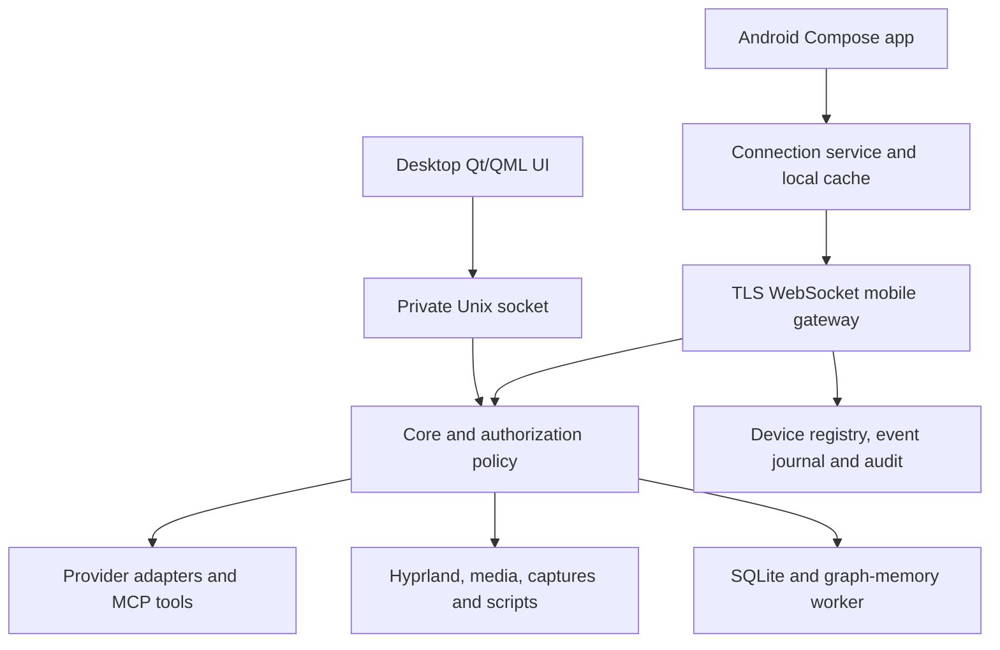

# Cere Mobile development plan

## 1. Executive summary

Cere Mobile is a Kotlin/Jetpack Compose Android client of the **running desktop Cere broker**. Providers, credentials, inference, tools, files, graph memory, personality, and authoritative state remain on the Arch Linux/Hyprland desktop. The app neither runs an independent assistant nor connects directly to Codex, Claude, Ollama, Neo4j, or Qdrant.

**Evidence baseline:** repository `otectus/Cere`, `main` at **`e97f0475e155496d0a44867f953f5354a83f8d38`**, inspected 2026-09-29. `[C]` means confirmed in this snapshot; `[P]` means a proposed implementation or chosen default; `[A]` means an assumption requiring device/environment validation. Repository paths in the inventory and prose are source citations, relative to the repository root. Read this plan against that commit; reconcile subsequent changes before implementation. This document is the only change made for this planning task.

[C] The stated desktop architecture is substantially correct: Qt/QML clients use a private, same-user Unix socket; the Node/TypeScript broker owns sessions, approvals, provider adapters, desktop actions, and persisted state. There is no Cere network listener. Graph memory has its own worker and canonical SQLite store plus rebuildable Neo4j/Qdrant projections. See [broker/main.ts](../../broker/main.ts), [broker/core.ts](../../broker/core.ts), [broker/peercred.ts](../../broker/peercred.ts), [broker/store.ts](../../broker/store.ts), [broker/graph-memory/service.ts](../../broker/graph-memory/service.ts), [native/controller.cpp](../../native/controller.cpp), and [docs/memory/architecture.md](../../docs/memory/architecture.md).

Four decisions shape the work:

1. **[P] An opt-in TLS WebSocket gateway inside the broker, with a purpose-built mobile API.** Bind only an explicitly selected LAN or WireGuard interface/address. Away-from-home access uses a separately configured WireGuard VPN; there is no public Cere relay, UPnP, automatic firewall change, or internet port forwarding. Keeping authorization in-process makes it possible to propagate the remote principal into tool and provider execution.
2. **[P] Offline, two-way QR pairing before the first listener opens.** Desktop Settings shows an offer; Android scans it and produces a signed response; the user pastes that response into desktop Settings and confirms matching short authentication codes. Only after local confirmation and explicit enablement may the gateway listen. Per-device keys and desktop-owned capability grants replace long-lived bearer tokens.
3. **[P] No-FCM delivery starts with a user-enabled persistent WebSocket foreground service.** Use Android's `connectedDevice` type, a visible monitoring notification, and a guided battery exemption for reliable screen-off operation. Without exemption, delivery is best effort and the UI must say so. The desktop retains pending requests; no connection loss grants permission. UnifiedPush is deferred.
4. **[P] Remote operations always enforce ordinary permissions, even when desktop bypass toggles are enabled.** Never expose raw broker RPC. Carry device, project, session, turn, and effective provider-policy identity through execution. Remote cannot enable bypasses, broaden permissions, edit scripts, change service endpoints, or enroll another device.

**[P] Android baseline:** `minSdk = 30` (Android 11), `compileSdk = targetSdk = 37` (Android 17). API 30 simplifies per-use Keystore signatures authenticated with biometrics or device credentials. As of this review, GrapheneOS releases are based on Android 17; the owner's exact Pixel model, installed build, and update channel are **not supplied**. Android 17 is the target-device planning baseline, not a claim about the phone's installed version. Record `Build.VERSION.SDK_INT`, build ID, and model in Phase 0. Sources: [GrapheneOS releases](https://grapheneos.org/releases), [Android 17 changes](https://developer.android.com/about/versions/17/behavior-changes-17).

**[P] MVP:** pair a phone; reach the awake desktop over LAN and WireGuard; create/select/rename managed sessions in desktop-approved projects; choose available provider/model/effort; send text; stream replies; Stop; view Activity; answer supported approvals, provider questions, primitive MCP forms, and saved-capture sharing requests with authorized previews from phone notifications; recover after connection loss; revoke access immediately from the desktop. It includes strict remote permission enforcement, filtered snapshots, durable reconciliation, and audit before any release. Image upload/full media management, handoff/history import, controls, full memory editing, and personality/settings editing follow in later parity phases. MVP is useful away from the desk without pretending the entire parity table is already delivered.

## 2. Feature inventory and classification

Each row's existing capability and source are **[C]**; treatment, reason, and phase are **[P]**. `Deferred / dropped` explicitly means withheld from the mobile surface, including desktop-only administration; it does not remove the desktop capability. Rows split execution from local phone UX so each has exactly one treatment. Phase numbers refer to section 9. This inventory includes broker/CLI capabilities that the QML screens do not fully expose.

| ID | Existing capability | Treatment | Mobile decision / reason | Source file(s) | Delivery |
| --- | --- | --- | --- | --- | --- |
| F01 | Chat/Sessions/Desktop/Settings in compact panel and resizable workspace | Adapted | Full-screen mobile destinations with bottom navigation; preserve capabilities and rebuild layouts. | [qml/Shell.qml](../../qml/Shell.qml), `Panel.qml`, `Workspace.qml` | MVP |
| F02 | Connection/reconnection and policy banners | On-device | Phone shows real reachability, stale timestamp, restricted/full-access policy, and local monitoring state. | [qml/Shell.qml](../../qml/Shell.qml); [native/controller.cpp](../../native/controller.cpp) | MVP |
| F03 | Session list, title/project/provider search, status/delegated/linked labels | Adapted | Searchable session list with Needs input priority and explicit desktop project. | [qml/SessionList.qml](../../qml/SessionList.qml); [broker/types.ts](../../broker/types.ts) | MVP |
| F04 | Managed Codex, Claude, Ollama session creation | Adapted | Native create flow; desktop provider execution only, explicit per-device provider-execution cap. | [qml/NewSession.qml](../../qml/NewSession.qml); [broker/core.ts:create](../../broker/core.ts) | MVP |
| F05 | Project folder selection, realpath validation, CLI trust | Adapted | Select desktop-approved canonical project IDs; phone filesystem picker cannot choose a desktop project. First trust stays local. | [qml/NewSession.qml](../../qml/NewSession.qml); [native/controller.cpp:chooseFolder](../../native/controller.cpp); [broker/core.ts:create](../../broker/core.ts) | MVP |
| F06 | CLI model/default/effort catalogs and refresh | Adapted | Show actual broker catalog, model descriptions and supported efforts; keep CLI-default semantics. | [broker/models.ts](../../broker/models.ts); [qml/NewSession.qml](../../qml/NewSession.qml) | MVP |
| F07 | Ollama server-pinned session/default model, Cloud/Tools/Images/context labels | Adapted | Retain per-session server identity and advertised context; disclose Cloud. No phone Ollama connection. | [broker/ollama.ts:ollamaModels](../../broker/ollama.ts); [broker/types.ts](../../broker/types.ts); [qml/OllamaConnection.qml](../../qml/OllamaConnection.qml) | MVP |
| F08 | Ollama conversation vs assistance; idle model/tools configuration | Adapted | Idle-only model sheet; assistance requires tool-capable model, project trust, category and device caps; images constrain model changes. | [broker/core.ts:configureSession](../../broker/core.ts); [qml/OllamaSessionDialog.qml](../../qml/OllamaSessionDialog.qml) | MVP |
| F09 | CLI history enumeration/import/resume | Adapted | Project-filtered import with stopped-external-writer confirmation. Do not promise complete historical transcript ingestion. | [broker/core.ts:history,create](../../broker/core.ts); [qml/SessionList.qml](../../qml/SessionList.qml); [qml/NewSession.qml](../../qml/NewSession.qml) | Phase 2 |
| F10 | Linked terminal lifecycle, terminal-only composer restriction | Adapted | Read-only status card and managed-handoff guidance; no terminal scraping or remote typing. | [broker/terminal.ts](../../broker/terminal.ts); [broker/core.ts:session.link](../../broker/core.ts); [qml/Chat.qml](../../qml/Chat.qml) | MVP view |
| F11 | Focus linked terminal on desktop | Remote-control | Windows-category action; label Open on desktop, never imply a phone terminal stream. | [broker/core.ts:session.terminal](../../broker/core.ts); [qml/Chat.qml](../../qml/Chat.qml) | Phase 2 |
| F12 | Cross-provider handoff to reviewed draft | Adapted | Preview last eight non-tool messages, choose provider/model/project, edit draft, then submit separately. | [qml/Chat.qml](../../qml/Chat.qml) handoff dialog; [broker/core.ts:create](../../broker/core.ts) | Phase 2 |
| F13 | Session rename and idle adapter disconnect/resume | Adapted | Overflow menu with revisions; disconnect does not delete history; active turn must Stop first. | [broker/core.ts:rpc](../../broker/core.ts); [qml/Chat.qml](../../qml/Chat.qml) | MVP |
| F14 | Streaming text, busy/error/waiting status and thinking/speaking/tool activity | Adapted | Revisioned whole-message upserts and separate state indicator; preserve completed/interrupted/error distinction. | [broker/core.ts:event,flush](../../broker/core.ts); [native/controller.h](../../native/controller.h); [qml/Chat.qml](../../qml/Chat.qml) | MVP |
| F15 | Stop and delegated-turn cancellation, fallback provider shutdown | Adapted | Prominent Stop, visible Stopping/Interrupted states; transport disconnect alone leaves work running. | [broker/core.ts:stopTurn](../../broker/core.ts); [broker/ollama.ts](../../broker/ollama.ts); [qml/Chat.qml](../../qml/Chat.qml) | MVP |
| F16 | Per-session saved drafts and debounce | Adapted | Local draft plus shared text CAS; failed send preserves it; conflicting desktop edits require review. | [broker/core.ts:session.draft](../../broker/core.ts); [qml/Chat.qml](../../qml/Chat.qml) | MVP |
| F17 | Persisted scroll and Latest/follow behavior | On-device | Phone stores its own message anchor; no desktop pixel-offset sync; avoid jumping while reading older output. | [qml/Chat.qml](../../qml/Chat.qml); [qml/ActivityPanel.qml](../../qml/ActivityPanel.qml); [broker/types.ts:Session.scroll](../../broker/types.ts) | MVP |
| F18 | Image attachment selection/clear/preview/consent, up to four | Adapted | Opaque uploads from phone picker/camera/share; reviewed provider send, common remote size validation. | [qml/Chat.qml](../../qml/Chat.qml); [broker/core.ts:sendTurn](../../broker/core.ts); [broker/ollama.ts:imageData](../../broker/ollama.ts) | Phase 2 |
| F19 | CommonMark/GFM selectable Markdown, code, lists/tasks/tables/images | Adapted | Compose AST renderer with code/table horizontal scroll; no WebView or automatic remote-image requests. | [qml/MessageCard.qml](../../qml/MessageCard.qml); [native/controller.cpp:formatMessage](../../native/controller.cpp); [VALIDATION.md](../../VALIDATION.md) | MVP text; images Phase 2 |
| F20 | Original-Markdown Copy and rendered-text selection | On-device | Android clipboard and selection; copy code/source distinctly. | [qml/MessageCard.qml](../../qml/MessageCard.qml); [native/controller.cpp:copy](../../native/controller.cpp) | MVP |
| F21 | Activated web/mail links, source chips and desktop file links | Adapted | Web/mail opens phone apps; file links offer policy-checked Open on desktop; no general file download. | [qml/MessageCard.qml](../../qml/MessageCard.qml); [native/controller.cpp:openMessageLink](../../native/controller.cpp) | MVP web; files Phase 2 |
| F22 | Separate Activity Panel, tool count/output/follow | Adapted | Bottom sheet with literal untrusted tool output, status and exact proposal detail; independent scroll. | [qml/ActivityPanel.qml](../../qml/ActivityPanel.qml); [native/controller.h:TranscriptFilter](../../native/controller.h) | MVP |
| F23 | Global approvals queue with session labels and exact choices | Adapted | Inbox plus inline cards; stable ID/revision and first valid responder, stale action feedback. | [qml/ApprovalCard.qml](../../qml/ApprovalCard.qml); [qml/Shell.qml](../../qml/Shell.qml); [broker/core.ts:answer](../../broker/core.ts) | MVP |
| F24 | Codex command and file-change approvals | Adapted | Review exact operation; enrich missing file-change detail before remote Allow or fail closed. | [broker/providers.ts:CodexAdapter.handle](../../broker/providers.ts) | MVP |
| F25 | Codex extra permissions scoped to the turn | Adapted | Typed permission review; never create lasting/broad grant from notification. | [broker/providers.ts](../../broker/providers.ts); [broker/core.ts:answer](../../broker/core.ts) | MVP |
| F26 | Codex provider questions with options/free text | Adapted | Native form; preserve question IDs; no invented answer and no arbitrary Allow choice. | [broker/providers.ts](../../broker/providers.ts); [broker/types.ts:Approval](../../broker/types.ts); [qml/ApprovalCard.qml](../../qml/ApprovalCard.qml) | MVP |
| F27 | Primitive MCP elicitation: string/bool/number/integer, enum/oneOf | Adapted | Typed forms, range/enum validation by broker; current implementation treats all generated fields as required. | [broker/providers.ts](../../broker/providers.ts); [broker/core.ts:answer](../../broker/core.ts) | MVP |
| F28 | Unsupported URL/complex MCP/unknown provider requests fail closed | Deferred / dropped | Preserve decline/terminal-continuation explanation; mobile cannot implement unsupported desktop adapter protocols. | [broker/providers.ts:CodexAdapter.handle](../../broker/providers.ts) | Explicit MVP limitation |
| F29 | Claude tool permission bridge; no native question adapter | Adapted | Same allowed permission cards; do not display a fabricated Claude-question feature. | [broker/providers.ts:ClaudeAdapter](../../broker/providers.ts); [broker/mcp.ts](../../broker/mcp.ts); [broker/core.ts:detect,mcp.call](../../broker/core.ts) | MVP |
| F30 | Capture-sharing image approval separate from capture | Adapted | Phone receives scoped saved-image preview only with device preview cap; Allow shares with named provider/turn. | [broker/core.ts:action](../../broker/core.ts); [broker/types.ts:Approval.image](../../broker/types.ts) | MVP existing requests; full transfer Phase 2 |
| F31 | Pet speech-bubble requests when desktop UI unavailable; notices in quiet mode | On-device | Notifications and persistent Inbox replace bubble; mobile must not claim local ui/overlay visibility. | [qml/ApprovalBubble.qml](../../qml/ApprovalBubble.qml); [native/controller.cpp:syncApprovalBubble](../../native/controller.cpp) | MVP |
| F32 | Completion/error/interruption/timer/approval desktop notices | On-device | Separate Android channels and redacted lockscreen state; suppression preferences independent of desktop quiet. | [broker/core.ts:event,checkTimers](../../broker/core.ts); [native/controller.cpp:receive](../../native/controller.cpp) | MVP |
| F33 | Desktop search/category filters/refresh/recent action cards | Adapted | Dedicated touch control screen; safe disabled reasons; no dense desktop card grid. | [qml/Desktop.qml](../../qml/Desktop.qml) | Phase 2 |
| F34 | Installed application discovery | Remote-control | Desktop app catalog, sanitized IDs/names; category cap applies even to discovery. | [broker/desktop.ts:applications,actionDefinitions](../../broker/desktop.ts) | Phase 2 |
| F35 | Launch installed app | Remote-control | Resolve current desktop ID, run existing gtk-launch on desktop. | [broker/desktop.ts:apps.launch](../../broker/desktop.ts) | Phase 2 |
| F36 | Open file/folder/project | Remote-control | Explicit approved-root desktop path/recent item; xdg-open stays desktop, label target. | [broker/desktop.ts:files.open](../../broker/desktop.ts); [qml/Desktop.qml](../../qml/Desktop.qml) | Phase 2 |
| F37 | List/focus Hyprland windows | Remote-control | Titles/classes/workspace only when device has windows cap; select current address. | [broker/desktop.ts:windows,windows.focus](../../broker/desktop.ts) | Phase 2 |
| F38 | Move window and switch numbered workspace 1–99 | Remote-control | Destination sheet, non-following move; validate current target and workspace. | [broker/desktop.ts:windows.move,workspace.switch](../../broker/desktop.ts) | Phase 2 |
| F39 | Live default-output volume 0–100 and mute | Remote-control | Desktop sink slider, throttled updates, unavailable state; phone volume unchanged. | [broker/desktop.ts:audioStatus,audio.volume,audio.mute](../../broker/desktop.ts); [qml/Desktop.qml](../../qml/Desktop.qml) | Phase 2 |
| F40 | MPRIS status/preferred Spotify target/capability availability | Remote-control | Show player/state, pin commands to its bus ID; disappeared target requires refresh. | [broker/desktop.ts:mediaStatus](../../broker/desktop.ts); [qml/Desktop.qml](../../qml/Desktop.qml); [tests/desktop.test.ts](../../tests/desktop.test.ts) | Phase 2 |
| F41 | Previous/PlayPause/Next/Stop playback | Remote-control | Same capability-checked desktop MPRIS commands; no implicit retarget. | [broker/desktop.ts:media.control](../../broker/desktop.ts) | Phase 2 |
| F42 | Timers: start/list/cancel, 1–10080 minutes, labels/deadline | Remote-control | Broker owns deadline and firing; mirror notification, no duplicate local timer or sleep-wake guarantee. | [broker/core.ts:action,checkTimers](../../broker/core.ts); [broker/store.ts](../../broker/store.ts); [broker/desktop.ts](../../broker/desktop.ts) | Phase 2 controls; MVP notices |
| F43 | Capture focused output using grim and interactive Satty | Remote-control | Preserve Start Satty and Waiting for desktop edit; separately approved remote-preview path makes capture useful away. | [broker/desktop.ts:captureInSatty](../../broker/desktop.ts); [qml/Desktop.qml](../../qml/Desktop.qml) | Phase 2 |
| F44 | Saved capture preview/open/attach/dismiss | Adapted | Scoped image viewer with crop/annotate and attach-to-draft; provider send remains separate consent. | [qml/Desktop.qml](../../qml/Desktop.qml) preview; [qml/Chat.qml:attachmentRequested](../../qml/Chat.qml) | Phase 2 |
| F45 | List/run explicitly saved executable with immutable argv/cwd/timeout | Remote-control | Desktop-approved script IDs per device; exact definition/hash review and recheck; 1–600s timeout. | [broker/desktop.ts:script.list,script.run](../../broker/desktop.ts); [broker/core.ts:action](../../broker/core.ts) | Phase 2 |
| F46 | Saved-script add/edit/remove (up to 100) | Deferred / dropped | Definitions stay desktop-only: allowing phone arbitrary executables defeats the boundary. | [qml/Settings.qml](../../qml/Settings.qml); [broker/core.ts:updateSettings](../../broker/core.ts) | Desktop only |
| F47 | Provider orchestration: list/start/send/read/wait/stop owned Codex/Claude children | Remote-control | Ollama orchestration remains desktop; child sessions inherit remote caps; exact task/follow-up approval mandatory. | [broker/orchestration.ts](../../broker/orchestration.ts); [broker/core.ts:toolsFor,callTool](../../broker/core.ts) | MVP provider strictness; Phase 2 full views |
| F48 | Ollama tool loops/context/history/thinking and crash recovery | Adapted | Surface native limits/errors, complete history, activity only for reasoning; retain 24 responses/16 tools and no crash replay. | [broker/ollama.ts](../../broker/ollama.ts); [broker/core.ts](../../broker/core.ts) constructor; [tests/ollama.test.ts](../../tests/ollama.test.ts) | MVP |
| F49 | Manual/scoped/broad profiles and nine disabled-by-default categories | Adapted | Read effective policy, categories and disabled reasons; ordinary policy intersects device caps. | [broker/permissions.ts](../../broker/permissions.ts); [broker/types.ts](../../broker/types.ts); [qml/Settings.qml](../../qml/Settings.qml) | MVP |
| F50 | Change profile/enable categories | Deferred / dropped | Authority expansion requires desktop; mobile cannot make unavailable tools available. | [broker/core.ts:updateSettings](../../broker/core.ts); [qml/Settings.qml](../../qml/Settings.qml) | Desktop only |
| F51 | Project/category expiring broad grants; list/revoke | Adapted | View exact project/expiry and revoke; retain ≤24h broker bounds and one-hour desktop UI convenience. | [broker/core.ts:updateSettings,action](../../broker/core.ts); [qml/Settings.qml](../../qml/Settings.qml) | MVP view; Phase 2 revoke |
| F52 | Create/extend broad grants | Deferred / dropped | Desktop-only privilege expansion; do not expose generic settings patch. | [broker/core.ts:updateSettings](../../broker/core.ts); [qml/Settings.qml](../../qml/Settings.qml) | Desktop only |
| F53 | Pause and revocation | Adapted | Defensive Pause/reduction allowed; explain Pause vs Stop and do not invent retroactive shell revocation. | [broker/permissions.ts](../../broker/permissions.ts); [broker/core.ts:updateSettings,action](../../broker/core.ts); [qml/Shell.qml](../../qml/Shell.qml) | MVP |
| F54 | Resume/re-enable privileges | Deferred / dropped | Desktop-only recovery from policy pause or reduced rights. | [qml/Settings.qml](../../qml/Settings.qml); [broker/core.ts:updateSettings](../../broker/core.ts) | Desktop only |
| F55 | Independent CLI/computer bypasses, pending auto-accept | Deferred / dropped | Mobile mutation forbidden; server suppresses effects for remote-controlled work; read warning only. | [broker/permissions.ts](../../broker/permissions.ts); [broker/providers.ts](../../broker/providers.ts); [qml/Settings.qml](../../qml/Settings.qml) | Desktop only |
| F56 | Per-adapter random MCP capability token | Deferred / dropped | Internal broker/provider capability only; never distribute to phone. | [broker/core.ts:sendTurn,mcp.call](../../broker/core.ts); [broker/mcp.ts](../../broker/mcp.ts) | Internal |
| F57 | Personality save/discard/default/empty-neutral, max 8000, next-turn effect | Adapted | Full-screen editor with draft/CAS conflict review; personality never grants tool permission. | [broker/personality.ts](../../broker/personality.ts); [qml/PersonalitySettings.qml](../../qml/PersonalitySettings.qml); [broker/providers.ts](../../broker/providers.ts); [broker/ollama.ts](../../broker/ollama.ts) | Phase 3 |
| F58 | Provider availability/version/model refresh and defaults | Adapted | Read sanitized connection health, refresh catalogs and choose a default within approved server. | [broker/core.ts:detect,refreshProviderModels](../../broker/core.ts); [qml/Settings.qml](../../qml/Settings.qml); [qml/OllamaConnection.qml](../../qml/OllamaConnection.qml) | MVP status; Phase 3 defaults |
| F59 | Ollama host/server endpoint editing and CLI authentication/config | Deferred / dropped | Desktop-only routing and credentials; avoids phone-triggered prompt exfiltration or provider reconfiguration. | [broker/core.ts:updateSettings](../../broker/core.ts); [broker/ollama.ts:ollamaHost](../../broker/ollama.ts); [broker/providers.ts](../../broker/providers.ts) | Desktop only |
| F60 | Web-search enable/provider selection | Adapted | Ollama-only desktop research; enabled default false; choose approved public provider, show fallback. | [broker/web.ts](../../broker/web.ts); [broker/types.ts](../../broker/types.ts); [qml/KnowledgeSettings.qml](../../qml/KnowledgeSettings.qml) | MVP existing setting; Phase 3 edit |
| F61 | Search web one-shot composer toggle | Adapted | Max 500-character current text becomes public query; reset only after accepted send. | [broker/core.ts:sendTurn](../../broker/core.ts); [qml/Chat.qml](../../qml/Chat.qml) | MVP |
| F62 | Automatic model web_search/web_read, cited sources, Activity, cancellation | Adapted | Through desktop with global enable/unpaused plus device web cap; 8 calls/turn, fail honestly on blocking. | [broker/web.ts](../../broker/web.ts); [broker/ollama.ts](../../broker/ollama.ts); [broker/core.ts:webCall](../../broker/core.ts) | MVP |
| F63 | Public HTTP(S) reader with DNS/private-network/redirect/body/type limits | Adapted | Preserve desktop reader as untrusted evidence; no new unrestricted URL-proxy endpoint. | [broker/web.ts:loadWeb,read](../../broker/web.ts); [tests/knowledge.test.ts](../../tests/knowledge.test.ts) | MVP |
| F64 | SearXNG configured endpoint, private endpoint exception | Deferred / dropped | Endpoint editing desktop-only; mobile may use only preconfigured instance. | [broker/web.ts:search](../../broker/web.ts); [broker/core.ts:updateSettings](../../broker/core.ts) | Desktop only |
| F65 | Opt-in graph memory for Ollama, project+saved-server scope | Adapted | Scoped status/browser; default disabled, no claim of equivalent Codex/Claude intake. | [broker/memory.ts:active,memoryScope](../../broker/memory.ts); [qml/KnowledgeSettings.qml](../../qml/KnowledgeSettings.qml) | MVP status; Phase 3 browser |
| F66 | Conversation observations, saved facts, exact witness/provenance | Adapted | Intake stays desktop; phone displays sources and cautions that assistant passages are not facts. | [broker/memory.ts:context,capture](../../broker/memory.ts); [broker/graph-memory/canonical.ts:observeText,recordResponse](../../broker/graph-memory/canonical.ts) | Phase 3 |
| F67 | Saved/conversation/assertion/episode/entity lists, 25/page, filter | Adapted | Native tabs and scoped filter; current assertion/episode filters are not uniformly implemented. | [broker/graph-memory/canonical.ts:list](../../broker/graph-memory/canonical.ts); [qml/MemoryDialog.qml](../../qml/MemoryDialog.qml) | Phase 3 |
| F68 | Save/edit note ≤2000 code points with expected revision | Adapted | Text editor with count and CAS; exact note IDs, no invented replacement ID. | [broker/memory.ts:save](../../broker/memory.ts); [broker/graph-memory/canonical.ts:saveText](../../broker/graph-memory/canonical.ts) | Phase 3 |
| F69 | Hybrid/keyword/semantic/graph recall and degraded coverage | Adapted | Desktop retrieval, show actual coverage/error rather than guarantee vector availability. | [broker/graph-memory/service.ts:retrieve](../../broker/graph-memory/service.ts); [broker/graph-memory/canonical.ts](../../broker/graph-memory/canonical.ts); [broker/graph-memory/ranking.ts](../../broker/graph-memory/ranking.ts) | MVP chat; Phase 3 search |
| F70 | Temporal world date/knowledge revision query and assertion history | Adapted | Human date controls with UTC microsecond wire values; provenance/history sheets. | [qml/GraphMemoryInspector.qml](../../qml/GraphMemoryInspector.qml); [broker/graph-memory/temporal.ts](../../broker/graph-memory/temporal.ts); [broker/graph-memory/canonical.ts:inspect,retrieve](../../broker/graph-memory/canonical.ts) | Phase 3 |
| F71 | Structured remember/correct/resolve_conflict with typed claim/exact quote | Adapted | Guided claim/source/witness form, registered ontology and revision guard; advanced JSON is review-only. | [broker/memory.ts:structured](../../broker/memory.ts); [broker/graph-memory/contracts.ts](../../broker/graph-memory/contracts.ts); [broker/graph-memory/ontology.ts](../../broker/graph-memory/ontology.ts); [broker/graph-memory/canonical.ts](../../broker/graph-memory/canonical.ts) | Phase 3 |
| F72 | Identity possible/same/not_same evidence records | Adapted | Read identity evidence; do not invent complete merge/split behavior. | [broker/graph-memory/canonical.ts:identity](../../broker/graph-memory/canonical.ts); [docs/memory/implementation-report.md](../../docs/memory/implementation-report.md) | Phase 3 read |
| F73 | Identity merge/split/remapping and task creation/binding gaps | Deferred / dropped | Incomplete desktop semantics must be finished separately before new mobile mutations. | [docs/memory/implementation-report.md](../../docs/memory/implementation-report.md); [broker/graph-memory/canonical.ts](../../broker/graph-memory/canonical.ts) | Dependency deferred |
| F74 | Episode freeze/consolidate/archive/topic associations | Adapted | Read episode and guided explicit freeze/archive using existing source-backed contracts; label experimental. | [broker/memory.ts:graph](../../broker/memory.ts); [broker/graph-memory/canonical.ts:freezeEpisode,consolidate](../../broker/graph-memory/canonical.ts); [qml/GraphMemoryInspector.qml](../../qml/GraphMemoryInspector.qml) | Phase 3 |
| F75 | Forget preview, revision/count, immediate suppression, physical-purge receipt | Adapted | Review scope/impact, authenticate, distinguish suppression from pending projection ACK, purge phone cache. | [broker/memory.ts:erase](../../broker/memory.ts); [broker/graph-memory/canonical.ts:forgetPreview,forget](../../broker/graph-memory/canonical.ts); [qml/GraphMemoryInspector.qml](../../qml/GraphMemoryInspector.qml) | Phase 3 |
| F76 | Clear project memory and associated managed chat passages | Adapted | Destructive scope-specific review; do not claim erasure of external providers' existing copies. | [broker/memory.ts:clear,erase](../../broker/memory.ts); [qml/MemoryDialog.qml](../../qml/MemoryDialog.qml); [docs/memory/operations.md](../../docs/memory/operations.md) | Phase 3 |
| F77 | Health/stats/doctor, queue/projection/extraction errors, embedding check/models | Adapted | Sanitized Diagnostics; read/probe only, no credential/endpoint leak; model changes stay local. | [broker/memory.ts:summary,check](../../broker/memory.ts); [broker/graph-memory/service.ts:call](../../broker/graph-memory/service.ts); [broker/core.ts:memory.models](../../broker/core.ts) | Phase 3 |
| F78 | Embedding/extraction model, enablement, Cloud extraction vs Cloud recall | Deferred / dropped | Desktop-only privacy expansion/routing; defaults include extraction allowed when unspecified and Cloud recall false. Phone can request reductions only. | [broker/memory.ts:configure](../../broker/memory.ts); [broker/graph-memory/service.ts](../../broker/graph-memory/service.ts); [qml/KnowledgeSettings.qml](../../qml/KnowledgeSettings.qml) | Desktop only |
| F79 | Collector/ranking/retention policy and approved roots | Deferred / dropped | Desktop-only collection/privacy administration; observation permission is distinct from action permission. | [broker/graph-memory/contracts.ts:policySchema](../../broker/graph-memory/contracts.ts); [qml/GraphMemoryInspector.qml](../../qml/GraphMemoryInspector.qml) | Desktop only |
| F80 | Current workspace snapshot, stale/unknown/unambiguous mappings | Adapted | Read authorized desktop workspace card; no phone collector and no certainty for stale mappings. | [broker/graph-memory/service.ts:workspace](../../broker/graph-memory/service.ts); [broker/graph-memory/adapters/live.ts](../../broker/graph-memory/adapters/live.ts) | Phase 3 |
| F81 | Hyprland live collector/event reconciliation | Remote-control | Observations remain desktop; title capture currently also needs an allowlist not supplied by service. | [broker/graph-memory/adapters/hyprland.ts](../../broker/graph-memory/adapters/hyprland.ts); [broker/graph-memory/service.ts:startCollectors](../../broker/graph-memory/service.ts) | Phase 3 view |
| F82 | Fish structured lifecycle/CWD events via private same-user socket | Remote-control | Desktop hook only; phone can inspect scoped metadata, no command-text intake claim. | [broker/graph-memory/collector-rpc.ts](../../broker/graph-memory/collector-rpc.ts); [broker/graph-memory/adapters/fish/](../../broker/graph-memory/adapters/fish/); [docs/memory/operations.md](../../docs/memory/operations.md) | Phase 3 view |
| F83 | Kitty explicitly configured read-only ls inspection | Remote-control | Desktop endpoint stays private; unavailable/ambiguous mapping shown accurately. | [broker/graph-memory/adapters/kitty.ts](../../broker/graph-memory/adapters/kitty.ts); [docs/memory/adapters-validation.md](../../docs/memory/adapters-validation.md) | Phase 3 view |
| F84 | Filesystem/repository metadata, root/symlink safeguards | Remote-control | Desktop approved-root metadata only; no mobile filesystem-root equivalence. | [broker/graph-memory/adapters/workspace.ts](../../broker/graph-memory/adapters/workspace.ts) | Phase 3 view |
| F85 | Editor collector, durable workspace history/file-content placeholders | Deferred / dropped | Class/policy fields exist, but service does not wire complete intake; no false parity feature. | [broker/graph-memory/adapters/workspace.ts:EditorEventCollector](../../broker/graph-memory/adapters/workspace.ts); [broker/graph-memory/service.ts](../../broker/graph-memory/service.ts); [docs/memory/implementation-report.md](../../docs/memory/implementation-report.md) | Dependency deferred |
| F86 | Graph/vector reindex and generation rebuild | Deferred / dropped | Operator action stays desktop; expose sanitized progress/health only. | [broker/graph-memory/canonical.ts:rebuild](../../broker/graph-memory/canonical.ts); [qml/GraphMemoryInspector.qml](../../qml/GraphMemoryInspector.qml) | Desktop only |
| F87 | Memory backup/restore to desktop filesystem staging | Deferred / dropped | Desktop-only backup/restore with erasure registry; no server path arguments from phone. | [broker/graph-memory/canonical.ts:backup,restore](../../broker/graph-memory/canonical.ts); [docs/memory/operations.md](../../docs/memory/operations.md) | Desktop only |
| F88 | Graph-memory CLI, authenticated Neo4j/Qdrant/Ollama dependency setup | Deferred / dropped | Operator CLI/service/backend ports remain local; supported user memory operations are adapted above. | [broker/memory-cli.ts](../../broker/memory-cli.ts); [packaging/memory-compose.yml](../../packaging/memory-compose.yml); [tools/memory-dependencies.sh](../../tools/memory-dependencies.sh) | Desktop only |
| F89 | SQLite sessions/messages/settings/timers and canonical graph state | Remote-control | Desktop remains authoritative; Android cache is derivative and contains no provider credentials. | [broker/store.ts](../../broker/store.ts); [broker/paths.ts](../../broker/paths.ts); [broker/graph-memory/client.ts](../../broker/graph-memory/client.ts); [broker/graph-memory/canonical.ts](../../broker/graph-memory/canonical.ts) | All phases |
| F90 | Broker restart interrupts turns, UI restart leaves broker work running | Adapted | Phone reconnect follows same interruption semantics; no provider tool replay or implied daemon resurrection. | [broker/core.ts](../../broker/core.ts) constructor; [broker/main.ts](../../broker/main.ts); [native/controller.cpp](../../native/controller.cpp) | MVP |
| F91 | Pet scale/topmost/position/display/show-hide | Deferred / dropped | Desktop presentation settings stay local; no Android floating overlay or display geometry port. | [qml/Pet.qml](../../qml/Pet.qml); [qml/Settings.qml](../../qml/Settings.qml); [native/controller.cpp:syncPet](../../native/controller.cpp) | Desktop only |
| F92 | Pointer-follow roaming/drag/hover gaze/fullscreen/multidisplay pauses | Deferred / dropped | Compositor/mouse-specific behavior has no phone equivalent. | [native/follow.h](../../native/follow.h); [native/controller.cpp:roam,followMouse](../../native/controller.cpp); [qml/Pet.qml](../../qml/Pet.qml) | Dropped on phone |
| F93 | Atlas/motions-driven expression/state/priority and confirmed-completion acting | Adapted | Optional lightweight in-app status avatar; static MVP, foreground-only gestures later. Listening means text focus. | [assets/motions.json](../../assets/motions.json); [native/motion.cpp](../../native/motion.cpp); [qml/GesturePlayer.qml](../../qml/GesturePlayer.qml); [qml/CereSprite.qml](../../qml/CereSprite.qml) | MVP static; Phase 3 motion |
| F94 | Desktop quiet/reduced motion/intensity/cues and gesture previews | Deferred / dropped | Editing desktop acting stays local; phone preferences are independent equivalents in F95. | [qml/Settings.qml](../../qml/Settings.qml); [native/motion.cpp](../../native/motion.cpp); [native/controller.cpp](../../native/controller.cpp) | Desktop only |
| F95 | Quiet/reduced motion/intensity/cue affordances applied to companion presentation | On-device | Phone avatar motion/accessibility settings; approvals never suppressed by desktop quiet. | [qml/Settings.qml](../../qml/Settings.qml); [assets/motions.json](../../assets/motions.json); [native/motion.cpp](../../native/motion.cpp) | Phase 3 |
| F96 | Desktop autostart and onboarding/shortcut instructions | Deferred / dropped | Login/service/pet onboarding belongs desktop; mobile pairing/monitoring is a separate local flow. | [native/controller.cpp:setAutostart](../../native/controller.cpp); [qml/Shell.qml](../../qml/Shell.qml); [tools/install-user.py](../../tools/install-user.py) | Desktop only |
| F97 | Tray quit keeping sessions vs Stop and quit; interface open/toggle | Deferred / dropped | Mobile disconnect/close never quits desktop; authorized session Stop is F15. | [native/controller.cpp:start,quit](../../native/controller.cpp); [broker/core.ts:ui.quit,ui.toggle](../../broker/core.ts); [tools/cere](../../tools/cere) | Desktop only |
| F98 | Keyboard shortcuts, hover tooltips, mouse-sized controls | Deferred / dropped | Replace with Back, long-press detail and 48dp targets; optional physical-keyboard support later. | [qml/Shell.qml](../../qml/Shell.qml); [qml/Chat.qml](../../qml/Chat.qml); [qml/CButton.qml](../../qml/CButton.qml); [qml/CField.qml](../../qml/CField.qml) | Touch replacement MVP |

**[C] Documentation status matters:** graph memory remains experimental, with incomplete identity/task/intake workflows and unmet quality gates. Existing validation reports are historical evidence, not tests executed during this planning task. Read [VALIDATION.md](../../VALIDATION.md) and `docs/memory/{implementation-report,evaluation,adapters-validation}.md`; do not relabel the desktop implementation production-complete because it gained a mobile UI.

**[P] Parity boundary:** no general remote terminal, remote desktop video stream, mouse/keyboard injection, file manager/download-all API, provider login, model pull/delete, or graph database console. These are not shipped user capabilities in the inspected UI/broker; exposing them would enlarge the scope rather than complete parity ([broker/terminal.ts](../../broker/terminal.ts), [broker/desktop.ts](../../broker/desktop.ts), [qml/OllamaConnection.qml](../../qml/OllamaConnection.qml)). Mobile-native additions are specified separately after the parity UX below.

## 3. Architecture

### Components and trust boundaries



**[P] Gateway:** add `broker/remote/` and instantiate its lifecycle from [broker/main.ts](../../broker/main.ts) after `Core` exists. Use Node HTTPS/TLS and the `ws` package; disable WebSocket compression. Bind `8443` to a locally configured literal address, defaulting to the selected WireGuard address for away access; LAN is a separately selected bind address. Multiple addresses require separate explicit entries. Never default to `0.0.0.0`, `::`, or a newly discovered interface. Fail closed if an address vanishes. A listener exists only while remote access is enabled and at least one confirmed, unexpired device is paired. Revoking the last device closes all listeners. Disabling remote access closes every remote connection, cancels pending remote commands, and interrupts turns owned by remote controllers; ordinary accidental disconnect does not Stop work.

**[P] Single authority:** mobile routing calls typed Core methods with `ExecutionContext`, not `Core.rpc(method, params)` on arbitrary input. Local Unix IPC continues to require same-user peer credentials and remains available when remote is disabled. Preserve local methods for existing QML clients; share validators, authorization, reducers, and domain operations underneath. The gateway's network parser must never accept `mcp.call`, session capability tokens, `session.link`, `ui.quit`, general `settings.update`, or general `memory.graph`.

[C] This is necessary because `Core.rpc('action.run')` invokes `Core.action()` without a `sessionId`; category/grant/revocation checks inside `Core.action()` currently run only for AI/session actions. Local direct `timer.cancel`, generic settings updates, and graph administration also assume a trusted same-user client. Broadcasting `Core.snapshot()` would expose all settings, scripts, projects, and approvals. Source: [broker/core.ts](../../broker/core.ts) (`rpc`, `action`, `snapshot`), [broker/main.ts](../../broker/main.ts).

**[P] Android:** one repository owns the WebSocket and state reconciliation. A user-started foreground service retains that repository while monitoring; Compose observes `StateFlow` and does not open a second connection. Room holds a limited encrypted cache, drafts, cursor, and pending command identifiers. The broker owns sessions, transcripts, approvals, timers, and permission policy. Preferences such as theme, monitoring, local notification sound, biometric UI lock, and status-avatar motion belong to the phone and do not change desktop settings.

### Reachability and discovery

**[P] Phase 0/MVP:** QR carries desktop identity, server certificate/public-key pins, and LAN/WireGuard endpoint candidates. No subnet scan and no discovery listener. The user configures WireGuard on the desktop/router and uses the standard Android WireGuard VPN app; Cere Mobile follows the Android system route, including always-on VPN lockdown. Phone root is unnecessary. A reachable VPN peer or router endpoint is required; NAT/CGNAT may require a user-provided VPN hub. The plan does not manufacture away connectivity from a private address.

**[P] Later:** opt-in mDNS `_cere._tcp.local` advertisement only while an already authorized gateway is listening. It carries protocol major and desktop ID, never pairing secrets, user/project names, or tokens. Android discovery is a foreground Settings action with local-network consent; candidate addresses are hints only and must match the QR-established TLS pin. WireGuard addresses are entered/carried in QR; mDNS does not cross the VPN by assumption. Maintain at most five owner-approved endpoint candidates; try VPN first when the active route is VPN, otherwise LAN, and never send credentials before pin validation.

| Rejected alternative | Why it loses |
| --- | --- |
| Separate same-user `cere-gateway` forwarding Unix RPC | It inherits trusted-local powers without Core knowing the remote origin; safely fixing that requires the same Core changes plus another service. |
| Raw existing JSON-lines protocol over WebSocket | It has no device authorization, replay, revisions, idempotency, or filtered state and exposes local administration. |
| gRPC | Extra generation and HTTP/2 deployment machinery provides little value for a small event API with binary attachments. |
| Socket forwarding over WireGuard alone | VPN membership is not Cere permission; a forwarded socket loses same-user credentials and cannot safely distinguish mobile requests. |
| Tailscale as the required transport | Adds an account/control-plane dependency; WireGuard plus the same TLS API keeps the no-Google, self-hosted baseline. Tailscale can carry traffic as an owner-selected VPN later. |
| Public reverse proxy/cloud push relay | Expands exposure and operations before the core boundary is proven; not included in parity or MVP. |

### Data flow

**[P] Chat:** user selects a broker session and reviews its desktop project/provider → app requests a send challenge and signs the exact text/attachment operation with the background connection key, without a password or fingerprint prompt → gateway checks device session/project caps and restrictive effective provider policy → Core atomically accepts a new `turnId` and command ID → provider adapter runs on the desktop → committed message upserts and session changes enter the journal → authorized subscriptions receive them → Room applies revisions atomically → Compose renders incremental updates. The command's accepted result does not mean the turn completed. Welcome must advertise `sendAuthentication: "connection-key"`; absence means an older broker expects the action key, and the app explains that the desktop broker must be restarted or updated rather than silently restoring a per-message prompt.

**[P] Approval:** provider or tool creates a request → Core records approval ID, turn generation, revision, exact proposed arguments, and originating operation → journal publishes a filtered approval → service posts a notification → tapping Approve opens the review activity and a per-use action-key authentication prompt → response binds the exact request revision/digest → Core atomically verifies still pending, policy still valid, and session still authorized → first valid response wins → provider/tool resumes → both desktop and phone remove the pending card. Deny can run immediately from a notification; forms open the app. No cached notification can resurrect a request.

**[P] Desktop control:** phone chooses an eligible project/session and category → app displays action and resolved target, signs command → gateway intersects device caps and ordinary Cere policy → shared action validator and authorization recheck immediately before execution → existing desktop implementation executes → result, audit, and refreshed status reach both clients. Broad grants may remove extra confirmations only for their exact category/project/expiry; provider questions, delegation-prompt review, and capture-sharing consent still require an answer. Direct phone gestures count as explicit human confirmation of the displayed operation; they do not change the underlying policy.

### Connectivity and state

**[P] Reconnect:** use exponential backoff with full jitter, base 1 second, cap 60 seconds, reset after a stable 30-second connection. While unreachable for 10 minutes, cap attempts at once every five minutes; network-available callbacks trigger one immediate attempt. Respect user Stop monitoring and GrapheneOS Network permission. Do not spin on `AUTH_REVOKED`, incompatible protocol, invalid TLS pin, or missing LAN permission. A 60-second application heartbeat with a 20-second response deadline is the initial measured baseline; tune only after battery tests. Heartbeats are not a Doze exemption.

**[P] Resume:** persist an opaque resume cursor after applying each event. Same broker epoch and retained cursor permit replay. Changed epoch, retention gap, changed device policy, or invalid cursor requires a scoped snapshot and selected-session transcript catch-up. The snapshot and replay boundary share one transaction/high-water cursor. Changes during snapshot construction queue behind that cursor. Events outside a device scope are omitted and never leak identifiers through its cursor; use signed per-device cursors wrapping the internal journal position and scope version.

[C] A current UI reconnect gets a snapshot and then explicitly reloads selected-session messages; message updates contain accumulated text and are flushed every 80 ms. Pending approvals are in-memory, not persisted, and broker restart interrupts incomplete turns without replay. There is no replay cursor, generation-safe universal provider event identity, or draft conflict detection. Sources: [native/controller.cpp](../../native/controller.cpp) (`receive`, `select`), [broker/core.ts](../../broker/core.ts) (`event`, `flush`, constructor, `session.draft`), [VALIDATION.md](../../VALIDATION.md) (expressive acting protocol limitation).

**[P] Both clients:** broker-assigned revisions settle conflicts. Session sends are serialized by session; the losing sender gets `SESSION_BUSY`, with its draft preserved. Approvals use first valid compare-and-swap. Titles, settings, and saved facts use `expectedRevision`; conflicting edits offer Reload or Save as a new draft. Each client retains its own scroll anchor; mobile never overwrites desktop pixel scroll. Shared text draft sync is an explicit Save draft operation with revision, plus debounced updates while connected; an unsubmitted divergent draft remains local and is never silently replaced. Attachments remain client-private until uploaded and explicitly associated with a reviewed send. Upgrade QML draft handling too, rather than adding mobile CAS around an unchanged last-writer-wins desktop.

**[P] Desktop sleeping/unreachable:** show last verified timestamp and cached content labeled stale; offer Retry and local draft composition. Disable send, approvals, controls, and memory mutations. Never imply whether it is asleep, powered off, behind a broken VPN, or blocked by firewall when only a timeout is known. No automatic wake, packet injection, or command queue executed on reconnection. An unsent draft is retained; an ambiguously accepted command is reconciled by command ID.

## 4. Protocol spec

### Versioned wire format

**[P] Endpoint:** `wss://<configured-address>:8443/mobile/v1`, subprotocol `cere.mobile.v1`, TLS 1.3 preferred with TLS 1.2 minimum for tooling compatibility. HTTP routes exist solely for WebSocket upgrade; no unauthenticated state, media URL, or file-serving route. Reject browser `Origin` headers, unexpected paths/subprotocols, oversized frames, and compression. Android is a native client; browser access is a separate future product.

**[P] Shared schema:** JSON Schema 2020-12 in `protocol/mobile/v1/`; validate TypeScript with Zod and test Kotlin `kotlinx.serialization` DTOs against the same valid/invalid fixtures. Major changes alter the path/subprotocol; additive optional fields increment minor version. Negotiate the highest common minor; unknown required capability prevents the operation. Ignore unknown optional **response** fields, but reject unknown request methods/parameters. Never treat missing policy as permission. Include `brokerBuild`, `protocol`, supported operations, provider capabilities, limits, and sanitized effective permission summaries in `welcome`; desktop IPC snapshot `version:1` remains distinct.

Request IDs, command IDs and initial phone device IDs are client-generated UUIDs; turn/approval/event/upload IDs are server-issued UUIDs. Message IDs are opaque stable strings: the broker currently composes some IDs from session/provider IDs ([broker/core.ts:event](../../broker/core.ts)), so Android must not parse them as UUIDs. Revisions and sequence/cursor positions are encoded as decimal strings to avoid JavaScript/Kotlin integer precision disagreements. Time is UTC epoch milliseconds as a JSON integer within safe range; graph timestamps/revisions use decimal strings because graph APIs use microseconds. UTF-8 decoding must be incremental and strict. Text size counts follow existing JS UTF-16 limits where parity requires them, plus a separate UTF-8 frame ceiling. All hashes in the protocol are SHA-256 over UTF-8 RFC 8785 canonical JSON, encoded unpadded base64url; binary-media hashes cover the exact uploaded bytes.

```json
{"v":1,"type":"request","id":"<uuid>","method":"sessions.send","params":{"sessionId":"<uuid>","text":"Hello","attachments":[],"webSearch":false,"expectedDraftRevision":"12","expectedConfigRevision":"3"},"commandId":"<uuid>","proof":{"challengeId":"<uuid>","signature":"<base64url DER>"}}
```

```json
{"v":1,"type":"response","id":"<uuid>","result":{"commandId":"<uuid>","status":"accepted","turnId":"<uuid>"}}
```

```json
{"v":1,"type":"event","cursor":"<opaque>","eventId":"<uuid>","name":"message.upsert","resourceRevision":"8","data":{"sessionId":"<uuid>","turnId":"<uuid>","messageId":"<uuid>","role":"assistant","kind":"text","text":"Full accumulated reply","sources":[]}}
```

```json
{"v":1,"type":"response","id":"<uuid>","error":{"code":"REVISION_CONFLICT","message":"The request changed. Review its current version.","retryable":false,"details":{"currentRevision":"13"}}}
```

**[P] Frame bounds:** unauthenticated JSON 8 KiB; authenticated JSON 1 MiB; binary attachment chunk 256 KiB plus a fixed 24-byte header; outgoing queued bytes 8 MiB per client, then `SLOW_CONSUMER` and disconnect. Page sessions 50, messages 100 with a 512 KiB page-byte budget, Activity 100, memory 25. Oversized single text items use `text.part {resourceId, revision, partIndex, partCount, utf8Bytes, sha256, text}` with at most 256 KiB text per part, a 4 MiB assembly ceiling and 30-second assembly timeout. All parts share one event ID/cursor and hash of complete UTF-8 text; reject duplicate-index conflicts, verify count/bytes/hash, and commit the revision/cursor only after complete assembly. Disconnect discards incomplete parts; resume starts after the prior committed event. This preserves full 100,000-character messages and bounded tool outputs without silently truncating authoritative chat. Optional Activity previews label truncation and offer scoped detail retrieval.

### Authentication handshake

1. Android validates the pinned desktop certificate/SPKI and allowed endpoint before WebSocket upgrade; no permissive global trust manager and no trust-on-first-use on a network connection. For the private self-signed certificate, trust only its paired identity in a dedicated OkHttp client and verify endpoint SANs. New addresses require a signed endpoint update from the existing identity or local re-pairing.
2. Client sends `hello {protocolMin, protocolMax, desktopId, deviceId, keyVersion, clientNonce, appVersion}`. Server returns `auth.challenge {challengeId, serverNonce, epoch, audience, expiresAt}`; nonce is 32 random bytes, single use, expires in 30 seconds. Unknown/revoked device receives the same generic denial; no state before authentication.
3. Client signs the RFC 8785 canonical JSON transcript containing literal domain `cere.mobile.auth.v1`, hello digest, challenge, desktop/device IDs, key version, and epoch using its connection key (`SHA256withECDSA`, P-256, DER signature encoded base64url). Server verifies registered key, pairing expiry, one-use nonce, negotiated version, and transcript.
4. `welcome` issues a random connection-bound `authSessionId`, capability/scope version, and 15-minute expiry. No reusable refresh token. Reauthentication over the existing TLS channel requires a fresh signed challenge and current registry checks; it can happen in the background. Revocation invalidates sessions immediately. Do not put identifiers or credentials in URL query strings.
5. `sync.open {resumeCursor?, selectedSessionId?}` starts authorized replay/snapshot. Validate scope on every subsequent request, event, page, attachment, and challenge; authentication alone grants nothing.

**[P] Mutation proof:** `commands.challenge {method, paramsDigest, commandId, expectedRevision?}` returns a single-use 30-second nonce. Sign a canonical transcript with domain `cere.mobile.action.v1`, desktop/device IDs, key/scope versions, epoch, authSessionId, challengeId, method, exact parameters hash, commandId, and relevant revisions. Server consumes the nonce atomically with command acceptance. Exact `sessions.send` uses the connection key when welcome advertises `sendAuthentication: "connection-key"`; the action key remains a compatible legacy Send proof. Allow/answer, authority-bearing settings/memory mutations, capture, desktop execution and every other proof-required method use the per-use authenticated action key. Read methods, sync ACKs, bounded scoped draft CAS/rename, defensive Stop/Deny/Pause/self-revoke, and protocol transport progress use connection-key authorization; these never widen authority. Upload chunks are authorized by a signed begin/commit and a scoped upload ID, not a biometric prompt per chunk. If an action-key prompt exceeds challenge expiry, get a fresh challenge and repeat authentication against the reviewed unchanged operation; never fall back unsigned. An attacker with a live read connection cannot replace parameters in an authenticated action or reuse its challenge.

### Operations

The following is the complete intended mobile allowlist; phase gates must be capability-negotiated. Names intentionally differ from the current local RPC. Endpoint handlers resolve project paths, session ownership, and action categories server-side.

| Method | Parameters/result and mandatory checks | Phase |
| --- | --- | --- |
| `sync.open`, `sync.ack` | Cursor, selected session; snapshot pages/high-water cursor or replay; ACK only after Room commit. | MVP |
| `sessions.list`, `sessions.get` | Cursor/filter or session ID; return only device-visible sessions and safe metadata/effective policy. | MVP |
| `projects.list` | Desktop-approved project IDs and display paths; no directory crawl. | MVP |
| `sessions.create` | `provider, projectId, title?, model?, effort?, tools`; ordinary trust required, approved project required, restricted provider policy, pinned Ollama endpoint. | MVP |
| `sessions.messages` | `sessionId, before?, limit`; stable order, message revisions and turn IDs; redact revoked sources. | MVP |
| `sessions.send` | Text, opaque attachment IDs, one-shot web-search choice, expectedDraftRevision and expectedConfigRevision; durable command acceptance and new turn ID. | MVP text; images Phase 2 |
| `sessions.stop`, `sessions.disconnect` | Stop scoped active turn; disconnect idle adapter only. Existing Stop acknowledgement/fallback semantics remain. | MVP |
| `sessions.rename`, `drafts.get`, `drafts.put` | Title/text and expected revision; scroll anchors are client-local. Draft limit 100,000 UTF-16 units. | MVP |
| `providers.models`, `sessions.configure` | Provider or scoped session; catalog refresh, model/effort capabilities; configure idle Ollama model/tools only, no endpoint mutation. | MVP |
| `approvals.list`, `approvals.get`, `approvals.answer` | ID, revision, exact proposal digest, choice, answers; first valid response wins; turn/session/policy and expiry checks. Primitive question schemas only. | MVP |
| `approvals.preview` | Approval ID/revision/digest; authorized saved-capture metadata and opaque preview handle, ≤1 MiB downsampled preview; stream by scoped binary read ID. No arbitrary path or general attachment listing. | MVP |
| `commands.challenge`, `commands.status` | Mutation proof and exact accepted/pending/completed/failed/unknown result by device+command ID. | MVP |
| `activity.list`, `activity.get` | Scoped tool output and action records; literal text, no execution or links auto-opened. | MVP |
| `devices.self`, `devices.selfRevoke` | This device only; self-revoke closes connection and stops its controlled turns. Other device management is local only. | MVP |
| `permissions.get`, `permissions.pause`, `permissions.reduce` | View ordinary category/profile/grant summary; pause globally or remove allowed category/grant subsets with revision. No unpause, add, extension, broaden, or bypass. | MVP pause; reduction Phase 2 |
| `attachments.begin`, `attachments.status`, `attachments.commit`, `attachments.abort` | Scoped upload metadata and chunk windows; session/provider limits and ownership; binary transfer below. | Phase 2 |
| `attachments.read` | Read-ID/offset/length bounded transfer; MVP permits only `approvals.preview` handles; Phase 2 adds authorized attachment/capture handles. | MVP preview; Phase 2 full |
| `sessions.handoffPreview`, `sessions.handoffCreate` | Recent text → new provider draft; review; no automatic send; trust and target-project checks. | Phase 2 |
| `sessions.history`, `sessions.import` | Authorized project/provider-filtered CLI history; explicit stopped-external-session confirmation; import to restrictive managed session. | Phase 2 |
| `sessions.focusTerminal` | Scoped linked-session ID; broker resolves stored desktop terminal address and checks windows cap/current target; no terminal typing/content. | Phase 2 |
| `desktop.status`, `desktop.apps`, `desktop.windows` | Category-authorized sanitized apps/windows/media/audio/timers, device-allowed saved-script definitions, and capture-authorized monitor IDs/names; no raw `hyprctl` result/PIDs. | Phase 2 |
| `desktop.execute`, `timers.cancel` | Action enum/args + selected project/session; validate and intersect category/grant policy; signed mutation; no arbitrary executable or shell. | Phase 2 |
| `captures.request`, `captures.status`, `captures.discard`, `captures.share` | Satty workflow or separately owner-enabled `remotePreview` mode; scoped previews; explicit provider-sharing consent. | Phase 2 |
| `settings.get`, `settings.patch` | Allowlisted personality/default model/search enable or provider among preconfigured choices; expected revision; privacy expansion remains desktop-only. | Phase 3 |
| `memory.health`, `memory.stats`, `memory.doctor`, `memory.check`, `memory.models`, `memory.policy`, `memory.list`, `memory.retrieve`, `memory.inspect`, `memory.workspace` | Device-authorized Ollama project/server scope; sanitized diagnostics/evidence/provenance, read-only policy/models, bounded embedding probe, pagination, UTC temporal params. Global desktop health/workspace data must be filtered to approved projects. | Phase 3 |
| `memory.save`, `memory.remember`, `memory.correct`, `memory.resolveConflict`, `memory.freezeEpisode`, `memory.consolidate` | Scoped note/structured mutation with witness and expected revision; validate existing graph contracts, no arbitrary admin JSON. | Phase 3 |
| `memory.forgetPreview`, `memory.forget`, `memory.clearPreview`, `memory.clear`, `memory.erasureStatus` | Exact scope and impact review; revision-bound deletion; propagate deletion to remote caches and journal payloads. | Phase 3 |

**[P] Event names:** `sync.snapshot.begin/page/end`, `session.upsert`, `session.removed` (visibility removed by scope reduction, not a claim of existing session deletion), `message.upsert`, `draft.updated`, `approval.upsert`, `approval.resolved`, `activity.upsert`, `command.updated`, `turn.terminal`, `timer.upsert/removed/fired`, `permissions.changed`, `settings.changed`, `memory.invalidated`, `attachment.ready/deleted`, `capture.status`, `desktop.configuration`, `remote.disabled`, `device.revoked`, and `server.draining`. Every event carries cursor, event ID, resource revision, and scope-safe data; session events include turn ID where applicable. `desktop.configuration` contains a desktop-identity-signed certificate/endpoint configuration update, accepted only for the already paired identity and owner-approved addresses. Mobile attention is separate remote status, never an `ui`/`overlay` owner that would suppress local approval bubbles. No private reasoning content is exposed; activity states can say Thinking, Speaking, or Tool work.

### Streaming, replay, and idempotency

**[P] Start with full accumulated message upserts**, matching the current broker output. No fragile token concatenation in the Android reducer. Persist revisions before publishing; ignore duplicates and lower revisions. Bind adapter callbacks to a generation captured at adapter/turn creation, and reject older-generation callbacks after Stop/replacement. Known provider-native IDs also map to the Cere turn; providers unable to identify a late event must be isolated in a fresh adapter/process boundary. Do not infer success from assistant prose.

**[P] Journal:** add durable internal sequence, journal-lineage ID, boot epoch UUID, event ID, audience scope, resource revision, type, and payload/reference. Retain at most 24 hours, 10,000 events, and 64 MiB of payload, trimming at the first exceeded bound; never delete authoritative transcript because the replay buffer aged out. Coalesce intermediate full-message projections at 250ms for mobile, preserve final revision, and retain no media bytes in the journal. Event generation and domain mutation must commit together where they share the SQLite database; use an outbox for graph-worker changes. Rehydrate state after broker restart; publish a new epoch and interrupt active turns, matching current semantics. Old approvals close as `interrupted`; never recreate provider promises or replay a tool.

**[P] Durable commands:** key by `(deviceId, commandId)`, store canonical params hash, kind, scope, acceptance revision, state, result/error, execution ID, and associated turn ID. Same ID/same hash returns previous result; same ID/different hash is `IDEMPOTENCY_CONFLICT`. Record accepted/in-progress before side effects. A crash after a subprocess accepted work but before completion leaves `OUTCOME_UNKNOWN`; never run it again automatically. Keep command records 30 days; a command outside retention/epoch reconciliation cannot be treated as safely new. Require a fresh user-confirmed command ID for a retry with unknown outcome. Deduplication covers sends, toggling mute/playback, script execution, capture, and approval answers; it does not promise exactly-once external execution.

**[P] Acceptance semantics:** long operations (send, script/control, capture, embedding probe and graph mutation) return `accepted {commandId, turnId?, executionId?}` promptly after validation/ledger commit; `command.updated` and `commands.status` carry running/completed/failed/unknown outcomes. Permission prompts can pause a job without keeping a socket RPC outstanding. No network timeout cancels an accepted desktop action. Short transactional draft/rename/answer mutations may return terminal result immediately. Send atomically checks `expectedDraftRevision` and `expectedConfigRevision`, creates one turn/user message, and clears only the exact accepted draft; streaming status/activity revisions do not invalidate an otherwise idle configuration revision. Edits after acceptance survive as the next draft.

**[P] Error codes:** `INVALID_ARGUMENT`, `UNAUTHENTICATED`, `AUTH_REVOKED`, `AUTH_EXPIRED`, `SCOPE_DENIED`, `POLICY_PAUSED`, `CATEGORY_DISABLED`, `PROJECT_UNTRUSTED`, `PROVIDER_POLICY_UNSAFE`, `SESSION_BUSY`, `APPROVAL_GONE`, `REVISION_CONFLICT`, `IDEMPOTENCY_CONFLICT`, `OUTCOME_UNKNOWN`, `RESUME_REQUIRED`, `INCOMPATIBLE_VERSION`, `UNSUPPORTED_FORM`, `RATE_LIMITED`, `LIMIT_EXCEEDED`, `ATTACHMENT_INVALID`, `DEPENDENCY_UNAVAILABLE`, `PROVIDER_UNAVAILABLE`, `DESKTOP_UNAVAILABLE`, and `SLOW_CONSUMER`. Errors identify the safe next step and optional retry-after; redact tokens, internal paths outside permitted projects, and provider secrets. A timeout never means Deny/Allow or safe retry.

### Media protocol

**[P] No filesystem paths from Android.** `attachments.begin` validates claimed type/size/session, returns opaque attachment ID and upload UUID; data uses binary frames with header: 16-byte upload UUID + 8-byte unsigned big-endian offset + bytes. `status` returns committed offset; only contiguous chunks advance it. `commit` checks SHA-256, actual file size/magic, decoded format/dimensions, and policy before issuing an attachment reference. Limit four attachments, 10 MiB each, 20 MiB total per send; PNG/JPEG/WebP only, applying the current Ollama limits uniformly to remote inputs. Limit 40 megapixels and dimensions to 16,384 each as new defensive defaults. No SVG, animated media, URL import, arbitrary file upload, or path traversal. Reject invalid content before provider dispatch.

[C] Four images are enforced in `Core.sendTurn`; 10 MiB/image, 20 MiB combined and PNG/JPEG/WebP checks are enforced specifically by Ollama's `imageData`, not uniformly by both CLI adapters. Codex receives `localImage` paths; Claude receives explicit local-image-path instructions. Sources: [broker/core.ts](../../broker/core.ts) (`sendTurn`), [broker/ollama.ts](../../broker/ollama.ts) (`imageData`), [broker/providers.ts](../../broker/providers.ts) (`send`).

**[P] Android import:** use Photo Picker/SAF, system camera `TakePicture` with private FileProvider URI, and `ACTION_SEND`/`SEND_MULTIPLE`; validate MIME by decoding, normalize orientation, strip location/EXIF metadata, and display the exact resulting preview and byte size before upload. Bound URI reads by bytes/time before decode, inspect dimensions before allocation, sample previews off the main thread, and allow one full-resolution decode at a time. Transcode HEIC/oversized images to JPEG or PNG after explicit size feedback; do not reduce quality silently. System camera intent avoids implementing a camera pipeline/storage grant, but because the app declares CAMERA for QR scanning, it must request that runtime grant before either QR or camera capture; denied camera leaves gallery/SAF working. Attachments remain separate from text drafts and cannot be shared with a different session without another reviewed send. Source: [MediaStore camera intent](https://developer.android.com/reference/android/provider/MediaStore#ACTION_IMAGE_CAPTURE).

**[P] Desktop staging:** create private `remote-media/<deviceId>/` directories and random filenames, keep partials 15 minutes and unattached committed files one hour, then purge. Once submitted, retain only as long as the authoritative session/provider representation needs them; document Ollama's persisted image context. Read is by authorized opaque ID and chunk range, not an absolute path. Scope/consent is rechecked per chunk; revoked or deleted media closes transfers. Do not auto-fetch Markdown remote images; load authenticated Cere previews only by default, and offer explicit external-image fetch in the phone browser rather than using the desktop as a proxy.

**[P] Preview/download:** `approvals.preview` binds a read UUID to device+approval+revision+saved image digest with a five-minute expiry and capped preview metadata. Read emits the same 24-byte UUID/offset binary frame format as uploads; the client requests `readId, offset, length≤256KiB` through `attachments.read`, with a preview-only capability available in MVP. Resolving/revoking the approval invalidates the handle. General attachment/capture downloads remain Phase 2; one user's preview ID cannot fetch another image/session. Full-image provider-sharing digest identifies the reviewed saved image, not only its downsampled preview.

## 5. Security model

### Threat model and limits

**[P] Protect against:** a stolen locked phone; an unlocked phone with cached data; hostile LAN/VPN peers; QR substitution; captured auth frames; malicious share intents/images/Markdown; replayed notifications; duplicate requests after outages; malicious provider/tool output; excessive traffic; and a compromised mobile app using every permission it has. Desktop OS compromise or malicious same-user code is outside the new gateway boundary: it already has the trusted Unix socket. Provider shell permission is a separate boundary from Cere MCP permissions, as documented in [README.md](../../README.md) and implemented in [broker/permissions.ts](../../broker/permissions.ts)/[broker/providers.ts](../../broker/providers.ts).

**[P] Residual risk:** a fully compromised unlocked phone can read authorized data and may induce its user to approve actions. Keystore protects private key export, not every action on a compromised OS. Desktop scopes, script allowlists, restrictive provider modes, audit, visible presence, and rapid revocation limit damage. Do not describe biometric checks or WireGuard membership as a sandbox for the desktop provider.

### Pairing before listening

1. **Desktop only:** open Settings → Remote access, choose explicit bind addresses, and click Prepare pairing. Generate desktop identity/certificate in a `0700` directory with `0600` files; generate a random pairing ID, 256-bit nonce, five-minute expiry. `enabled` remains false and no TCP listener opens.
2. Desktop displays a signed `cere-pair://v1/<base64url RFC8785-JSON offer>` QR with desktop ID/name, P-256 certificate DER and SPKI hash, at most three endpoint SAN/candidates, identity public key, pairing ID/nonce/expiry, and protocol major. Use this one encoding for offer and response; limit the **final encoded URI to 2,000 bytes** at QR error correction M, names to 48 UTF-8 bytes and endpoint strings to 96 bytes each; reject/regenerate oversized offers rather than silently changing format. Display expiry countdown/Regenerate. Pin identity comes from this physical/local exchange.
3. Android scans and locally validates offer structure/expiry; generates two non-exportable P-256 Keystore keys: background connection key and per-use user-authenticated action key. It displays name, scope request, and signed response QR plus Copy response text. Response binds offer digest, both public keys, nonce, and a new device nonce; proof for each key signs its exact immutable enrollment transcript, with the action-key proof authenticated through BiometricPrompt.CryptoObject. No network request occurs.
4. User pastes the response into desktop Settings (for example, transfer the public response text using any chosen channel) or later uses a desktop camera scanner. This is public signed enrollment data, not a password; possession alone never completes enrollment. Desktop verifies offer still pending, both key proofs, format and size, and displays the phone fingerprint plus a six-word short authentication string. Both screens compute it from SHA-256 over the offer+response digests using a fixed, versioned word list. User compares both screens and explicitly confirms on desktop.
5. Desktop grants the selected categories, session/project roots, optional saved-script IDs, read scopes, and a 90-day device expiry. Default preset is scoped transcript/questions plus tools-off Ollama conversation, with control categories empty. To use Codex/Claude Send or native command/file/permission Allow, the owner explicitly selects separate high-authority `providers.execute` / `approvals.provider` API caps for approved exact projects; these are not granted by generic `chat.write` or by Cere's `providers` orchestration category. Capture-preview/share and memory read/write are separate choices. Confirmed pair and `enabled=true` commit atomically. Only now bind the selected gateway addresses. A failed/cancelled/expired pairing destroys the offer and opens nothing. Phone then connects using the established pin and key.

**[P] Cost:** initial setup is two-way, less convenient than a live HTTP pairing endpoint, but literally satisfies the requirement that nothing listens before a device is paired. A six-digit online pairing code or unauthenticated bootstrap listener is deliberately not a hidden exception. `remote.preparePair`, `remote.confirmPair`, enable, revoke, endpoint edit, and identity recovery are local Unix IPC methods only.

### Keys, sessions, and grants

**[P] Connection key:** allows background authentication, read subscriptions and exact challenge-bound `sessions.send` proofs after first user unlock; no storage in shared preferences/backups/logs. It cannot sign creation, positive approvals, settings, memory, desktop control or any other proof-required mutation. Action key uses `setUserAuthenticationRequired(true)` and per-use `BIOMETRIC_STRONG | DEVICE_CREDENTIAL`, signed through `BiometricPrompt.CryptoObject` with timeout zero. It remains valid for Send compatibility and is mandatory for every other sensitive proof. Prefer StrongBox if available, fall back to TEE-backed Keystore without making StrongBox a requirement. Require a phone lock credential before pairing. Separate crypto fixtures must test Android DER signatures against Node verification. Never claim remote enforcement of hardware attestation; pairing trusts the locally confirmed device keys.

**[P] Desktop registry:** device ID/name, connection/action public keys and key version, created/last-seen/expiry/revoked dates, scope revision, project/session selector, category cap set, allowed saved-script IDs, capture-preview enablement, memory read/write caps, and read-cache policy. Display fingerprints and effective caps. Projects are resolved canonical paths under approved roots; mobile picks opaque project IDs and cannot set `trusted:true` for an arbitrary path. Existing local projects are not automatically approved for every device.

**[P] Expiry and rotation:** auth sessions expire after 15 minutes with proof-based renewal; devices require desktop renewal after 90 days, with warnings starting seven days before expiry. Replace device keys through a locally confirmed key-rotation flow; old key expires immediately after atomic switch. Use SPKI as durable TLS identity and DER certificate as private trust bootstrap: before certificate renewal, transmit a `desktop.configuration` update signed by the separate desktop identity key with new DER/SAN/config revision and unchanged TLS SPKI, verify/persist it over the still-valid connection, then switch certificates. Exact old-leaf DER equality is not the long-term identity rule. If renewal/update was missed or the old certificate expired, import a local signed configuration QR; never skip expiry or hostname checks. A TLS key or desktop identity-key change requires desktop re-pairing. Revocation removes device access, closes sockets, invalidates transfers/cursors/challenges, and Stops that device's controlled provider turns/delegations. Reinstallation/key loss requires pairing again. Phone Forget desktop also deletes local keys/cache and attempts self-revoke if reachable.

**[P] Authorization equation:** authenticated/unexpired device ∩ device operation/session/project caps ∩ ordinary Cere category/profile/valid grants ∩ provider's actual effective restriction ∩ current resource revision/consent. Recheck when accepting a command, after awaiting approval, and immediately before every side effect. A token may narrow Cere access but never widen it. `apps`, `files`, `windows`, `audio`, `media`, `capture`, `timers`, `scripts`, and `providers` are the existing category names ([broker/desktop.ts](../../broker/desktop.ts), [broker/orchestration.ts](../../broker/orchestration.ts)); chat/session/memory read/write/approval-response caps are separate API scopes, not invented replacements for these categories.

### Bypass and shared-session policy

**[P] Critical implementation:** add immutable origin and restrictive-policy metadata to sessions/turns and execution contexts. For remote-authorized execution, evaluate ordinary settings with both bypass flags forced false; do not mutate the owner's global flags. MCP capability tokens resolve to the turn's context, so a downstream subprocess cannot regain trusted-local status. Propagate restrictions to Ollama delegation and child sessions.

[C] Setting `hooks.bypassCliPermissions=false` alone is insufficient: Codex reads configured `approval_policy`, reviewer, and sandbox, then preserves returned `normalPermissions`, which may themselves be unrestricted. Claude uses `--permission-mode manual`; remote execution additionally requires detected `--restricted` and `--strict-mcp-config` support so user/project/local configuration cannot pre-authorize tools. Sources: [broker/providers.ts](../../broker/providers.ts) (`CodexAdapter.initialize`, `send`, `ClaudeAdapter.send`), [broker/core.ts](../../broker/core.ts) (`sendTurn` hooks), [broker/permissions.ts](../../broker/permissions.ts).

**[P] Remote-controlled sessions are sticky-restricted** until explicitly detached at the desktop. At idle, close old adapters, invalidate old MCP tokens, and reopen with a verified restrictive policy before accepting mobile Send/Allow: Codex requests `approvalPolicy:on-request`, `approvalsReviewer:user`, and no more permissive than `workspace-write` (preserve stricter read-only/network restrictions); reject returned `dangerFullAccess`, disabled review, or unverified policy. Claude uses detected restricted mode, manual permission handling, and a strict Cere-only MCP configuration; command/code-running built-ins and WebFetch are unavailable, and unsupported versions get read/Stop/Deny only. Ollama receives only ordinary enabled tools; inherited child providers are restrictive too. Record policy fingerprint and generation; do not rely on current global toggle values to describe an already running process.

**[P] Existing active full-access desktop turn:** phone can view allowed output and Stop/Deny, but cannot approve/escalate or send into it. Show “Desktop full-access session: stop it and attach with restricted permissions.” A pending normal desktop request may be answered only if its live adapter/turn already has verified restrictive effective policy and the broker atomically attaches/narrows its context to the device's caps before accepting Allow/answer. This attachment constrains every subsequent Cere tool/approval and becomes sticky; if native policy cannot be verified/narrowed without replacement, view/Stop/Deny only until idle recreation. Desktop settings enabling bypass must not auto-resolve any remote-controlled approval or raise that session's policy. A local desktop turn in a sticky-restricted session remains restricted; the desktop must Stop/disconnect and explicitly release remote control to restore its normal configuration. This behavior is a deliberate limitation needed to satisfy the fixed no-bypass constraint.

**[P] Pause:** mobile may pause and revoke/reduce; only desktop may resume or expand. Preserve current meaning: Pause blocks further Cere tools and research, but does not retroactively revoke a provider's existing shell operation ([broker/permissions.ts](../../broker/permissions.ts), [broker/core.ts](../../broker/core.ts), [README.md](../../README.md)). Offer Stop alongside Pause. The remote-access kill switch additionally Stops remote-owned turns and child processes with documented best-effort interrupt/termination; it cannot undo already completed external changes.

### Desktop-only administration

**[P] Keep desktop-only:** both permission bypass toggles; profile/category enablement; creating/extending broad grants; unpause; remote enable/bind/firewall configuration; pairing/revoking other devices/renewal/key identity; first project trust and approved roots; saved-script add/edit/delete/argument/timeout changes; Ollama/SearXNG/Neo4j/Qdrant endpoints and credentials; provider login/billing/executable paths; memory enablement, extraction/embedding model changes, cloud-consent expansion and collector policy; graph rebuild/reindex/backup/restore; autostart, shutdown of broker/UI, desktop pet geometry/topmost/roaming. Phone may view a sanitized summary and reduce selected privileges. Personality/default model/search-provider choices within already approved destinations can be edited with scope and revision in Phase 3.

### Audit, presence, and limits

**[P] Audit:** dedicated append-only application log in private SQLite, separate from the existing 500-row Activity retention ([broker/store.ts](../../broker/store.ts)). Record device ID, auth session, operation, target scope, turn/execution/command IDs, timestamp, policy revision, args digest, displayed safe target summary, decision, start/end/exit/error, and whether outcome is unknown. Log remote chat starts, approval answers, policy reductions, script/capture/memory mutations, pairing, expiry, revocation, failed auth, and kill-switch events. Do not log raw prompts, image bytes, secrets, QR nonces, or memory text. Retain 90 days by default, with desktop export and purge. This is useful attribution, not tamper-proof evidence against the same desktop user.

**[P] Visible desktop presence:** persistent header/tray state “Remote connected: <device>”; amber “Remote action running” with project/session; show even in quiet/hidden-pet mode. Settings lists devices, caps, expiry, last-seen, active/monitoring connections, and active remote turns. Local kill switch closes gateway and Stops remote turns without confirmation; local IPC hotkey/CLI `cere remote off` works even with no window. Presence and audit are not dependent on an Android request claiming its own origin.

**[P] Initial limits:** five paired devices, two simultaneous connections/device (one primary subscription plus one temporary transfer), ten total sockets, five unauthenticated handshakes/IP/minute, ten failed auth attempts/device/minute, twenty read requests/second with burst forty, ten authority-bearing mutations/minute, bounded draft sync at two/second, final volume commits at two/second, and defensive Stop/Deny/Pause with reserved budget; one active send/session, two concurrent mobile-started turns/device, one script execution/device, one desktop capture globally, 20 MiB upload aggregate/send, 100 MiB staging/device. Pre-auth timeout ten seconds; no allocation of large buffers before auth. Persist cap/expiry checks; invalid input and backpressure fail closed. Device rate limits do not accidentally prevent emergency revocation or Deny.

**[P] Phone data:** encrypted Room content using SQLCipher with a random database key wrapped by a non-per-use-auth Keystore key, so the service can commit cursors/notifications after first unlock while the screen is locked. The app-content lock/action authentication is a separate UI/operation gate. Disable cloud/device-transfer backups for keys, transcripts, previews, cursors, and registry. Cache only selected/recent authorized sessions, maximum 20 MiB or seven days; memory detail cache is off by default, capture previews expire after ten minutes, lockscreen notifications redact content. Scope reduction purges affected cache, memory erasure publishes invalidations, and self-revoke wipes cache. Revocation cannot remotely erase a phone that remains offline; minimize cached data accordingly.

## 6. UX spec

### Screen map and navigation

**[P] Primary navigation:** Chat, Sessions, Inbox, Desktop; Settings and connection/device details are reached from a top-bar overflow. Memory is a full-screen destination from an eligible Ollama session or Settings, not a fifth permanent navigation item. MVP shows Chat/Sessions/Inbox and hides the not-yet-supported Desktop destination behind negotiated capabilities. Inbox badge counts pending authorized requests, not total desktop requests. On narrow phones, session selection is a list → conversation flow, not a sidebar. Tablets may use two panes later using the same models.

| Screen | Contents and main actions | State preservation |
| --- | --- | --- |
| Welcome / Pair desktop | Scan offer, name device, display response/SAS, wait for local desktop confirmation, diagnostic connection steps. | Incomplete offer expires; never silently restart pairing. |
| Connection details | Desktop identity, LAN/VPN candidate, current route, last sync, monitoring/battery/notification permission, self-revoke/forget. | Device selection and explicit monitoring preference persist. |
| Sessions | Search, Needs input/Working filters, provider/project labels, create, rename, read-only linked indicator, delegated parent grouping. | Query and scroll anchor local. |
| New session | Approved desktop project, provider, actual model/effort catalog, trust status, Ollama tools toggle, Cloud disclosure. | Unsubmitted selections local; incompatible defaults visibly reset. |
| Chat | Header title/provider/model/project/status, transcript, persistent composer, Activity handle, pending approval summary, Stop. | Draft per session, selected message anchor, unsent attachments local. |
| Inbox / Request detail | Group by desktop project/session; exact proposed action, origin/provider, request revision/time, sensitive preview/form, permitted choices. | Server pending state is authoritative; no offline approval queue. |
| Desktop | Apps/Windows/Audio & media/Captures/Timers/Scripts, searchable touch lists and disabled reasons. | Chosen project/control context, not desktop mouse state. |
| Memory | Project/server header, type tabs, search, evidence/history, note edit, correction/conflict, forget impact/purge status. | Sensitive detail ephemeral unless explicit read-cache policy. |
| Settings | Phone preferences, sanitized desktop policy/diagnostics, editable allowed personality/default/search settings, update check. | Dirty editor survives rotation; external revision prompts conflict review. |

**[P] Navigation:** system Back dismisses transient sheets/dialogs first, then returns from detail to list; it does not Stop a provider or disconnect monitoring. A sticky connection banner appears throughout disconnected screens. Long-running content never blocks access to Inbox or Stop. A notification deep link navigates directly to the request's session/detail using stored IDs and a fresh authoritative fetch; expired links show Resolved/Interrupted with no action buttons.

### Composer and conversation

**[P] Layout:** expandable multiline text field above the IME/navigation inset; leading Attach button opens Camera / Photos / Files / Shared image choices in Phase 2. Attachment thumbnails show format/size, Remove, and accessible descriptions. Below text, a compact row shows Provider/Model (catalog sheet), effort if available, and one-shot Search web chip. A large Send control becomes Stop during starting/working/waiting; Stopping disables repeated submissions but retains visual status. Tapping Provider on an existing conversation opens New session in MVP and reviewed Handoff in Phase 2; it never changes a session's provider in place. The header's model sheet changes only idle Ollama sessions; Codex/Claude model changes require a new/handoff session because the current code only exposes idle `session.configure` for Ollama ([broker/core.ts:configureSession](../../broker/core.ts), [qml/Chat.qml](../../qml/Chat.qml)).

**[P] Limits:** show message count only near 100,000 UTF-16 units; web chip displays 500-character search limit and “This text will be sent as a public search query.” Hide it for Codex/Claude and tools-disabled relevance does not hide it for an enabled Ollama conversation. Tool capability and vision labels come from the broker. If Cloud is selected, indicate desktop → configured server → Cloud routing before sending attachments; never imply images remain on the phone. Image-only sends still require accompanying text, matching `Core.sendTurn` ([broker/core.ts](../../broker/core.ts)).

**[P] Submission:** authenticate after composing, display Sending → Accepted → Working; do not clear local draft until command acceptance confirms the exact draft revision. Lost ACK shows “Checking whether the desktop accepted this”; query `commands.status`. Unknown outcome shows explicit Review before retry. Offline Send is disabled, with Save draft available. Search web resets after accepted send, matching desktop intent. A stale draft can be compared with the desktop draft without losing either.

**[P] Rendering:** parse CommonMark plus GFM tables, strikethrough, task lists and autolinks into native Compose blocks. Headings/lists/tasks/tables/code retain structure, selectable text, and original Markdown Copy. Fenced/indented code is monospace with Copy code and horizontal scrolling; wide tables scroll horizontally with a fixed accessible row order. Tool output stays literal in Activity. Plain HTML is shown as inert text or omitted with an explicit unsupported marker, never executed. Links open only on activation and only allow `https`, `http`, `mailto`; desktop file links are resolved server-side under approved roots and offer Open on desktop. Unknown/executable schemes are inert. Known scoped images use authenticated opaque media IDs; arbitrary local paths from Markdown are not a file-download permission. No renderer-side network fetch is triggered by streamed text. Preserve the read position and offer Latest when new content arrives below.

**[P] Activity:** a bottom sheet handle below the transcript shows count/current tool/status. Half-open displays recent tool cards; full-height shows literal command/output, proposal digest, duration, sources/errors, and exact provider permission details where known. Transcript and Activity scroll independently. Run output cannot create a permission button; only structured approval records can. The sheet remains reachable with the keyboard open and while a permission card is waiting.

### Approvals and GrapheneOS notifications

**[P] Review flow:** session/project/provider and human-readable source type above the exact operation. Command approval shows command, resolved CWD, reason and allowed scope; file change shows target paths and patch/summary when available. The current Codex adapter's detail does not include a complete diff ([broker/providers.ts:handle](../../broker/providers.ts)); Phase 0 must normalize provider-native request detail or decline remote Allow for an opaque write. Grant requests display every supported permission and turn scope. Saved scripts display immutable executable/argv/CWD/timeout and hash. Provider delegation displays exact full prompt/model/effort and target provider. Never collapse a sensitive proposal into an unexplained “Cere needs access”.

**[P] Choices:** label Allow once, Deny, Cancel turn according to actual supported choices. Questions use Send answer; forms render typed inputs and valid options with help/required/range feedback. Current primitive form support is the parity minimum; no URL authorization webview or arbitrary nested schema. Capture consent shows the saved-image preview, desktop project, named provider, and “Share this image with this turn”; preview transfer requires its own paired device cap. If preview is unauthorized or cannot load, Allow remains disabled and the user can Deny or review on desktop. Answering on another UI closes the card with a brief attribution; notification updates are deduplicated by approval ID.

**[P] Foreground monitoring:** user explicitly chooses Keep connected for approvals while app is visible. Start a nonexported `ConnectionService`, call `startForeground` immediately with `connectedDevice`, and show low-importance Connected/Reconnecting notification with Disconnect. `CHANGE_NETWORK_STATE` supports a real `ConnectivityManager.requestNetwork` demand for the paired-device connection while monitoring; request INTERNET and remove default NOT_VPN, release it on Stop. Track handover separately with `registerDefaultNetworkCallback`; sockets use the system default route, never physical-network binding. This service-type choice fits an external desktop controlled over a network; `dataSync` has a background time limit, `remoteMessaging` is narrower, and `specialUse` is unnecessary. Sources: [FGS types](https://developer.android.com/develop/background-work/services/fgs/service-types), [ConnectivityManager](https://developer.android.com/reference/android/net/ConnectivityManager).

**[P] Doze:** guide the user to system battery-optimization Settings and check `PowerManager.isIgnoringBatteryOptimizations`. Explain that reliable screen-off approvals without Google push need this user choice. Declining leaves an explicit “Best effort — approvals may be delayed while idle” state. No permanent wake lock; use only bounded processing locks of at most ten seconds if measurements demonstrate need. Foreground service visibility alone cannot guarantee Doze network access. MVP requires a user tap to resume after reboot/force-stop; it does not promise automatic resurrection. OS/profile stop, revoked Network permission, VPN loss and desktop sleep still prevent delivery. Source: [Doze and App Standby](https://developer.android.com/training/monitoring-device-state/doze-standby).

| Channel | Contents | Actions/privacy |
| --- | --- | --- |
| Connection | One ongoing connection/monitoring notification. | Disconnect monitoring; no project/message content. |
| Approvals | One stable notification/request plus group summary. | Approve → review/auth Activity, Deny → scoped receiver, Review for questions/forms/captures; redacted lockscreen public version. |
| Problems | Interrupted/error/provider-unavailable result for authorized session. | Open session; sanitized detail, no secrets/raw command. |
| Completions | Confirmed complete, configurable sound/vibration. | Open chat; no victory on cancellation/error. |
| Timers | Desktop timer label/deadline/fired state. | Open timers; redacted when locked; no Android exact alarm duplicate. |
| Updates | Compatible mobile release available. | Open exact release page; no background installer. |

**[P] Implementation:** explicit immutable PendingIntents with unique request IDs; Allow uses a direct Activity intent, avoiding notification trampolines. API 31+ also uses action `setAuthenticationRequired(true)`; API 30 uses a locked-screen-aware Activity plus BiometricPrompt before sending. Re-fetch and verify exact revision/digest before signing. Deny uses connection-key authorization, never a notification payload as an authority grant; receiver is narrow and nonexported. Request POST_NOTIFICATIONS only after pairing with an explanation; if denied/channel disabled, foreground Inbox still works and the app reports that alerts are disabled. Source: [Notification permission](https://developer.android.com/develop/ui/compose/notifications/notification-permission), [Notification.Action.Builder](https://developer.android.com/reference/android/app/Notification.Action.Builder).

**[P] Alternatives:** UnifiedPush later may wake a reconnect using opaque hints through an owner-selected distributor; it cannot carry an approval decision and brings another battery/server dependency. WorkManager polling is not the approval transport: its intervals/Doze delay fail the timely-use case. No FCM/Google Play fallback hidden in the release flavor.

### Desktop controls, captures, memory and settings

**[P] Controls:** every action displays “On <desktop>” and selected authorized project/control context. App cards launch installed IDs. Windows list chooses focus or Move → numbered destination. Audio sheet controls desktop sink; volume commits on slider release (one authenticated action), preventing an auth prompt per pixel. Media buttons name their pinned player and disable missing capabilities. Timer editor shows minutes and deadline in phone local time; script Run requires exact current definition confirmation. Opening a desktop file uses approved-root recent paths/validated text, not Android content URIs. List data refreshes only while the control screen is visible, with coalesced status events and explicit Refresh; no unnecessary continuous compositor polling on the phone.

**[P] Captures:** two explicitly labeled flows. **Start Satty on desktop** preserves current crop/annotation/Enter/Escape behavior; mobile shows Waiting for desktop editor and can cancel the new tracked capture job. **Capture for phone preview** is a new remote adaptation, off per device by default and enabled locally only with capture category/project authority plus `capturePreview` cap. User selects an authorized monitor ID, reviews it, authenticates, and the broker runs grim into a private temporary image without pretending Satty was completed. Desktop shows a capture indicator/audit. Phone fetches a bounded preview, crops/annotates locally, uploads the edited derivative if desired, then chooses Save to desktop or Attach to draft. Attaching does not send; provider-sharing is a separate revision-bound consent. Cancel/timeout/revoke deletes raw/partial images. Preserve a single global capture job and avoid capturing hidden consent dialogs. No continuous video or screen monitoring.

**[P] Memory:** require eligible Ollama session; show its desktop project and pinned server in the header. Evidence details precede correction, with source ID, exact quotation, validity dates and known revision. Corrections use guided ontology fields and exact witness selection; conflicts show current alternatives and revision. Forget previews explain dependent records/source-wide removal and prompt reauthentication; suppression acknowledgement removes local cached evidence immediately, while Purge pending can remain. Do not report the current GrapheneOS workspace as a Hyprland observation. Diagnostics shows stale/unmapped/degraded/experimental states; no graph database credentials or raw administrative path operations.

**[P] Settings:** separate Phone and Desktop groups. Phone has monitoring, notification-channel shortcuts, lockscreen previews (default redacted), local motion/theme/cache controls, identity and updates. Desktop policy shows categories/grants/profile/effective restrictions and offers Pause/revoke/reduce; locked rows explain Open desktop Settings to increase access. Personality editing is a full page with save/discard/default/neutral choice and next-turn notice; never send reset until reviewed Save. Endpoint/script/collector/cloud/bypass administration remains withheld as listed in section 5.

**[P] Touch/accessibility:** minimum 48dp interactive targets and spacing between Allow/Deny; primary actions within lower thumb reach; IME-safe padding; no hover-only information. Support TalkBack headings, meaningful image descriptions, status announcements without reading every stream token, 200% font scale, high contrast, landscape, cutouts, and Android Back. Destructive actions require explicit review, not swipe-only gestures. In-app avatar is optional, small, static under reduced motion and frozen offscreen/background; no overlay permission or animation timers in the service. No expressive cue is evidence of task success.

### Beyond parity — only after parity phases

**[P] These are additions, not claims of existing desktop capability.** Voice input is new: the desktop's Listening state is focused text composition, with no microphone ([qml/Chat.qml](../../qml/Chat.qml), [native/controller.cpp:setListening](../../native/controller.cpp), [README.md](../../README.md)).

| Addition | Chosen scope and rationale | Phase |
| --- | --- | --- |
| Share-to-Cere text/URLs/images | Android share target chooses desktop/session and opens a reviewed draft; never auto-sends a share intent. Image attachment parity uses this import source. | Phase 2 |
| Offline voice input | Optional on-device Vosk English model, downloaded only with explicit consent; microphone while foreground, transcript goes to draft. No cloud ASR or assumed Google SpeechRecognizer service. Validate model/license/size before inclusion. | Phase 4 |
| Quick Settings tile | Connect/disconnect monitoring or open Inbox; no approval/run-script button and no permission escalation. | Phase 4 |
| Home-screen shortcut/widget | Open chosen session or redacted pending count; no cached commands or lockscreen memory detail. | Phase 4 |
| Optional UnifiedPush integration | Owner chooses distributor; encrypted/opaque wake hint triggers normal TLS auth/reconciliation. | Phase 4 after baseline battery evidence |

**[P] Optional root-only enhancements:** none are required or planned for parity. If a rooted device is explicitly requested later, a separate experimental module could observe otherwise inaccessible phone system context or automate phone tasks. It must have a different capability surface, opt-in prompts, separate tests and its own threat model. Do not ask GrapheneOS users to root, unlock Verified Boot, grant accessibility automation, or install Play Services to use Cere Mobile.

## 7. Desktop-side changes

All entries below are **[P]** implementation work; current source references explain where to integrate. Do not implement a transparent relay as a shortcut.

| File(s) | Concrete change | Phase |
| --- | --- | --- |
| [broker/main.ts](../../broker/main.ts) | Start/stop gateway after Core startup reconciliation; default-off listener state machine; close on disable/final revoke/shutdown; Unix peer checks unchanged. No role supplied by network can impersonate local UI. | 0 |
| New `broker/remote/config.ts`, `identity.ts`, `pairing.ts`, `devices.ts` | Private registry/config, P-256 keys/certificate generation, offline QR offers/responses/SAS, scoped grants, expiry/rotation/revocation; local-only management entry points. Use `openssl` via validated `execFile` for certificate generation; never shell-interpolate SANs. | 0 |
| New `broker/remote/server.ts`, `auth.ts`, `router.ts`, `schemas.ts`, `dto.ts` | TLS/WS parser/handshake, allowlist, rate/backpressure limits, pinned identities, filtered output, method-to-domain mapping; no arbitrary RPC or file paths. | 0 |
| [broker/types.ts](../../broker/types.ts); new `broker/execution.ts` | ExecutionContext, device/API scopes, category/project caps, remote-control restriction state, effective provider policy, turn generation and resource revisions. Keep existing session/settings fields compatible. | 0 |
| [broker/core.ts](../../broker/core.ts) | Typed submission/action/answer APIs; asynchronous persisted acceptance; per-session mutation coordinator; turn identity; immutable approval record/detail; context propagation; sticky remote restrictions; filtered snapshots; safe settings subsets. Explicitly gate remote reads/cancels/terminal focus as well as action execution. | 0/MVP |
| [broker/permissions.ts](../../broker/permissions.ts) | Shared context-aware ordinary-policy evaluator; bypass ignored for strict remote work; local auto-accept loop skips strict approvals; current category/grant/paused semantics retained. | 0 |
| [broker/providers.ts](../../broker/providers.ts) | Effective policy reporting/validation and restrictive initialization; generation-bound hooks, normalized native request detail including file target/changes, exact question/form provenance; teardown unsafe adapters before remote send. Keep unsupported forms fail closed. | 0/MVP |
| [broker/ollama.ts](../../broker/ollama.ts), [broker/orchestration.ts](../../broker/orchestration.ts) | Propagate parent device/project/category caps to tools and children; web/memory scopes separately enforced; strict provider-execution capability; no bypass-derived tool availability. Preserve loop/context/cancellation semantics. | 0/MVP |
| [broker/mcp.ts](../../broker/mcp.ts), [broker/core.ts](../../broker/core.ts) MCP token map | Bind internal tokens to immutable adapter/turn generation and execution context; revoke on replacement; resolve remote restrictions from token, not caller flags. Never expose tokens through DTO. | 0 |
| [broker/store.ts](../../broker/store.ts); new `broker/remote/store.ts`, `journal.ts`, `commands.ts`, `audit.ts` | Versioned migrations and transactional domain outbox; device/offer/event/command/approval/audit tables; revisions; bounded replay; terminal/unknown startup reconciliation. Current schema marker is `1`; introduce explicit ordered migration, back up metadata and test upgrade/downgrade rejection. | 0/MVP |
| New `protocol/mobile/v1/*.schema.json`, `fixtures/`, `tools/check-mobile-protocol.ts` | Canonical auth/action/QR contracts, DTO fixtures, unknown/invalid cases; TypeScript/Kotlin conformance and documented protocol capability matrix. | 0 |
| `native/controller.{h,cpp}`; new `qml/RemoteSettings.qml`; [qml/Settings.qml](../../qml/Settings.qml) | Local-only pairing/response paste/SAS confirmation, enabled/bind/devices/scopes/expiry controls, revoke/kill switch, dirty/error states; display remote presence. Generate QR PNG via Node `qrcode` and local-only result. | 0/MVP |
| [qml/Shell.qml](../../qml/Shell.qml); [native/controller.cpp](../../native/controller.cpp) tray | Persistent remote connected/action-running indicator independent of quiet/hidden pet; immediate kill switch. Keep phone presence separate from ui/overlay attention. | MVP |
| [qml/Chat.qml](../../qml/Chat.qml); [native/controller.cpp](../../native/controller.cpp); [qml/PersonalitySettings.qml](../../qml/PersonalitySettings.qml) | Draft CAS and conflict UI on desktop; revisions for editable settings; avoid old QML writes overwriting mobile edits. Add explicit restricted-session attach/detach banner. | MVP; settings Phase 3 |
| [broker/desktop.ts](../../broker/desktop.ts); new `broker/remote/media.ts`, `captures.ts`; [broker/paths.ts](../../broker/paths.ts) | Uniform remote image validator/staging/opaque scoped IDs; tracked Satty jobs with cancel/cleanup; separate owner-enabled monitor-specific preview capture and derivative handling. Existing interactive Satty semantics remain. | MVP preview read; Phase 2 full |
| [broker/memory.ts](../../broker/memory.ts), `broker/graph-memory/{contracts,service,canonical}.ts` | Scoped/sanitized mobile read/mutation wrappers and health/workspace filtering; revisioned outbox invalidations on suppression/scope changes, no admin route forwarding; reject erased journal references. Preserve canonical worker single-writer boundary. | Phase 3 |
| [tools/cere](../../tools/cere), [broker/cli.ts](../../broker/cli.ts) | Local `cere remote status/off` control using Unix IPC; off Stops remote-controlled work and closes listener without needing Qt. No network management command accepts remote input. | MVP |
| [package.json](../../package.json), [package-lock.json](../../package-lock.json); [.node-version](../../.node-version) | Pin `ws`, `@types/ws` for development, `qrcode`, and a small audited RFC 8785 implementation; locked production staging. Keep validated Node/SQLite floor and avoid bundling Android tooling in npm runtime. | 0 |
| [CMakeLists.txt](../../CMakeLists.txt), [tools/stage-runtime.mjs](../../tools/stage-runtime.mjs), [tools/install-user.py](../../tools/install-user.py), [PKGBUILD](../../PKGBUILD) | Stage new runtime dependencies and broker subdirectories; install protocol/mobile operations docs; add `openssl` prerequisite and optional WireGuard docs. Android build is separate, no Qt-on-phone runtime. | MVP |
| [packaging/cere-broker.service](../../packaging/cere-broker.service) | Keep one per-user service and UMask; no gateway socket activation or second service. Remote-enabled state controls listener, not installation/autostart. Retain graphical-session lifecycle; report no desktop session when unavailable. | MVP |
| [README.md](../../README.md), [VALIDATION.md](../../VALIDATION.md); new `docs/mobile/{PROTOCOL,SECURITY,SETUP,RELEASES,TESTING}.md` | Setup/pair/VPN/firewall/battery/revoke instructions; compatibility/release matrix; actual test evidence and limits; no claim of always-on delivery while sleeping/logout. | MVP onward |
| `tests/{core,providers,ollama,desktop,knowledge,memory}.test.ts`; new remote tests/Qt cases | Domain policy, device context, migration/replay/ledger/parser/media contracts, and desktop pairing/presence/draft/regression checks. | Every phase |

**[P] Storage migration details:** `remote_devices`, `remote_pair_offers`, `remote_events`, `remote_commands`, `approval_records`, `remote_audit`, and per-resource revision metadata live in `cere.sqlite`. TLS private material is a private sibling directory, never JSON in a remotely serialized Settings object. Graph memory remains in its existing private database ([broker/store.ts](../../broker/store.ts), [broker/graph-memory/canonical.ts](../../broker/graph-memory/canonical.ts), [broker/paths.ts](../../broker/paths.ts)). Store durable journal lineage ID separately from boot epoch. On disable preserve paired keys unless user revokes; export/backup must clearly separate registry from plaintext private keys. Graph backup does not implicitly back up remote credentials.

**[P] Packaging/network:** installation and ordinary Cere login autostart do not opt into remote access or change firewall rules. Setup shows exact address/port and offers copyable owner-reviewed firewall commands scoped to LAN/VPN interfaces. Existing [packaging/cere-broker.service](../../packaging/cere-broker.service) is `PartOf=graphical-session.target`; away access is unavailable after logout/graphical-session teardown unless the owner later explicitly chooses a separately reviewed headless mode. Do not enable linger automatically. A sleeping desktop cannot serve chat or approvals; Wake-on-LAN is outside parity. Keep memory service ports on loopback ([packaging/memory-compose.yml](../../packaging/memory-compose.yml)).

## 8. Android project

### Modules and build

**[P] Add `mobile/android/` to this repository**, with Kotlin DSL Gradle wrapper, `settings.gradle.kts`, root `build.gradle.kts`, `gradle/libs.versions.toml`, dependency verification metadata, and three modules:

| Module | Responsibility |
| --- | --- |
| `:app` | Compose screens/navigation, feature ViewModels, notifications/deep links/share target, FileProvider, pairing scanner, Android service entry point and manifest. Feature packages: pairing, chat, sessions, approvals, desktop, memory, settings. |
| `:core:protocol` | Pure Kotlin versioned DTOs, canonical signing transcript, validators, event reducer, cursor/revision/idempotency fixtures; no Android dependencies. |
| `:core:data` | Repositories, OkHttp/TLS, Keystore signer interfaces, Room encryption/cache, device registry, media staging, connection state/backoff/network monitor, release-check client. |

Use manual dependency injection initially; `Application` owns the repository graph. Coroutines/StateFlow with lifecycle-aware collection and ViewModel state restoration. No Qt JNI fork and no providers/databases running on phone. Stable application ID `dev.otectus.cere.mobile`; debug suffix `.debug`; display name Cere Mobile. Use one universal APK (SQLCipher packaged for supported ABIs); primary release test ABI arm64. StrictMode in debug, release logging redacted.

**[P] Reproducible starting toolchain:** AGP **9.3.3**, Gradle **9.5.0**, JDK **17**, Android platform **37**, Build Tools **36.0.0**, minSdk 30. AGP 9 uses built-in Kotlin; choose matching Compose compiler/serialization plugin versions against that bundled Kotlin at Phase 0 dependency resolution, lock the exact resolved versions and wrapper SHA-256, then keep them fixed through the spike. Do not add the obsolete Android Kotlin plugin on top of built-in Kotlin or use dynamic `+` versions. Resolving compatible library versions is an implementation step with automated compile verification, not an owner decision. Sources: [AGP 9.3 compatibility](https://developer.android.com/build/releases/agp-9-3-0-release-notes), [built-in Kotlin](https://developer.android.com/build/migrate-to-built-in-kotlin).

| Library/API | Decision and purpose |
| --- | --- |
| Compose Material 3, Navigation Compose, Lifecycle/ViewModel | Native touch layouts, Back/accessibility and observable screen state. |
| Kotlin coroutines and `kotlinx.serialization` | Structured cancellation and a strict versioned JSON boundary; no reflection-heavy generic RPC objects. |
| OkHttp | WebSocket/TLS control, cancellation, bounded transfers. Dedicated paired-desktop trust client; separate normal public-HTTPS client for GitHub. |
| Room + `net.zetetic:sqlcipher-android` | Bounded transactional encrypted cache/cursor/draft storage; call `System.loadLibrary("sqlcipher")` and use the selected Room-compatible factory/driver, not deprecated `android-database-sqlcipher`. Verify native 16KiB alignment and every packaged ABI. Source: [SQLCipher Android](https://github.com/sqlcipher/sqlcipher-android). |
| DataStore | Nonsecret phone preferences only; private keys remain Keystore, encrypted DB key in credential-protected private storage. |
| AndroidX Biometric + Android Keystore | Per-use approval/action signatures; no Play Integrity or Google attestation. |
| `commonmark-java` + GFM tables/strikethrough/autolink/task-list extensions | Parse Markdown into a custom Compose AST renderer with precise parity tests. Source: [parser project](https://github.com/commonmark/commonmark-java). |
| Coil 3 | Bounded local/authenticated thumbnails and previews, with external-image loading disabled by default. |
| ZXing core + CameraX for QR only | Offline pairing scanner with CAMERA consent; no ML Kit/Play dependency. Shared-image capture uses system camera intent instead. |
| AndroidX Activity Photo Picker/SAF, FileProvider | Photos/share/camera attachments with narrow URI access and document-picker fallback; no Play photo-picker backport service. Source: [Photo Picker](https://developer.android.com/training/data-storage/shared/photo-picker). |
| NotificationCompat, WorkManager (updates only if needed later) | Native notifications; WorkManager does not deliver approvals or maintain socket. |
| JUnit, coroutines-test, MockWebServer, Compose UI test, AndroidX Test | Unit/race/transport/render/notification instrumentation; real broker tests remain mandatory. |

**[P] Manifest:** INTERNET, ACCESS_NETWORK_STATE, CHANGE_NETWORK_STATE, FOREGROUND_SERVICE; FOREGROUND_SERVICE_CONNECTED_DEVICE on applicable platforms; USE_BIOMETRIC (verify merged AndroidX manifest); POST_NOTIFICATIONS with runtime request API 33+; ACCESS_LOCAL_NETWORK runtime API 37+; CAMERA requested contextually before QR scan or system camera capture; WAKE_LOCK only if bounded event-processing use is measured. Nonexported service/receivers/providers, exported launcher and explicit share activity only. No READ/WRITE_EXTERNAL_STORAGE, MANAGE_EXTERNAL_STORAGE, accessibility service, exact alarm, overlay, contacts, location, Play services, or root permission for parity. `usesCleartextTraffic=false`; disable backups and exclude data extraction/transfer for private state. Use credential-protected storage; MVP does not monitor before first unlock.

**[P] Android 17:** request local-network permission when connecting a LAN candidate or opting into discovery; distinguish denial/revocation from generic network failure. GrapheneOS's app Network toggle is another denial case. Keep public GitHub TLS trust separate from the privately pinned Cere endpoint; custom trust anchors require a deliberate implementation and do not justify global certificate-check disablement. Sources: [local-network permission](https://developer.android.com/privacy-and-security/local-network-permission), [network security configuration](https://developer.android.com/privacy-and-security/security-config).

**[P] Developer commands after scaffold:** `cd mobile/android`, then `./gradlew :core:protocol:test :app:testDebugUnitTest :app:lintDebug :app:assembleDebug`; `./gradlew :app:connectedDebugAndroidTest` against API 30/33/34/35/36/37 as available. Root `npm test` and `npm run typecheck` remain independent. Put Android build caches/keystores outside tracked sources and update `.gitignore`; store no `local.properties` SDK paths or signing credentials in git.

### Signing, GitHub Releases and updates

**[P] Distribution is APK sideload only.** Tags `mobile-vX.Y.Z`, `versionName=X.Y.Z`, monotonic `versionCode = major*1000000 + minor*1000 + patch` with each component below 1000; prerelease builds use distinct debug/beta application IDs until a release numbering policy is defined. Release assets: `cere-mobile-vX.Y.Z.apk`, `SHA256SUMS`, signing-certificate SHA-256 fingerprint, machine-readable `mobile-release.json` (package/version/min Android/protocol/min desktop/asset/hash), and license/SBOM notices. Release notes state desktop compatibility and GrapheneOS battery/setup limitations.

**[P] Signing:** one stable offline-created release keystore, encrypted offline backup, and documented recovery ownership. CI accesses it only in a protected `mobile-release` environment after review; pull-request jobs have no secrets. Pin Actions by commit SHA; minimal workflow permissions (`contents:read` for checks, `contents:write` only publishing). Create `.github/workflows/mobile-check.yml` for unit/lint/compile/contract checks, and `mobile-release.yml` on mobile tags for signed APK, `apksigner verify --verbose --print-certs`, checksum, artifact provenance and release upload. Use `assembleRelease`, R8 tests and an install/update smoke test. No Play App Signing or Play bundle upload. Consistent signing identity is necessary for normal sideload updates; source: [Android signing](https://developer.android.com/studio/publish/app-signing).

**[P] Native release gate:** SQLCipher adds prebuilt native libraries even though Cere Mobile has no bespoke JNI. Verify ELF segment and APK ZIP alignment for 16KiB page-size devices and run encrypted open/read/write/migration on a 16KiB emulator plus physical arm64 target. AGP does not repair incorrectly built third-party `.so` files; select a compatible maintained AAR or fail the release. Source: [Android page-size support](https://developer.android.com/guide/practices/page-sizes).

**[P] Obtainium:** document adding `https://github.com/otectus/Cere`, stable tag filter `^mobile-v`, APK asset filter `^cere-mobile-v.*\.apk$`, and one stable APK per mobile release. Validate the filter on real desktop-only and mobile releases before publishing. Do not rely on whichever repository release happens to be latest. Source: [Obtainium](https://github.com/ImranR98/Obtainium).

**[P] In-app check:** explicit Check for updates, plus at most daily while the app is foreground, uses unauthenticated GitHub Releases API with ETag/If-None-Match, pagination bounded to ten pages, and timeout/backoff. Filter published non-draft/non-prerelease `mobile-v*` tags with the expected APK/metadata; compare Android versionCode and protocol compatibility. `/releases/latest` is insufficient in this monorepo because a desktop release can be latest. Handle rate limit/offline as Update check unavailable without affecting chat. Open the exact release page/asset in browser/Obtainium for user installation; no REQUEST_INSTALL_PACKAGES in MVP. A later integrated updater must verify APK package, higher version, expected signing certificate, checksum and allowed GitHub asset origin before invoking the system installer; never silent install/downgrade. Source: [GitHub Releases API](https://docs.github.com/en/rest/releases/releases).

## 9. Phased roadmap

Phases below are **[P]**. Do not release remote action powers ahead of their authorization/contract tests. No calendar estimate is implied; Phase 0 measures protocol/provider/device risks before scheduling. Every phase has a concrete exit test; later phases do not retroactively expand the MVP definition.

### Phase 0 — transport, policy and reconciliation spike

**Scope:** prove one Android client can pair without an initial listener, authenticate over real pinned TLS, receive a real Core fixture turn and approval, disconnect/reconcile, and be revoked. Use isolated desktop state and fixture providers; no user's live sessions or billed inference. Minimal Compose screens are acceptable; no control/media/memory feature UI yet.

**Implementation order a coding agent can start immediately:**

1. Checkout the evidence commit or reconcile current `main`; read repository guidance if added. Install the pinned Node runtime ([.node-version](../../.node-version)) and locked npm dependencies, plus Qt/native build prerequisites from [README.md](../../README.md). Run baseline `npm test`, `npm run typecheck`, `npm run build`; record failures before changing behavior. Use new temp `CERE_STATE_DIR`/`CERE_RUNTIME_DIR` for every spike broker, never production state. Build the peer-credential addon so the real local socket is tested.
2. Add protocol schemas/fixtures and pure Kotlin DTO/reducer module; pin AGP/Gradle/JDK/SDK per section 8. Compile a blank Compose app before adding network behavior. Add a deterministic fixture adapter that emits Unicode Markdown and a command approval, modeled on [tests/fixtures/ui-codex.mjs](../../tests/fixtures/ui-codex.mjs) and injected Core factories in [tests/core.test.ts](../../tests/core.test.ts).
3. Implement execution context, restrictive provider-policy checks, MCP token provenance, ordinary category intersection, and local management methods. First test both desktop bypass flags ON with manual/empty categories: remote actions remain denied, remote approvals cannot auto-accept, and unsafe provider adapters refuse remote Send. This is not a UI-only spike.
4. Add explicit migration/revision/command/journal scaffolding and transaction coordinator. Implement accepted send, message upsert, approval CAS, unknown-outcome restart reconciliation, scoped snapshot. Keep fake external effects to test duplicate/crash semantics.
5. Implement offline pairing offer/phone response in local Qt Settings plus phone scanner/manual offer text import. Record actual Pixel/Android/GrapheneOS build. Prove no TCP/UDP listener before enable+confirmation. Generate/verify real P-256 signatures and certificate/SAN pins; accept only the paired device; bind a selected test LAN address after confirmation.
6. Implement handshake, `sync.open`, sessions/messages/send/Stop and one approval card. Add phone disconnect/reconnect and command-status reconciliation. Test direct `settings.update`, `mcp.call`, `action.run`, memory admin, arbitrary-path attachment and role impersonation are rejected at router boundary.
7. Use externally configured WireGuard from phone mobile data to selected desktop VPN address with the same pin/API. Document actual routing/firewall prerequisites and repeat scope/revocation tests. Do not postpone away-from-home reachability to after claiming MVP.

**Deliverables:** compiling minimal APK, gateway/schema/auth/policy changes, migrations, isolated fixture runner, protocol contract report, actual LAN+VPN proof, desktop pairing/disable/revoke/presence controls, and updated [VALIDATION.md](../../VALIDATION.md) with environment-specific evidence.

**Acceptance:** zero Cere network listeners when disabled or unpaired; wrong certificate/key/nonce/expired pair denied; no secret/full snapshot leak; fixture text matches exactly on Qt and Android; approved exact command executes once; denied/disabled category never executes; other UI response resolves the phone card; reconnect catches up without duplicate send; restart marks interrupted/unknown rather than executing again; revoke closes the live socket and rejects reconnect. Global local bypasses do not alter remote restrictions.

**Exit test:** from a fresh temporary state, show offer → phone response → desktop confirm → phone TLS connect → create approved-project fixture session → send Unicode/table/code prompt → disconnect midstream → answer the resulting permission on desktop → reconnect and verify exact final transcript/resolved Inbox → submit a second request whose ACK is dropped and prove no duplicate → kill broker during a fixture external effect and verify unknown/interrupted result → revoke → verify connect denied → disable and inspect `ss -lntup`/listener handles for no Cere network sockets. Repeat chat/approval once over mobile-data WireGuard. Block MVP if any authorization property fails.

### Phase 1 — MVP away from the desk

**Scope:** polished pairing/connection, sessions/provider/model/effort selection, approved projects, text/Markdown chat/Activity/Stop, draft CAS, supported approvals/questions/primitive forms and existing saved-image consent previews, no-FCM foreground notifications, scoped replay/audit, desktop kill/revoke and signed sideload release. Preexisting desktop privacy/search/memory settings are respected; no full mobile administration or control dashboard yet.

**Deliverables:** primary Compose screens, actionable redacted notifications, battery setup/status, connection service, API30–37 permission handling, Qt restricted-session/draft conflict UI, protected release workflow and Obtainium documentation. Include preview-only opaque media download required to make capture-sharing approval reviewable; camera/gallery upload and initiating captures remain Phase 2.

**Acceptance:** pair and use three providers through installed/fixture adapters; Claude/Ollama unsupported native questions not advertised; available catalogs/Cloud/vision/context shown accurately; supported Codex questions/MCP forms answered with correct types; stale/duplicate approval has no effect; mobile and desktop drafts never silently overwrite; Stop interrupts delegated children; app/profile/network/reboot states show truthful monitoring limits; notification actions authenticate exact proposals; no Play dependency. Replay retention gaps force safe resnapshot. On an awake reachable desktop with measured battery exemption, approval latency target ≤5 seconds p95 during screen-off test; with exemption denied, label delays and reconcile all pending requests on wake.

**Exit test:** real unrooted GrapheneOS Pixel with no Play installed, app background/screen off over VPN; start a harmless desktop task needing supported provider approval → receive alert → unlock/review/Allow once → see completion; ask a multi-field primitive form → answer → Stop a long-running isolated task. Drop/recover Wi-Fi/VPN midstream and compare transcript and audit; race phone/desktop Allow vs Deny; force-stop/relaunch and show pending state without claiming delivery during force-stop; change local bypass while remote session active and verify restrictions unchanged. Fresh-install and update the signed APK through Obtainium filters, then revoke and disable remotely active device at desktop.

### Phase 2 — media, handoff and full desktop control parity

**Scope:** bounded camera/gallery/share attachments; capture previews/phone crop/annotation/separate provider-sharing; existing Satty workflow with explicit waiting/cancel state; sessions handoff and authorized historical import; linked-terminal focus; app/file/window/workspace/audio/media/timer/saved-script control; grant/category reduction and full remote action audit. Device caps remain desktop-owned.

**Deliverables:** Desktop destination, image staging/validation/chunk resume, capture job model, script definition/hash review, history/handoff draft flow, encrypted bounded preview cache, real Hyprland/Satty/MPRIS integration tests, and media/privacy docs.

**Acceptance:** every F11–F12/F18/F21/F33–F47 control route operates only on desktop, no arbitrary path/executable; disabled/manual/paused/expired grants blocked despite bypass; script changed during review rejected; pinned media disappearance never reroutes; window moves validated; one image over bound rejected before provider access; phone uploads survive transfer disconnect safely; raw capture removed on cancel/revoke; saved capture can be approved for phone while provider sharing remains denied. Handoff/import never sends until reviewed Submit; external-writer-stopped condition is explicit.

**Exit test:** on isolated real Hyprland workspace, perform one launch/focus/move/workspace change, volume/mute/media action and restore initial state; start/cancel/firing timer; run a preconfigured harmless printf script and race a definition edit; initiate Satty and cancel; owner-enable remotePreview, capture a synthetic monitor, crop/annotate on phone, deny provider sharing, then explicitly share a separate approved image to a vision-capable fixture/opt-in live provider. Import stopped fixture history and hand off a reviewed draft to another provider. Verify audit and no temporary media after cancellation. Revoke category at each await boundary and show no subsequent side effect.

### Phase 3 — memory/settings/personality and expressive parity

**Scope:** scoped memory types/search/temporal evidence/history/notes/corrections/conflicts/episode workflows/erasure receipts; sanitized workspace and health/projection diagnostics; permitted personality/default-model/search settings; read-only desktop security/collector/cloud administration; foreground status avatar with independent motion accessibility. Complete all mobile treatments in F57–F95 that are not explicitly withheld.

**Deliverables:** native Memory/Settings screens, graph-worker invalidation outbox, typed witness/correction forms, immediate cache erasure, revision-aware Qt settings flows, static/reduced-motion avatar and optional lightweight asset-driven gestures, and evidence of all inventory rows' final implementation disposition.

**Acceptance:** project+server isolation maintained; memory read cannot invoke admin/global raw routes; exact witness/revision enforced; erasure removes phone cached evidence/messages immediately after suppression and cannot reappear through old journal/cursor/backup; semantic outages report degraded state; no editor/title/history behavior invented beyond actual desktop implementation. Personality neutral/reset/save matches next-turn semantics. No enabling collectors/cloud extraction/recalled-cloud memory/backend endpoint from phone. Avatar has no background timers and no false-success acting.

**Exit test:** two isolated Ollama projects and two pinned server scopes with synthetic contradictory facts; list/retrieve/inspect/correct/resolve/forget/clear one scope from phone while desktop edits; test CAS conflict, stale projection and offline cache reconnection; verify the other scope is unchanged and deleted text cannot return after broker restart/replay. Show cloud/privacy/collector controls locked, diagnostic stale/unknown states accurate, personality changes on next turn, and reduced-motion/static avatar with zero background animation work.

### Phase 4 — optional mobile-native additions

**Scope:** beyond-parity table only, after a parity review: offline voice-to-draft, tile/widget, optional UnifiedPush, foreground mDNS discovery, measured background restart improvements. No root requirement.

**Deliverables:** separately opt-in features and additional threat/battery tests; update capability/version matrix and Obtainium release notes.

**Acceptance:** voice audio stays on device and cannot auto-submit; share intents/widgets/tiles cannot approve or run actions; notification provider is optional, carries no approval authority, and replay remains source of truth; LAN discovery requires permission/pin; monitoring never resumes after explicit user Stop without a new user action.

**Exit test:** complete a regression parity checklist with all additions disabled, then enable each individually on no-Play GrapheneOS. Verify identical broker authority, no extra privilege, measured battery cost, and working Android denial/revocation paths. Root-related work is a separate future design, not a Phase 4 dependency.

## 10. Testing and validation

This section specifies **[P]** required implementation validation. This planning task inspected code and historical evidence; it did **not** run new builds, model turns, native UI tests, Android instrumentation, battery measurements, or a security penetration test. [VALIDATION.md](../../VALIDATION.md) and existing tests provide patterns, not evidence that the proposed mobile implementation passes.

### Automated tests

| Layer | Required meaningful checks | Existing source to extend |
| --- | --- | --- |
| Kotlin protocol/reducer unit | Canonical auth/action/QR vectors; DER signatures; strict enums/types/unknown requests; Unicode fragments; upsert revisions; cursor commit ordering; chunk assembly hash; limits; error states. | New `:core:protocol`; current wire semantics in [broker/wire.ts](../../broker/wire.ts)/`types.ts`. |
| Kotlin data/service unit | Backoff/jitter with virtual time; network handover; foreground-monitoring opt-in persistence; cancellation; cache purge/expiry; command-status uncertainty; GitHub release tag/asset/version filtering and rate limit. | New `:core:data` and MockWebServer fixtures. |
| Node shared-policy unit | Remote cap ∩ project ∩ ordinary policy; all nine categories; manual/paused/bypass/grant combinations; delegation inheritance; read/Stop/Deny-only unsafe policy; revocation after approval before side effect. | [tests/core.test.ts](../../tests/core.test.ts), `providers.test.ts`, `ollama.test.ts`; [broker/permissions.ts](../../broker/permissions.ts). |
| Real broker protocol contracts | Spawn [broker/main.ts](../../broker/main.ts) with private temp state/runtime and peercred addon; TLS client/actual Core/Store; fixture subprocess providers and local Ollama HTTP fixture; no mocked authorization server. Replay/ledger/migrations/approval races/parser/backpressure tested over actual WS. | [tests/fixtures/ui-codex.mjs](../../tests/fixtures/ui-codex.mjs), `ui-ollama.mjs`, `permissions-cli.mjs`; existing `tests/*.test.ts`. |
| Crash fault injection | Terminate before/after accepted-command commit, provider launch, first output, approval ownership, action effect, result commit, media commit, and snapshot boundary. Exactly one durable logical send, external outcome unknown when unprovable, no replay. | New `tests/remote-recovery.test.ts`; [broker/store.ts](../../broker/store.ts), `core.ts`. |
| Desktop tool integration | Fake executable argv and real isolated Hyprland round trips; pins, disappeared targets, script-definition change, capture cleanup/cancel, direct local behavior retained. | [tests/desktop.test.ts](../../tests/desktop.test.ts), [tests/ui.cpp](../../tests/ui.cpp). |
| Memory/security integration | Scope/time/source/erasure filtering, graph invalidation outbox, old replay payload removal, revision conflict, degraded backend and exact witness checks; fake and real staged projections. | [tests/memory.test.ts](../../tests/memory.test.ts), `memory-adapters.test.ts`, `knowledge.test.ts`; [docs/memory/evaluation.md](../../docs/memory/evaluation.md). |
| Compose instrumented UI | Pairing/rotation, one-handed composer+IME, session draft switches, older-message scroll stability, Markdown tasks/table/code/image layouts, Activity sheet, stale approvals/forms, offline and expired identity, TalkBack/font scale. | New `:app` UI tests; desktop parity cases in [tests/ui.cpp](../../tests/ui.cpp). |
| Notification/Keystore device tests | Denied channels/POST_NOTIFICATIONS, locked/unlocked Allow/Deny, exact revision binding, StrongBox fallback, credential removal/key invalidation, process death, nonexported components and forged share/notification intents. | New Android instrumentation; actual API30/31+/GrapheneOS. |
| Release/package | Debug/stable separation, signer/package/versionCode verification, previous-version upgrade, no Play runtime classes/services, backup exclusions, obtain correct asset among desktop releases. | New workflows; current [CMakeLists.txt](../../CMakeLists.txt), [tools/install-user.py](../../tools/install-user.py), [PKGBUILD](../../PKGBUILD). |

**[P] Contract fixtures:** check into `protocol/mobile/v1/fixtures` and consume from TypeScript and Kotlin: paired/unpaired config, auth good/replay/wrong audience/key, grants expired/project mismatch, full-access provider policy, simultaneous approval answers, primitive form bounds, saved script hash change, image over aggregate limit, Unicode/table transcript, snapshot gap, erased memory reference, mixed desktop/mobile releases. Run Kotlin against the real fixture broker in CI using a JVM test client; run Android instrumentation on emulators for UI and on physical GrapheneOS for idle/key/network behavior. MockWebServer alone cannot prove Core enforcement.

**[P] Baseline commands:** use `npm ci`, `npm run typecheck`, `npm test`, `npm run build`, `./build/cere-motion-check`, and focused Qt pairing/draft/permission/presence tests with `QT_QUICK_CONTROLS_STYLE=Basic`, per [README.md](../../README.md). Graph-memory canonical tests require the documented Node-linked SQLite floor and FTS5 ([docs/memory/versions.md](../../docs/memory/versions.md)); CI must test it rather than rely on package engines `>=24`. Native tests use isolated state and synthetic data. Live CLI/Ollama inference is opt-in and billed/authorized, after fixtures pass; never send user history to validate a transport.

### Manual GrapheneOS checklist

Record exact Pixel model, GrapheneOS build/channel, Android/API version, battery health, VPN configuration, desktop OS/Node/Qt/provider versions and commit for every run. Primary physical target has no sandboxed Google Play installed; validate primary and secondary-profile behavior.

- Fresh signed sideload install; require lock credential, scan offline offer, compare SAS, reject mismatched/expired offer; prove no Cere listener before confirmation or after final revoke/disable. Reject another LAN client with correct endpoint but wrong key/pin.
- Notifications granted/denied/channel-disabled; battery exemption granted/denied/revoked; Android17 local-network permission denied/revoked; GrapheneOS Network toggle denied. Each shows accurate diagnosis and Inbox recovery.
- Screen off and stationary unplugged; Wi-Fi → mobile data → Wi-Fi; WireGuard always-on lockdown; broken VPN, captive portal, airplane mode, packet loss and desktop suspend/resume/logout. No direct physical-network escape or queued actions on return.
- Same session on Qt and Android: simultaneous send/rename/draft/approval; changed script while pending; provider Stop/late output; terminal-only session; restricted versus full-access desktop session. Global bypass toggles never accept remote requests.
- Allow/Deny from lockscreen, stale notification after desktop answer, unsupported URL/complex form, required bool/int/enum fields, capture preview unavailable/revoked. No raw command/image/memory detail leaks on lockscreen.
- App rotation/IME/landscape at 200% font scale, TalkBack, contrast, long code/table Markdown, old transcript reading during streaming, share-to-draft without auto-send, malicious URL/scheme/raw HTML/image input.
- Process kill versus swipe-away versus Active apps Stop/force-stop/reboot/profile stop; require correct monitored/disconnected state. Relaunch reconciles pending requests and unknown command outcomes without replay.
- Camera/gallery/SAF/share input with HEIC/rotated EXIF/oversized/corrupt images; bounds before decode/provider; revoke CAMERA after QR pairing and verify contextual camera permission/SAF fallback; interrupted upload; revoke during download; capture cancellation/purge; no broad storage grant.
- Memory erasure while phone offline and reconnect; scope reduced while viewing; wrong project/server query rejected; no deleted passage resurrected through cache/journal/snapshot. External provider copies clearly outside erasure claim.
- Obtainium mobile tag/APK filtering, install over previous stable version, wrong signer/downgrade rejection, app update with monitoring active, GitHub rate-limit/offline check independent of chat.

### Security review checklist

Before the first external release, independently review the **implemented code**, not only this design:

- Exact default-off listener state machine and per-address bind; no network pairing endpoint/mDNS before confirmed enablement; firewall stays owner-managed; local same-user peer credential check still fail closed.
- Network parser/schema/limit boundary; no arbitrary Core RPC/role/admin method/path/token; all response/event/attachment scopes filtered; private config excluded from DTO and debug logs.
- Auth transcript/challenge replay/audience/expiry; both key proofs/SAS; strict per-desktop trust manager/SAN/pin; no global trust-all or cleartext fallback; registration/revocation rotation race.
- Provider effective-policy verification, inherited project config, restrictive sticky session, generation-bound MCP token and delegation context; desktop auto-accept paths cannot restore bypass; native CLI shell approval authority explicitly disclosed.
- Approval revision/digest/turn checks and atomic ownership; no invented form answers; opaque file-change permission fails closed; captures separate phone-preview and provider-sharing consent.
- Ledger/external uncertain-outcome paths; no safe-retry assumption; transactional outbox/snapshot watermark; per-device cursor cannot reveal forbidden session IDs; retention gap/restart/erasures cannot revive content.
- Rate/backpressure/exhaustion, reserve defensive actions, upload decoder/decompression/EXIF/path attacks, redirect/DNS policies, Markdown/link/share-intent injection.
- Manifest exported surface, immutable PendingIntents/direct Activity Allow, authenticated action key semantics on real hardware, backup/private cache/notification redaction; no Play/root dependence.
- Audit attribution/redaction/retention, visible presence independent of pet, local kill switch interrupts remote-owned work, packaging does not opt into remote services.
- Dependency licenses/verification/SBOM, secretless PR CI, protected signing/publishing, correct Android versionCode/tag/signature and update compatibility.

### Battery measurement and release gates

**[P] Measure paired eight-hour screen-off sessions** on the actual unrooted Pixel: Wi-Fi and mobile-data WireGuard, with/without battery exemption; compare against matched phone baseline and VPN-only baseline. Use OS battery data, `adb shell dumpsys batterystats`, radio/wakelock/process traces and app counters. Measure mAh, percentage-point delta, CPU/wakelock time, radio activity, bytes/heartbeats, reconnect count, received/missed/replayed events, and approval latency p50/p95. No device-independent battery promise.

Initial product targets: ≤2 additional percentage points per eight-hour idle Wi-Fi session, ≤4 on mobile data including measured incremental Cere cost over the same VPN baseline, no persistent wake lock, and ≤5-second p95 approval alert while reachable/exempt. If unmet, optimize batching/backoff/network demand or explicitly revise the target with measured evidence; do not quietly ship polling/busy loops. Non-exempt Doze is tested for truthful delayed-mode behavior and 100% pending-state reconciliation after wake, not a low-latency guarantee.

Use `adb shell dumpsys deviceidle force-idle` / `unforce` plus a real overnight test; force-idle alone is not a battery measurement. Check app standby, credential availability and profile lifecycle separately. Record method and failed runs in [VALIDATION.md](../../VALIDATION.md), with synthetic data only. Source: [Doze testing](https://developer.android.com/training/monitoring-device-state/doze-standby).

**[P] Release gates:** Node/type/protocol/Kotlin/lint checks pass; focused native regression passes; signed physical-device install/update and no-Play GrapheneOS manual checks pass; security reviewer signs off unresolved high-severity boundary defects; battery/latency evidence published; inventory status lists every withheld/deferred capability. A LAN-only demo or emulator notification test cannot qualify as away-from-desk MVP.

## 11. Risks, assumptions, and open questions

Open questions below are **[A]** unless code-confirmed with a source. Defaults are chosen so implementation can begin; they do not require the owner to answer before Phase 0. Change only the dependent scope when new evidence contradicts a default.

| Risk / owner question | Recommended default and implementation consequence |
| --- | --- |
| Exact Pixel/model/installed Android unknown | Assume updated supported GrapheneOS Android17/API37; min30 compatibility. Record actual device/build in Phase 0; do not infer it from OS project releases. |
| Away-from-home route, NAT/CGNAT and existing VPN unknown | WireGuard-first, owner-configured VPN endpoint/hub; direct LAN WSS also supported. No public Cere port/relay. A reachable VPN and awake logged-in desktop are deployment prerequisites. |
| Strict no-listener-until-paired makes ordinary online pairing impossible | Use offline two-way QR/public response paste plus desktop SAS confirmation. Convenience cost is accepted; no unauthenticated bootstrap exception. |
| Both global bypass toggles can raise native CLI access | Sticky remote restrictions and verified adapter recreation; active full-access sessions read/Stop/Deny only. No raw RPC. Sources: [broker/permissions.ts](../../broker/permissions.ts), `providers.ts`, `core.ts`. |
| Provider configuration/native tool permissions are broader than Cere categories | Pair explicit high-authority provider-execution/approval cap for approved exact projects; default tools-off Ollama for least privilege. Codex restrictive on-request policy is not a promise of an approval for every in-sandbox operation; provider project/config review matters. Reject unsafe/unverifiable policy rather than invent confinement. |
| Claude CLI versions differ in enforceable remote restrictions | Require detected restricted mode, strict MCP configuration, and manual permission handling; unsupported versions remain read/Stop/Deny. Remote Claude omits command/code-running built-ins and WebFetch. Do not claim CLI shell is bounded by Cere desktop categories. Source: [broker/providers.ts](../../broker/providers.ts). |
| Remote direct controls conflict with locally trusted UI behavior | New principal-aware entry points; mobile follows AI categories/grants/paused policy even where trusted local human controls do not. This intentionally limits phone controls in Manual mode. Source: [broker/core.ts:action,rpc](../../broker/core.ts). |
| Satty needs a person at the desktop | Preserve interactive mode and label waiting. Add separately locally enabled monitor-specific phone-preview capture in Phase 2; never silently return unsaved Satty raw image. Source: [broker/desktop.ts:captureInSatty](../../broker/desktop.ts). |
| No-FCM notification immediacy vs battery | Explicit foreground monitoring + user battery exemption, measured hardware gate; without it best effort. UnifiedPush later, no hidden polling/FCM substitute. |
| Reboot/force-stop/secondary-profile suspension | MVP user tap to resume after unlock; no claim of continuous service across these states. Future restart opt-in must obey OS restrictions. |
| Desktop sleep/logout and graphical-session service | Show Unreachable with last sync; no automatic wake/linger/headless mode. Source: [packaging/cere-broker.service](../../packaging/cere-broker.service). |
| Current broker lacks replay, universal turn generations and draft CAS | These are Phase0/MVP prerequisites, not optional polish. Upgrade desktop writers and storage atomically; no external exactly-once claim. Sources: [broker/core.ts](../../broker/core.ts), `store.ts`, [native/controller.cpp](../../native/controller.cpp), [qml/Chat.qml](../../qml/Chat.qml), [VALIDATION.md](../../VALIDATION.md). |
| Graph memory is experimental and incomplete | Preserve existing functionality/limits and expose experimental state; do not tie MVP to fixing all graph memory research gates. Identity merge/split/editor/history/file-content gaps remain dependency-deferred. Sources: [docs/memory/implementation-report.md](../../docs/memory/implementation-report.md), `evaluation.md`, `adapters-validation.md`. |
| Memory export/backup/collector settings could enable surveillance | Withhold administrative mutation; scoped read/write cap per approved project/server; phone can only reduce privacy exposure. Keep backend paths and credentials desktop-only. Sources: [broker/memory.ts](../../broker/memory.ts), `graph-memory/contracts.ts`. |
| Erased information remains in external provider copies or offline lost-phone cache | State this limit; minimize cache, invalidate on reconnect, keep memory details ephemeral and no provider erasure promise. Source: [broker/memory.ts:erase](../../broker/memory.ts), [docs/memory/operations.md](../../docs/memory/operations.md). |
| Release signing owner/backup not yet identified | One long-lived owner-controlled sideload key, protected CI environment, offline encrypted backup; no published stable APK before key continuity documented. |
| Monorepo Releases could confuse updates/Obtainium | `mobile-v*` tags + exact APK filter + metadata/protocol compatibility; never blindly use latest desktop release. |
| Strict per-action authentication may feel heavy | Exact Send uses a challenge-bound connection-key proof without a per-message prompt. Authenticate Allow/control/memory mutations after review; draft sync/rename and defensive actions use narrow background-key permissions. Volume executes on release. No broad persistent approval bypass. |
| Device cache cost/SQLCipher native packaging | Default 20MiB/seven days, memory detail off, preview ten minutes; universal APK with supported ABI verification. If encryption integration fails a hardware/release gate, use ephemeral transcript bodies rather than unencrypted fallback. |
| Public search providers block/rate-limit | Preserve explicit failures/fallback, pinned selection and SearXNG option; phone does not bypass CAPTCHA. Source: [broker/web.ts](../../broker/web.ts), [tests/knowledge.test.ts](../../tests/knowledge.test.ts). |
| Repository license/artwork/dependency notices for APK | Verify owner-provided source/art license and each chosen library/model notice before stable distribution; package existing Cere assets only with confirmed permission. [PKGBUILD](../../PKGBUILD) currently labels license custom. |
| Need rooted phone enhancements? | None by default; fully functional unrooted. Any future phone system automation belongs a separately reviewed optional extension, not remote Cere parity. |

**[P] Implementation handoff:** begin Phase 0 in the order specified, keep the feature IDs in the issue/validation matrix, and record any changed code baseline or failed acceptance criterion. Do not expand network exposure, native provider privilege, or desktop-only administration to make a demonstration pass.
